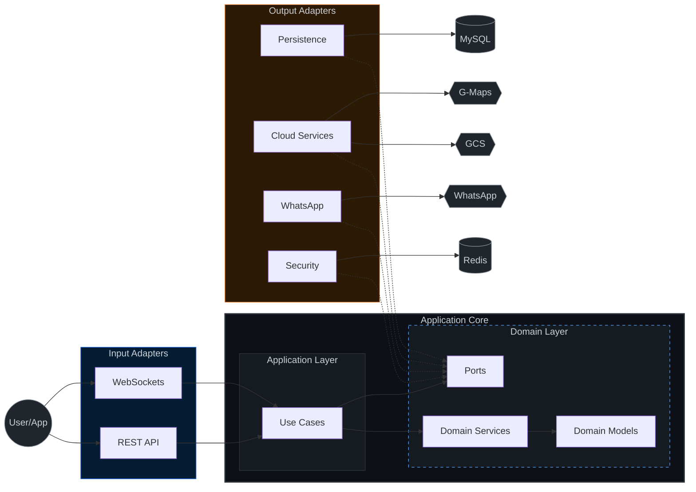
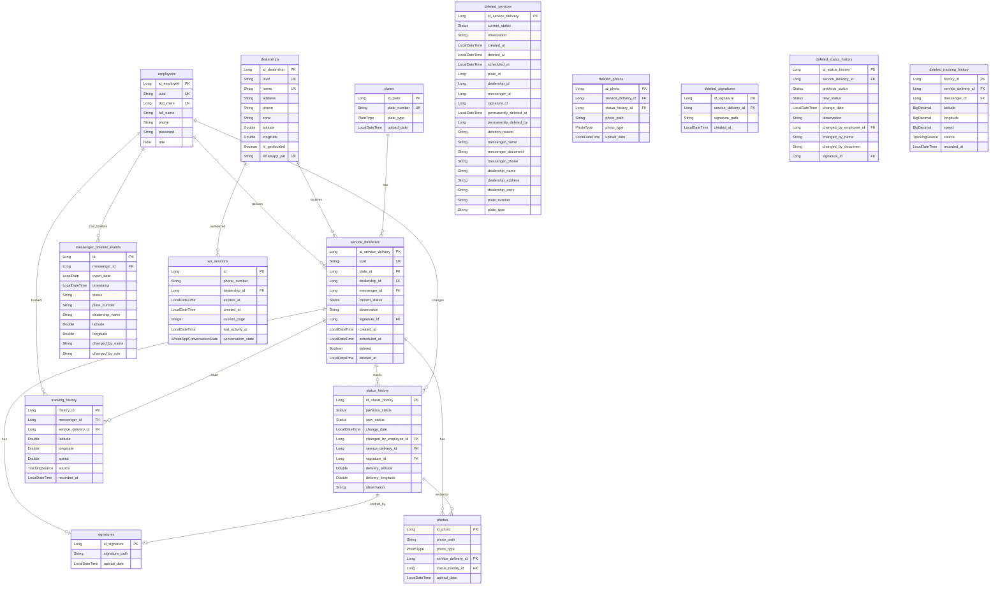
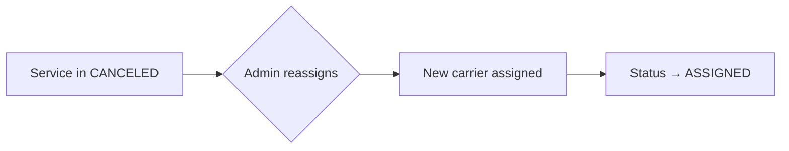

> **Copyright (C) 2026 Mateo Valencia Ardila. All rights reserved. The source code for this application is protected by copyright laws. DNDA Registration No. 13-108-139. Copying, distributing, or modifying this application without express authorization is strictly prohibited.**

<div align="center">

# Messenger Backend API


[](https://openjdk.org/)
[](https://spring.io/projects/spring-boot)
[](https://www.mysql.com/)
[](https://redis.io/)
[](https://cloud.google.com/)
[](LICENSE)

**Motorcycle delivery management system by chassis and carrier monitoring.**
Intelligent platform for logistic control and distribution of motorcycles identified by chassis number, integrated with continuous satellite tracking of carriers on route.

[🇪🇸 Versión en Español](./README.md)

</div>

---

## Table of Contents

- [Architecture](#architecture)
- [Tech Stack](#tech-stack)
- [Project Structure](#project-structure)
- [Environment Profiles](#environment-profiles)
- [API Endpoints](#api-endpoints)
- [Database Schema](#database-schema)
- [Real-Time Tracking](#real-time-tracking)
- [Business Rules](#business-rules)
- [Trash Management (Soft Delete & Archive)](#trash-management-soft-delete--archive)
- [Security](#security)
- [Observability](#observability)
- [Architecture Verification](#architecture-verification)
- [Performance Optimization](#performance-optimization)
- [Setup & Installation](#setup--installation)
- [CI/CD](#cicd)
- [Testing](#testing)
- [Postman Collection](#postman-collection)
- [Android Integration](#android-integration)
- [Support & Contact](#support--contact)

---

## Architecture

The project implements **Hexagonal Architecture (Ports & Adapters)** to keep the domain isolated from external dependencies.



---

## Tech Stack

| Component                | Technology                                                                                             |
| ------------------------ | ------------------------------------------------------------------------------------------------------ |
| **Framework**            | Spring Boot 3.5.14                                                                                     |
| **Language**             | Java 17                                                                                                |
| **Database**             | MySQL 8.0+                                                                                             |
| **Cache/Streaming**      | Redis                                                                                                  |
| **Security**             | JWT + BCrypt + Cloudflare Turnstile (Bot Protection) + Bucket4j (Distributed Rate Limiting with Redis) |
| **Documentation**        | OpenAPI / Swagger UI                                                                                   |
| **Storage**              | Google Cloud Storage                                                                                   |
| **Maps**                 | Google Maps Platform                                                                                   |
| **Mobile Client**        | Capacitor (Android App Generation)                                                                     |
| **WhatsApp**             | WhatsApp Cloud API (Meta)                                                                              |
| **Real-Time**            | WebSocket + Redis                                                                                      |
| **Build**                | Maven 3.9+                                                                                             |
| **Migrations**           | Flyway (Database Versioning)                                                                           |
| **Monitoring**           | Spring Boot Actuator (Health, Metrics)                                                                 |
| **CI/CD**                | GitHub Actions                                                                                         |
| **Architecture Testing** | ArchUnit                                                                                               |
| **Performance**          | Spring Cache + Redis, Hibernate L2 Cache, Lazy Loading, Database Indices                               |

---

## Project Structure

```
messenger/
├── src/main/java/app/
│   ├── MessengerApplication.java
│   ├── adapter/
│   │   ├── in/                          # Input Adapters
│   │   │   ├── builder/                 # Object Builders
│   │   │   ├── rest/
│   │   │   │   ├── controllers/         # REST Controllers
│   │   │   │   ├── mapper/              # Request/Response Mappers
│   │   │   │   ├── request/             # Input DTOs
│   │   │   │   ├── response/            # Output DTOs
│   │   │   │   └── validators/          # Input Validators
│   │   │   └── websocket/               # Real-time tracking
│   │   └── out/                         # Output Adapters
│   │       ├── maps/                    # Google Maps Integration
│   │       ├── persistence/             # JPA Adapters
│   │       │   ├── adapter/             # JPA Port Implementations
│   │       │   ├── entities/            # JPA Entities
│   │       │   ├── listener/            # Domain event listeners
│   │       │   ├── mapper/              # Entity-to-Domain Mappers
│   │       │   └── repository/          # Spring Data JPA Repositories
│   │       ├── security/                # JWT Adapter
│   │       ├── storage/                 # Google Cloud Storage
│   │       ├── tracking/                # Location Tracking
│   │       └── whatsapp/                # WhatsApp Cloud API
│   ├── application/
│   │   └── usecase/                     # 11 Use Cases (Monitoring, Settings, Location...)
│   ├── domain/
│   │   ├── events/                      # Domain Events
│   │   ├── exception/                   # BusinessException, InputsException...
│   │   ├── model/                       # 14+ Models + 7 Enums + Auth
│   │   │   └── enums/                   # Role, Status, PlateType...
│   │   ├── ports/                       # 14 Ports (interfaces)
│   │   ├── services/                    # Domain Services
│   │   └── util/                        # Domain Utilities
│   └── infrastructure/
│       ├── config/                      # Spring Configuration
│       ├── exception/                   # Global Error Handler
│       ├── health/                      # Health Indicators (Actuator)
│       ├── helper/                      # Utilities (File, etc.)
│       ├── scheduler/                   # Scheduled Jobs (Trash, Timeouts, ServiceActivation)
│       ├── security/                    # Security Filters & Web Config
│       ├── service/                     # Infrastructure Services
│       └── storage/                     # Local Utilities (ImageOptimizer)
└── src/main/resources/
    ├── application.properties           # Base Configuration
    ├── application-local.properties     # Local Development (H2)
    ├── application-dev.properties       # Development with APIs
    ├── application-test.properties      # Automated Testing
    ├── application-prod.properties      # Production
    └── db/migration/                    # Flyway Migrations
```

---

## Environment Profiles

| Profile | Purpose                                | Database                     | External APIs | JWT Exp. |
| ------- | -------------------------------------- | ---------------------------- | ------------- | -------- |
| `local` | Local development without dependencies | MySQL Local                  | Mock/Disabled | 8 hours  |
| `dev`   | Development with real services         | MySQL                        | Enabled       | 8 hours  |
| `test`  | Automated testing (CI/CD)              | Testcontainers (MySQL/Redis) | Mock          | 1 hour   |
| `prod`  | Production (Cloud Run)                 | Cloud SQL (MySQL 8)          | Enabled       | 30 min   |

### Profiles

<details>
<summary><b>Local</b> - No external dependencies</summary>

- MySQL Local database (Dockerized)
- **Zero-Config**: Pre-configured with test keys and Mocks
- **Data Seeding**: Automatic user initialization (Admin/Messenger) via `DataInitializer`

- Local file storage (LocalStorageAdapter)
- Detailed logging
- Perfect for quick demos and offline development

</details>

<details>
<summary><b>Dev</b> - Development with APIs</summary>

- MySQL development database
- Google Cloud APIs enabled
- SQL visible for debugging
- Actuator endpoints enabled
- Tracking interval: 15 seconds

</details>

<details>
<summary><b>Test</b> - Automated testing</summary>

- **Testcontainers integration**: Automated lifecycle for MySQL 8.0 and Redis 7.2.
- **Hierarchical Singleton Pattern**: BaseContainerTest ensures infrastructure starts once per JVM.
- **Data Isolation**: Each execution environment is clean and isolated.
- **Real Migrations**: Full parity with production database schema via Flyway.

</details>

<details>
<summary><b>Prod</b> - Production (Cloud Run Optimized)</summary>

- MySQL with mandatory SSL
- Optimized connection pool (HikariCP)
- **Structured JSON Logging** (Logstash Encoder)
- Graceful shutdown enabled (30s timeout)
- Security headers (HSTS, HTTP-only cookies)
- Compression enabled
- No exposed stack traces
- Cloud Run Proxy support (Forwarded Headers)

</details>

### Activation

```bash
# Environment variable (recommended)
export SPRING_PROFILES_ACTIVE=local

# Command line
./mvnw spring-boot:run -Dspring.profiles.active=local

# Docker
docker run -e SPRING_PROFILES_ACTIVE=local
```

---

## API Endpoints

### Authentication (`/auth`)

| Method | Endpoint         | Description                                                           |
| ------ | ---------------- | --------------------------------------------------------------------- |
| `POST` | `/auth/login`    | Login and receive access + refresh tokens (Requires `turnstileToken`) |
| `POST` | `/auth/refresh`  | Renew access token with refresh token                                 |
| `POST` | `/auth/ws-token` | Get temporary token for WebSocket connection                          |
| `POST` | `/auth/logout`   | Logout and clear authentication cookies                               |
| `GET`  | `/profile/me`    | Get authenticated user profile (ADMIN/MESSENGER)                      |
| `PUT`  | `/profile/me`    | Update profile (name, phone, password - min 6 chars)                  |

### Employees (`/employees`) - ADMIN only

| Method   | Endpoint                             | Description              |
| -------- | ------------------------------------ | ------------------------ |
| `POST`   | `/employees/createEmployee`          | Create new employee      |
| `GET`    | `/employees/allEmployees`            | List all employees       |
| `GET`    | `/employees/findByEmployeeId/{uuid}` | Get employee by UUID     |
| `PUT`    | `/employees/updateEmployee/{uuid}`   | Update existing employee |
| `DELETE` | `/employees/deleteEmployee/{uuid}`   | Delete employee          |

### Dealerships (`/dealerships`)

| Method   | Endpoint                                     | Description                        |
| -------- | -------------------------------------------- | ---------------------------------- |
| `POST`   | `/dealerships/createDealership`              | Create dealership (ADMIN)          |
| `GET`    | `/dealerships/allDealerships`                | List all dealerships               |
| `GET`    | `/dealerships/findByDealershipId/{uuid}`     | Get by UUID                        |
| `GET`    | `/dealerships/findByDealershipName/{name}`   | Get by Name                        |
| `PUT`    | `/dealerships/updateDealership/{uuid}`       | Update dealership (ADMIN)          |
| `DELETE` | `/dealerships/deleteDealership/{uuid}`       | Delete dealership (ADMIN)          |
| `POST`   | `/dealerships/geocodeDealership/{uuid}`      | Geocode dealership address (ADMIN) |

### Service Deliveries (`/services`)

| Method   | Endpoint                         | Description                                                  |
| -------- | -------------------------------- | ------------------------------------------------------------ |
| `POST`   | `/services/createService`        | Create service (Supports scheduling with `scheduledAt`)      |
| `PUT`    | `/services/updateService/{uuid}` | Update status (multipart: status + evidence)                 |
| `PUT`    | `/services/reassign/{uuid}`      | Reassign to another carrier (ADMIN/CANCELED)               |
| `GET`    | `/services/findByServiceId/{uuid}`| Get service by UUID                                         |
| `GET`    | `/services/allServicesPageable`  | List services with **pagination, search & sorting**          |

### WhatsApp (`/api/whatsapp`)

| Method | Endpoint                | Description                                            |
| ------ | ----------------------- | ------------------------------------------------------ |
| `GET`  | `/api/whatsapp/webhook` | Webhook verification (required by Meta)                |
| `POST` | `/api/whatsapp/webhook` | Receive incoming messages (Validated with HMAC-SHA256) |

> [!TIP]
> **WhatsApp Bot Workflow**:
>
> 1. User sends a message.
> 2. Bot requests a 4-digit PIN (requested every 12 hours or upon logout).
> 3. After authentication, the user can query chassis status or list pending deliveries belonging to the dealership associated with the PIN.
> 4. **Master PIN (Llave Maestra)**: Entering the global master PIN authenticates the user as a **"Master Key"** session (not tied to any specific dealership), allowing them to search and view chassis status and events across **all dealerships** without restrictions.

> [!IMPORTANT]
> **Bot Security**:
>
> - **Webhook Validation**: Uses HMAC-SHA256 with Meta's App Secret to verify request origin.
> - **PIN Protection**: 4-digit PIN required to access dealership data (expires every 12 hours).
> - **Master PIN**: Global access via a master PIN for unified viewing of all dealerships.
> - **Brute Force Protection**: Bot access is blocked for 15 minutes after 3 failed PIN attempts, managed via Redis.

> [!CAUTION]
> **File Constraints**:
>
> - **Images**: Max 10MB (WebP)
> - **Signatures (Static)**: Max 2MB (WebP)


### Locations & Routes (`/locations`)

| Method | Endpoint              | Description                             |
| ------ | --------------------- | --------------------------------------- |
| `POST` | `/locations/geocode`  | Address to coordinates                  |
| `POST` | `/locations/route`    | DISABLED - Calculate optimized route    |
| `GET`  | `/locations/distance` | Distance + time estimate between points |
| `GET`  | `/locations/reverse`  | Coordinates to address                  |

### Files (`/files`)

| Method | Endpoint            | Description                                      |
| ------ | ------------------- | ------------------------------------------------ |
| `GET`  | `/files/{filename}` | Download protected file (photos/signatures) |

### Real-Time Tracking (`/tracking` & WebSocket)

| Method | Endpoint                   | Description                                      |
| ------ | -------------------------- | ------------------------------------------------ |
| `WS`   | `/ws/tracking/update`             | Update location via WebSocket (with Heartbeat) - Used by Web App (React) |
| `POST` | `/tracking/update`         | Update location via REST POST - Used by Mobile App in background (Foreground Service) |
| `GET`  | `/tracking/messenger/{uuid}`      | Get last known location of a carrier (ADMIN)      |
| `POST` | `/tracking/messengers/bulk-locations`| Get last location of multiple carriers (ADMIN)  |
| `GET`  | `/tracking/active`                | Get all active carriers (ADMIN)                 |
| `GET`  | `/tracking/history/pageable/{uuid}`| Get location history with **pagination**          |
| `GET`  | `/tracking/service/{uuid}`        | Get history for a specific service                |

### Monitoring & Activity (`/monitoring`) - ADMIN only

| Method | Endpoint                              | Description                                         |
| ------ | ------------------------------------- | --------------------------------------------------- |
| `GET`  | `/monitoring/messenger/{messengerUuid}/activity` | Get daily activity timeline + stats for a carrier |

---

## Database Schema



### Enums

| Enum               | Values                                                                                                |
| ------------------ | ----------------------------------------------------------------------------------------------------- |
| **Role**           | `ADMIN`, `MESSENGER`                                                                                  |
| **PlateType**      | `MOTORCYCLE`                                                                                          |
| **Status**         | `SCHEDULED`, `ASSIGNED`, `PENDING`, `DELIVERED`, `RETURNED`, `CANCELED`, `RESOLVED`, `DELETED`                     |
| **PhotoType**      | `EVIDENCE`                                                                                            |
| **TrackingStatus** | `ACTIVE`, `INACTIVE`, `OFFLINE`                                                                       |
| **TrackingSource** | `GPS`, `NETWORK`, `MANUAL`                                                                            |

---

## Real-Time Tracking

Hybrid GPS tracking system for real-time carrier monitoring, tailored by client and state:
*   **Web Application (React)**: Uses a two-way **WebSocket** connection to send the location and keep-alive (`heartbeat`) signal when the carrier's interface is active in the foreground.
*   **Mobile Application (Android)**: Uses the **REST POST** (`/tracking/update`) endpoint via a background service (`Foreground Service`) to report location periodically, reducing battery consumption and preventing connection dropouts.

Locations are processed with low latency using **Redis** for active status and are permanently archived in MySQL.

### Features

| Feature                 | Description                                     |
| ----------------------- | ----------------------------------------------- |
| **Live location**       | Updates every 45 seconds (5s rate limit)        |
| **Technical accuracy**  | < 100m GPS error filtered for history           |
| **Complete history**    | Permanent retention (Historical Archive)        |
| **Low latency**         | Redis for location caching                      |
| **WebSocket**           | Real-time data updates (Server Push to the admin panel) |

### WebSocket API

Connection URL: `ws://localhost:8080/ws/tracking`

| Type   | Destination               | Description                                |
| ------ | ------------------------- | ------------------------------------------ |
| `SEND` | `/app/tracking/update`    | Send GPS location update (Web Client / React) |
| `SEND` | `/app/tracking/heartbeat` | Send keep-alive signal (no GPS, Web Client / React) |
| `SUB`  | `/topic/tracking/{id}`    | Receive updates for specific carrier (ADMIN Panel in React) |
| `SUB`  | `/topic/tracking/all`     | Receive updates for all carriers (ADMIN Panel in React) |

### Google Maps Integration

- **Geocoding**: Address ↔ Coordinates
- **Directions API**: DISABLED - Optimized routes
- **Distance Matrix**: Time estimation
- **Reverse Geocoding**: Coordinates → Address

## Business Rules

> [!IMPORTANT]
> **Role-Based Status Transitions**
>
> - **CARRIER** can only change to: `PENDING`, `DELIVERED`, `RETURNED` statuses.
> - **ADMIN** can change to all allowed statuses (`ASSIGNED`, `PENDING`, `DELIVERED`, `RETURNED`, `CANCELED`, `RESOLVED`).
> - Services can be modified at any time regardless of their current state.
> - Admins can reassign **CANCELED** services to another carrier.

> [!NOTE]
> **Evidence Requirements**
>
> - **DELIVERED**: Advisor signature is mandatory. Photos (maximum 10) and observations are optional.
> - **PENDING**: Signature, photos (maximum 10), and observations are optional (no longer mandatory).
> - **RETURNED**: Signature, photos (maximum 10), and observations are optional (no longer mandatory).
> - **CANCELED** & **RESOLVED**: No additional evidence required.


> [!NOTE]
> **Soft Delete (Trash Bin)**
>
> Deleted services are moved to a **trash bin** and permanently deleted after **60 days**.
> Admins can restore services from the trash before permanent deletion.

> [!NOTE]
> **Scheduled States (`SCHEDULED`)**
>
> Services created with a future date (`scheduledAt`) enter the `SCHEDULED` state. An automated background process (`ServiceActivationScheduler`) checks every minute and activates them (changing their state to `ASSIGNED`) once their scheduled date is reached.

### State Rules

| State       | Carrier                              | Admin                               | Delete   |
| ----------- | ------------------------------------ | ----------------------------------- | -------- |
| `SCHEDULED` | -                                    | → `Any state`                       | ✅ Trash |
| `ASSIGNED`  | → `PENDING`, `DELIVERED`, `RETURNED` | → `Any state`                       | ✅ Trash |
| `RETURNED`  | → `PENDING`, `DELIVERED`             | → `Any state`                       | ✅ Trash |
| `PENDING`   | → `DELIVERED`, `RETURNED`            | → `Any state`                       | ✅ Trash |
| `DELIVERED` | -                                    | → `Any state`                       | ✅ Trash |
| `CANCELED`  | -                                    | → `Any state` (Reassign → `ASSIGNED`) | ✅ Trash |
| `RESOLVED`  | -                                    | → `Any state`                       | ✅ Trash |

### Reassignment Flow



## Trash Management (Soft Delete & Archive)

| Action         | Endpoint                              | Description                      |
| -------------- | ------------------------------------- | -------------------------------- |
| Delete → Trash | `DELETE /services/deleteService/{uuid}` | Moves to trash (soft delete)     |
| View Trash     | `GET /services/trash`                 | Lists deleted services (ADMIN)   |
| Restore        | `POST /services/trash/restore/{uuid}` | Restores from trash (ADMIN)      |
| Empty Trash       | `DELETE /services/trash/empty`        | Archives all trash items (ADMIN) |
| Permanent Delete  | `DELETE /services/trash/{uuid}`       | Permanent delete individual item (ADMIN) |
| Auto-Archive      | Scheduled job (3 AM daily)          | Archives services after 60 days  |

**Archive System**: Services are permanently archived to dedicated tables (`deleted_services`, `deleted_status_history`, `deleted_photos`, `deleted_tracking_history`, `deleted_signatures`) instead of being deleted. All historical data is preserved for auditing and analytics.

---

## Security

### Rate Limiting (DoS Protection)
The system implements an IP-based rate limiting filter to prevent abuse and brute force attacks:
- **Limits**: 100 requests/min for general endpoints, 10 requests/min for `/auth/**`.
- **Persistence**: Counters are maintained in **Redis** (shared across nodes).
- **Fallback**: If Redis fails, the system automatically switches to a local in-memory cache to maintain protection.
- **Header**: In case of blockage (HTTP 429), the `Retry-After` header is included with the required wait time in seconds.
- **Proxy / Cloudflare Compatibility**: Detects the client's real IP address using `CF-Connecting-IP` and `X-Forwarded-For` headers, preventing accidental rate limiting of Cloudflare proxy servers.

### Roles & Permissions

- **ADMIN**: Full access to all endpoints.
- **MESSENGER**: Only manages their own services and location.

### Security Headers (Production)

- HSTS (HTTP Strict Transport Security)
- Cookies: `Secure`, `HttpOnly`, `SameSite=Strict`
- CORS configured by origin
- No stack trace exposure

---

## Observability

### Monitoring Endpoints (Actuator)

| Endpoint            | Description                     | Profile        | Access        |
| ------------------- | ------------------------------- | -------------- | ------------- |
| `/actuator/health`  | Health status (DB, Redis, Disk) | All            | Public        |
| `/actuator/metrics` | JVM and HTTP metrics            | `dev`, `local` | Private (JWT) |
| `/actuator/info`    | Build information               | All            | Private (JWT) |

### Cloud Run Optimization

- **JSON Logging (Prod):** Structured output compatible with Google Cloud Logging
- **Graceful Shutdown:** Waits 30s to finish active connections
- **SSL Offloading:** Trusts proxy headers (`X-Forwarded-Proto`) from Cloud Run

### API Documentation

| Endpoint                 | Description                      |
| ------------------------ | -------------------------------- |
| `/swagger-ui/index.html` | Interactive Swagger UI           |
| `/v3/api-docs`           | OpenAPI 3.0 Specification (JSON) |
| `/v3/api-docs.yaml`      | OpenAPI 3.0 Specification (YAML) |

> [!TIP]
> Swagger UI is publicly accessible in `dev` profile. In production, consider restricting access via security configuration.

---

## Architecture Verification

The project includes **ArchUnit** tests to enforce structural integrity and ensure that the **Hexagonal Architecture** principles are never violated.

### Automated Rules

- **Layer Isolation**: Domain and Application layers must never depend on Infrastructure.
- **Dependency Flow**: Input adapters must only talk to Use Cases, and Use Cases must only interact with Domain services or Ports.
- **Package Integrity**: Controllers, entities, and repositories must reside in their respective adapter/infrastructure packages.

Run architecture tests:

```bash
mvn test -Dtest=HexagonalArchitectureTest
```

---

## Performance Optimization

The system includes multiple optimization layers to ensure high performance and low latency.

### Caching Strategy (Redis)

- **Spring Cache Abstraction**: Application-level caching using `@Cacheable` and `@CacheEvict`.
  - `Dealerships`: TTL 30 minutes.
  - `Employees`: TTL 15 minutes.
- **Hibernate Second-Level Cache (L2)**: Entity-level caching via Redisson to reduce database load.
  - Enabled for `DealershipEntity`, `EmployeeEntity`, and `PlateEntity`.
- **Custom Serialization**: Optimized `ObjectMapper` with `JavaTimeModule` support for `LocalDateTime`.

### Data Fetching Optimization

- **Lazy Loading**: Most relationships in `ServiceDeliveryEntity` are configured as `FetchType.LAZY` to avoid loading unnecessary data.
- **Entity Graphs**: Explicit `@EntityGraph` definitions in repositories to solve the N+1 problem by fetching only required associations in a single query.

### Image Optimization

- **Dual WebP Pipeline**: The frontend performs WebP pre-compression (0.85 quality) before upload to save mobile bandwidth. The backend receives, validates, and applies a second optimization and metadata sanitization step.
- **Differentiated Qualities**: **0.85** quality for photos (optimized for size) and **0.95** for digital signatures (maximum sharpness).
- **Metadata Removal**: Automatic EXIF metadata cleaning during re-encoding to improve privacy and reduce file size.

### Connection Pool Tuning (HikariCP)

- **Optimized for Cloud SQL**: Fine-tuned parameters for low-resource environments (db-f1-micro).
- **Leak Detection**: Active threshold to identify and prevent connection leaks.

---

## Setup & Installation

### Prerequisites

| Requirement | Version |
| ----------- | ------- |
| Java        | 17+     |
| MySQL       | 8.0+    |
| Redis       | 6.0+    |
| Maven       | 3.9+    |

### Environment Variables Required

The system requires the following environment variables for proper operation. For detailed configuration instructions and guides by environment (CI/CD vs. Production), see the **[Secrets Management](./.github/SECRETS.md)** document.

### Quick Start (Docker Zero-Config)

For a quick demonstration without manual setup, use Docker Compose. This will spin up the frontend, backend, database, and redis automatically.

1. Navigate to backend root: `cd messenger-backend`
2. Run: `docker-compose -f docker-compose.local.yml up --build`
3. Access: `http://localhost`

### Development with Hot Reloading

For active development with automatic code reloading (no need to restart containers when making changes):

```bash
docker-compose -f docker-compose.dev.yml up --build
```

> [!IMPORTANT]
> **Requirements for the Development Profile (dev)**:
> 
> - **Real Environment Variables**: Unlike the local profile, the `dev` profile requires you to define real environment variables on your host machine or via a `.env` file (such as Google Maps, Turnstile, and WhatsApp API keys).
> - **GCP Credentials**: The container expects a Google Cloud Platform credentials JSON file mounted via Docker volumes. By default, it is mapped to `/home/fttmatteo/Documentos/gcp-json/messenger-backend.json` (you can adjust this source path in the volume mapping of `docker-compose.dev.yml` if needed).


| Service             | URL                     | Description                      |
| ------------------- | ----------------------- | -------------------------------- |
| Frontend (Vite HMR) | `http://localhost:5173` | Auto-reloads on file save        |
| Backend API         | `http://localhost:8080` | Auto-restarts on recompile       |
| PHPMyAdmin          | `http://localhost:8081` | Database management              |
| Remote Debug        | Port `5005`             | Attach IntelliJ/VS Code debugger |

> [!TIP]
> Check the **[Quick Start Guide](./GUIA_RAPIDA.md)** (Spanish) for more details on test credentials and phpMyAdmin access.

---

## CI/CD

Automated pipeline with **GitHub Actions**:

```yaml
# .github/workflows/maven.yml
on:
  push:
    branches: ["main", "develop"]
  pull_request:
    branches: ["main", "develop"]
```

### Features

| Feature            | Description                            |
| ------------------ | -------------------------------------- |
| Automated build    | Java 17 + Maven                        |
| Dependency caching | Faster builds                          |
| Secure secrets     | Credential injection                   |
| Testing            | Profile test with Docker (MySQL/Redis) |

### Required GitHub Secrets

> [!TIP]
> To view the complete list and learn how to configure the necessary secrets for CI/CD, please refer to the [Secrets Management](./.github/SECRETS.md) guide.

---

## Testing

The project implements a robust testing strategy across all layers of the hexagonal architecture.

| Level            | Strategy                            | Technology                               |
| ---------------- | ----------------------------------- | ---------------------------------------- |
| **Unit**         | Isolated logic verification         | JUnit 5 + Mockito                        |
| **Integration**  | Infrastructure & Service validation | Spring Boot Test + **Testcontainers**    |
| **Persistence**  | Data mapping & Query validation     | `@DataJpaTest` + Real MySQL              |
| **Architecture** | Hexagonal rules compliance          | **ArchUnit**                             |
| **Mutation**     | Test effectiveness measurement      | **Pitest**                               |
| **E2E (Client)** | Full business flow validation       | **Playwright** (in `messenger-frontend`) |

### Key Features

- **Testcontainers (MySQL & Redis)**: No manual Docker setup required. Tests download and manage containers automatically.
- **Integral Strategy (Full-Stack)**: The project is complemented by a frontend E2E suite that validates real integration with backend endpoints, including security bypass (Turnstile) and sensor simulation (GPS/Camera).
- **Hierarchical Singleton Pattern**: `BaseContainerTest` shares infrastructure across test contexts, drastically reducing startup time.
- **Mutation Testing**: Metrics beyond line coverage, injecting faults to ensure assertions actually detect errors.
- **Flyway Parity**: Integration tests run on the exact same migrations used in production.

### Running Tests

```bash
# Standard tests (Unit + Integration)
./mvnw test

# Mutation Testing (Pitest)
./mvnw org.pitest:pitest-maven:mutationCoverage
```

---

## Postman Collection

**[Messenger_API.postman_collection.json](./Messenger_API.postman_collection.json)**

### Features

- **JWT and Refresh Token** saved automatically
- **Environment variables** preconfigured (`baseUrl`, `token`, `refreshToken`)
- **Automated tests** that save tokens to collection variables
- **Payload examples** for all endpoints
- **9 controllers** fully documented.

### Usage

1. Import collection in Postman
2. Configure `baseUrl` variable (default: `http://localhost:8080`)
3. Run **"Login"** first
4. Tokens (`token` and `refreshToken`) are saved automatically
5. All other endpoints use the token automatically
6. When access token expires, run **"Refresh Token"**

---

## Android Integration

The system includes a native Android application built with **Capacitor**, providing a seamless mobile experience for carriers.

### Technical Details

- **App ID**: `com.plak.messenger`
- **Framework**: Ionic + Capacitor
- **Plugins**:
  - `CapacitorHttp`: Optimized native network requests.
  - `StatusBar`: Custom UI overlays for edge-to-edge experience.

### Key Features & Permissions

The app requests the following permissions to function correctly:

- **Location**: `ACCESS_FINE_LOCATION` & `ACCESS_BACKGROUND_LOCATION` for real-time tracking even when the app is minimized.
- **Camera**: `CAMERA` for delivery evidence.
- **Notifications**: `POST_NOTIFICATIONS` for delivery updates.
- **Foreground Service**: Ensures tracking persistence during deliveries.

### Development Setup (Emulator)

To connect the Android Emulator to your local backend development environment:

1. Ensure the backend is running on `localhost:8080`.
2. The Android project is pre-configured to use `10.0.2.2` to access the host machine's `localhost`.
3. Cleartext traffic is permitted for `10.0.2.2` in `network_security_config.xml`.

### Commands

From the `messenger-frontend` directory:

```bash
# Sync web assets to Android project
npx cap sync android

# Open in Android Studio
npx cap open android
```

---

## Support & Contact

**Official Documentation:**

- [Spring Boot Documentation](https://spring.io/projects/spring-boot)
- [Google Cloud Run](https://cloud.google.com/run/docs)

**Documentation:**

- [**Secrets Management**](./.github/SECRETS.md)
- [**Quick Start Guide**](./GUIA_RAPIDA.md)
- [**Postman Collection**](./Messenger_API.postman_collection.json)
- [**Contribution Guide**](./COLABORACION.md)
- [**Versioning (v1.0.0)**](./VERSIONING.md)

**Scripts:**

- [**Start Test Services**](./scripts/start-test-services.sh): Starts MySQL and Redis containers for local integration tests.
- [**Flyway Verification**](./messenger/verify_flyway.sh): Validates database connection and status of Flyway migrations.
- [**Security Headers Test**](./test-security-headers.sh): Performs automated audit of CSP, CORS, and HTTP security headers.
- [**Rate Limiting Test**](./test-rate-limiting.sh): Simulates request bursts to validate the effectiveness of Rate Limiting.
- [**Sync Version**](./sync-version.sh): Syncs the project version.

**Project:**

- Repository: `messenger-backend`
- Author: [Mateo Valencia Ardila](https://github.com/fttmatteo)
- Email: [contacto@plak.digital](mailto:contacto@plak.digital)

> **Copyright (C) 2026 Mateo Valencia Ardila. All rights reserved. The source code for this application is protected by copyright laws. DNDA Registration No. 13-108-139. Copying, distributing, or modifying this application without express authorization is strictly prohibited.**