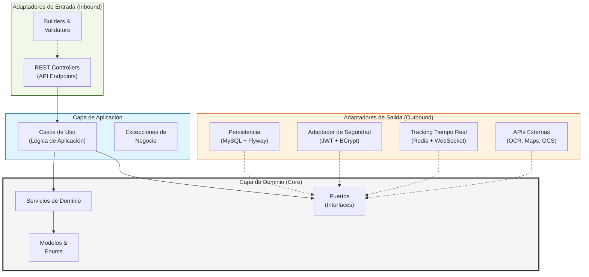
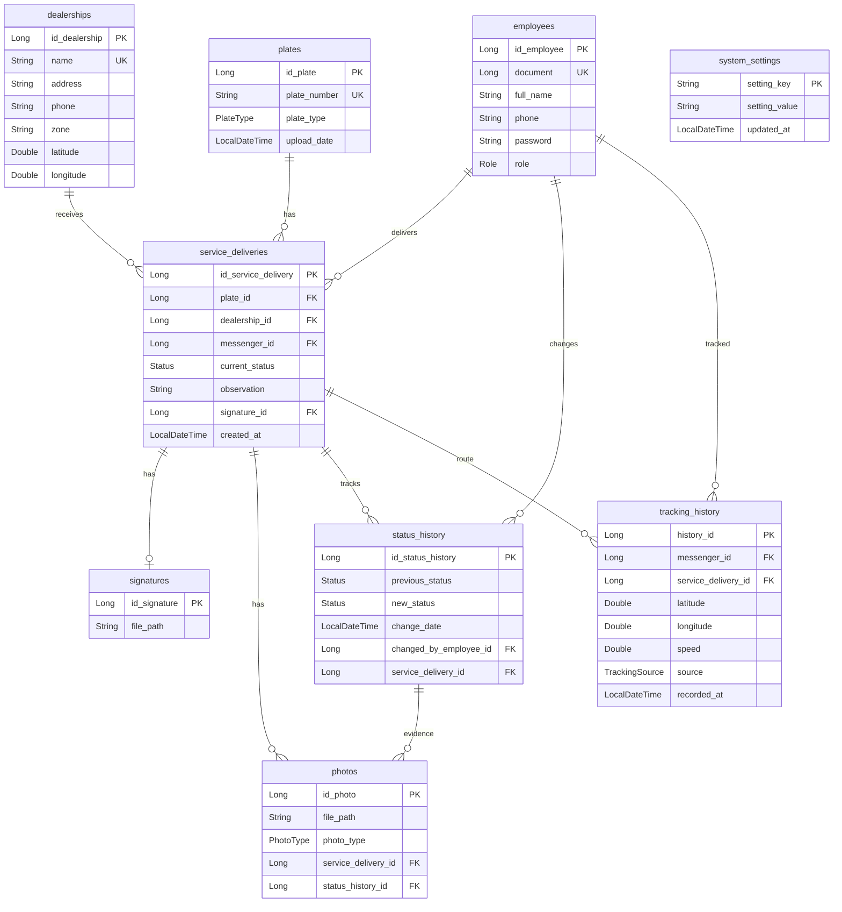
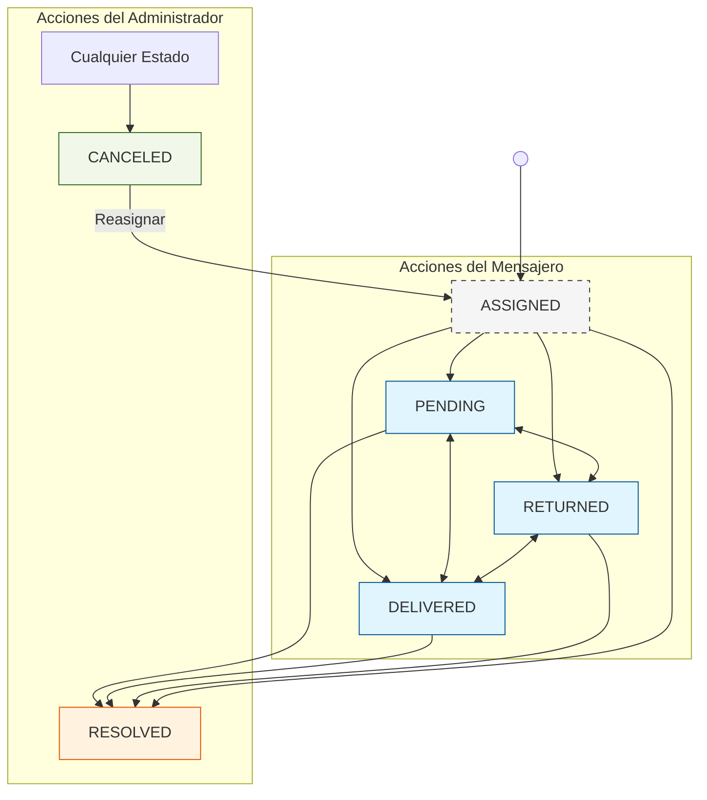
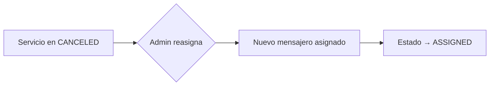

> **Copyright (C) 2025 Mateo Valencia Ardila. All rights reserved. Confidential and Proprietary.**

<div align="center">

# 🚀 Messenger Backend API

[](https://openjdk.org/)
[](https://spring.io/projects/spring-boot)
[](https://www.mysql.com/)
[](https://redis.io/)

**Sistema de entregas con reconocimiento automático de placas vehiculares mediante OCR.**

[🇺🇸 English Version](./README.md)

</div>

---

## 📋 Tabla de Contenidos

- [Arquitectura](#-arquitectura)
- [Stack Tecnológico](#-stack-tecnológico)
- [Estructura del Proyecto](#-estructura-del-proyecto)
- [Perfiles de Ambiente](#-perfiles-de-ambiente)
- [API Endpoints](#-api-endpoints)
- [Esquema de Base de Datos](#-esquema-de-base-datos)
- [Tracking en Tiempo Real](#-tracking-en-tiempo-real)
- [Flujo de Estados](#-flujo-de-estados)
- [Seguridad](#-seguridad)
- [Observabilidad](#-observabilidad)
- [Auditoría](#-auditoría)
- [Configuración e Instalación](#️-configuración-e-instalación)
- [CI/CD](#-cicd)
- [Testing](#-testing)
- [Colección Postman](#-colección-postman)

---

## 🏗 Arquitectura

El proyecto implementa **Arquitectura Hexagonal (Ports & Adapters)** para mantener el dominio aislado de las dependencias externas.



---

## 💻 Stack Tecnológico

| Componente | Tecnología |
|------------|------------|
| **Framework** | Spring Boot 4.x |
| **Lenguaje** | Java 17 |
| **Base de Datos** | MySQL 8.0+ |
| **Migraciones** | Flyway |
| **Cache/Streaming** | Redis |
| **Seguridad** | JWT + BCrypt + Bucket4j (Rate Limiting) |
| **Documentación** | OpenAPI / Swagger UI |
| **OCR** | Google Cloud Vision API |
| **Almacenamiento** | Google Cloud Storage |
| **Mapas** | Google Maps Platform |
| **Tiempo Real** | WebSocket + Redis |
| **Build** | Maven 3.9+ |
| **Monitoreo** | Spring Boot Actuator (Health, Metrics) |
| **Auditoría** | JPA Callbacks + AOP (Aspect Oriented Programming) |
| **CI/CD** | GitHub Actions |
| **Tests de Arquitectura** | ArchUnit |
| **Rendimiento** | Índices de Base de Datos (Optimización para paginación) |

---

## 📁 Estructura del Proyecto

```
messenger/
├── src/main/java/app/
│   ├── MessengerApplication.java
│   ├── adapter/
│   │   ├── in/                          # Adaptadores de entrada
│   │   │   ├── builder/                 # Constructores de objetos
│   │   │   ├── rest/
│   │   │   │   ├── controllers/         # 9 REST Controllers
│   │   │   │   ├── mapper/              # Mappers Request/Response
│   │   │   │   ├── request/             # DTOs de entrada
│   │   │   │   └── response/            # DTOs de salida
│   │   │   └── validators/              # Validadores de entrada
│   │   └── out/                         # Adaptadores de salida
│   │       ├── maps/                    # Google Maps Integration
│   │       ├── ocr/                     # Google Vision OCR
│   │       ├── security/                # JWT Adapter
│   │       ├── storage/                 # Google Cloud Storage
│   │       └── tracking/                # Location Tracking
│   ├── application/
│   │   ├── exceptions/                  # BusinessException, InputsException
│   │   └── usecase/                     # 11 Casos de Uso (Monitoring, Settings, Location...)
│   ├── domain/
│   │   ├── model/                       # 12+ Modelos + 7 Enums + Auth
│   │   ├── ports/                       # 10 Puertos (interfaces)
│   │   └── services/                    # Servicios de dominio
│   └── infrastructure/
│       ├── persistence/
│       │   ├── entities/                # Entidades JPA
│       │   ├── mapper/                  # Entity ↔ Domain mappers
│       │   └── repository/              # Spring Data Repositories
│       └── security/                    # SecurityConfig, JwtFilter
└── src/main/resources/
    ├── application.properties           # Configuración base
    ├── application-local.properties     # Desarrollo local (H2)
    ├── application-dev.properties       # Desarrollo con APIs
    ├── application-test.properties      # Testing automatizado
    ├── application-prod.properties      # Producción
    └── db/migration/                    # Migraciones Flyway
```

---

## 🌍 Perfiles de Ambiente

| Perfil | Propósito | Base de Datos | APIs Externas | JWT Exp. |
|--------|-----------|---------------|---------------|----------|
| `local` | Desarrollo local sin dependencias | H2 In-Memory | Mock/Deshabilitado | 8 horas |
| `dev` | Desarrollo con servicios reales | MySQL | Habilitado | 8 horas |
| `test` | Testing automatizado (CI/CD) | H2 In-Memory | Mock | 1 hora |
| `prod` | Producción (Cloud Run) | MySQL (SSL) | Habilitado (JSON Logs) | 30 min |

### Características por Perfil

<details>
<summary><b>🏠 Local</b> - Sin dependencias externas</summary>

- Base de datos H2 en memoria
- OCR simulado (placeholder)
- Almacenamiento en sistema de archivos
- Logs detallados
- Perfecto para desarrollo offline

</details>

<details>
<summary><b>🔧 Dev</b> - Desarrollo con APIs</summary>

- MySQL de desarrollo
- Google Cloud APIs habilitadas
- SQL visible para debugging
- Actuator endpoints habilitados
- Tracking interval: 15 segundos

</details>

<details>
<summary><b>🧪 Test</b> - Testing automatizado</summary>

- H2 en memoria (aislamiento)
- Servicios mock
- Sin dependencias externas
- Compatible con GitHub Actions

</details>

<details>
<summary><b>🚀 Prod</b> - Producción (Optimizado Cloud Run)</summary>

- MySQL con SSL obligatorio
- Pool de conexiones optimizado (HikariCP)
- **Logging Estructurado JSON** (Logstash Encoder)
- Graceful shutdown habilitado (30s timeout)
- Headers de seguridad (HSTS, HTTP-only cookies)
- Compresión habilitada
- Sin stack traces expuestos
- Soporte Proxy Cloud Run (Forwarded Headers)

</details>

### Activación

```bash
# Variable de entorno (recomendado)
export SPRING_PROFILES_ACTIVE=dev

# Línea de comandos
./mvnw spring-boot:run -Dspring.profiles.active=dev

# Docker
docker run -e SPRING_PROFILES_ACTIVE=prod messenger-api
```

---

## 🔌 API Endpoints

### Autenticación (`/auth`)

| Método | Endpoint | Descripción |
|--------|----------|-------------|
| `POST` | `/auth/login` | Iniciar sesión y obtener tokens de acceso + refresh |
| `POST` | `/auth/refresh` | Renovar token de acceso con refresh token |

---

### Empleados (`/employees`) - Solo ADMIN

| Método | Endpoint | Descripción |
|--------|----------|-------------|
| `POST` | `/employees/createEmployee` | Crear nuevo empleado |
| `GET` | `/employees/allEmployees` | Listar todos los empleados |
| `GET` | `/employees/findByEmployeeId/{id}` | Obtener empleado por ID |
| `PUT` | `/employees/updateEmployee/{id}` | Actualizar empleado existente |
| `DELETE` | `/employees/deleteEmployee/{id}` | Eliminar empleado |

---

### Concesionarios (`/dealerships`)

| Método | Endpoint | Descripción |
|--------|----------|-------------|
| `POST` | `/dealerships/createDealership` | Crear concesionario (ADMIN) |
| `GET` | `/dealerships/allDealerships` | Listar todos los concesionarios |
| `GET` | `/dealerships/findByDealershipId/{id}` | Obtener por ID |
| `GET` | `/dealerships/findByDealershipName/{name}` | Obtener por Nombre |
| `PUT` | `/dealerships/updateDealership/{id}` | Actualizar concesionario (ADMIN) |
| `DELETE` | `/dealerships/deleteDealership/{id}` | Eliminar concesionario (ADMIN) |
| `POST` | `/dealerships/geocodeDealership/{id}` | Geocodificar dirección de concesionario (ADMIN) |

---

### Servicios de Entrega (`/services`)

| Método | Endpoint | Descripción |
|--------|----------|-------------|
| `POST` | `/services/createService` | Crear servicio (multipart: imagen + datos) |
| `PUT` | `/services/updateService/{id}` | Actualizar estado (multipart: estado + evidencias) |
| `PUT` | `/services/reassign/{id}` | Reasignar a otro mensajero (ADMIN/CANCELED) |
| `GET` | `/services/findByServiceId/{id}` | Obtener servicio por ID |
| `GET` | `/services/allServices` | Listar servicios (filtrado por rol) |
| `GET` | `/services/allServicesPageable` | Listar servicios con **paginación y búsqueda** |
| `GET` | `/services/stats/daily` | Estadísticas diarias (requiere messengerId, from, to) |
| `DELETE` | `/services/deleteService/{id}` | Mover a papelera (ADMIN) |
| `GET` | `/services/trash` | Listar servicios eliminados (ADMIN) |
| `POST` | `/services/trash/restore/{id}` | Restaurar desde papelera (ADMIN) |
| `DELETE` | `/services/trash/empty` | Vaciar papelera permanentemente (ADMIN) |
| `DELETE` | `/services/trash/{id}` | Eliminación individual permanente (ADMIN) |

---

### Configuraciones del Sistema (`/settings`) - Solo ADMIN

| Método | Endpoint | Descripción |
|--------|----------|-------------|
| `GET` | `/settings/status-colors` | Obtener configuración de colores de estados |
| `PUT` | `/settings/status-colors` | Actualizar configuración de colores de estados |

---

### Ubicaciones y Rutas (`/locations`)

| Método | Endpoint | Descripción |
|--------|----------|-------------|
| `POST` | `/locations/geocode` | Dirección a coordenadas |
| `POST` | `/locations/route` | Calcular ruta optimizada |
| `GET` | `/locations/distance` | Distancia + tiempo estimado entre puntos |
| `GET` | `/locations/reverse` | Coordenadas a dirección |

---

### Archivos (`/files`)

| Método | Endpoint | Descripción |
|--------|----------|-------------|
| `GET` | `/files/{filename}` | Descargar archivo protegido (fotos/firmas) |

---

### Tracking en Tiempo Real (`/tracking`)

| Método | Endpoint | Descripción |
|--------|----------|-------------|
| `POST` | `/tracking/update` | Actualizar ubicación en vivo del mensajero |
| `GET` | `/tracking/messenger/{id}` | Obtener última ubicación conocida (ADMIN) |
| `GET` | `/tracking/active` | Listar todos los mensajeros activos (ADMIN) |
| `GET` | `/tracking/history/{id}` | Obtener historial por fecha (`?date=YYYY-MM-DD`) |
| `GET` | `/tracking/service/{id}` | Obtener historial para un servicio específico |

---

### Monitoreo (`/monitoring`) - Solo ADMIN

| Método | Endpoint | Descripción |
|--------|----------|-------------|
| `GET` | `/monitoring/messenger/{id}/activity` | Línea de tiempo y estadísticas diarias de un mensajero |

---

## 🗄 Esquema de Base de Datos



### Enums

| Enum | Valores |
|------|---------|
| **Role** | `ADMIN`, `MESSENGER` |
| **PlateType** | `CAR` (ABC 123), `MOTORCYCLE` (ABC 12A), `MOTORCAR` (123 ABC) |
| **Status** | `ASSIGNED`, `PENDING`, `DELIVERED`, `RETURNED`, `CANCELED`, `RESOLVED` |
| **PhotoType** | `EVIDENCE`, `SIGNATURE`, `PLATE` |
| **TrackingStatus** | `ACTIVE`, `INACTIVE`, `OFFLINE` |
| **TrackingSource** | `GPS`, `NETWORK`, `MANUAL` |

---

## 📡 Tracking en Tiempo Real

Sistema de tracking GPS usando **Redis** + **WebSocket** para monitoreo de mensajeros.

### Características

| Feature | Descripción |
|---------|-------------|
| 🔴 **Ubicación en vivo** | Actualización cada 30 segundos |
| 📍 **Validación de entrega** | Radio máximo de 200m del destino |
| 📊 **Historial completo** | Retención de 30 días |
| ⚡ **Baja latencia** | Redis para caché de ubicaciones |
| 🌐 **WebSocket** | Notificaciones push en tiempo real |

### Integración Google Maps

- **Geocoding**: Dirección ↔ Coordenadas
- **Directions API**: Rutas optimizadas
- **Distance Matrix**: Estimación de tiempos
- **Reverse Geocoding**: Coordenadas → Dirección

---

## 🔄 Flujo de Estados



### Reglas de Negocio

> [!IMPORTANT]
> **Transiciones de Estado por Rol**
> - **MENSAJERO** solo puede trabajar con: `PENDING`, `DELIVERED`, `RETURNED`.
> - **ADMIN** solo puede trabajar con: `CANCELED`, `RESOLVED`.
> - Los servicios pueden ser modificados en cualquier momento sin importar su estado actual.
> - Los administradores pueden reasignar servicios en estado **CANCELED** a otro mensajero.

> [!NOTE]
> **Requisitos de Evidencia**
> - **DELIVERED**: Firma de recibido obligatoria.
> - **PENDING** & **RETURNED**: Firma, al menos una foto y observación obligatorias.
> - **CANCELED** & **RESOLVED**: No requieren evidencia adicional.

> [!NOTE]
> **Eliminación Suave (Papelera)**
> Los servicios eliminados se mueven a una **papelera** y se archivan permanentemente después de **60 días**.
> Los administradores pueden restaurar servicios de la papelera antes de la eliminación permanente.

### Reglas de Estados

| Estado | Mensajero | Admin | Eliminar |
|--------|-----------|-------|----------|
| `ASSIGNED` | → `PENDING`, `DELIVERED`, `RETURNED` | → `CANCELED`, `RESOLVED` | ✅ Papelera |
| `RETURNED` | → `PENDING`, `DELIVERED` | → `CANCELED`, `RESOLVED` | ✅ Papelera |
| `PENDING` | → `DELIVERED`, `RETURNED` | → `CANCELED`, `RESOLVED` | ✅ Papelera |
| `DELIVERED` | → `PENDING`, `RETURNED` | → `CANCELED`, `RESOLVED` | ✅ Papelera |
| `CANCELED` | - | Reasignar → `ASSIGNED` | ✅ Papelera |
| `RESOLVED` | - | - | ✅ Papelera |

### Resumen de Permisos

| Rol | Estados Disponibles | Acciones Especiales | Notas |
|-----|---------------------|---------------------|-------|
| **MENSAJERO** | `PENDING`, `DELIVERED`, `RETURNED` | - | Puede cambiar servicios a cualquier estado permitido en cualquier momento |
| **ADMIN** | `CANCELED`, `RESOLVED` | **Reasignar mensajero** (desde `CANCELED` únicamente) | Puede cambiar servicios a estados administrativos desde cualquier estado actual |

### Flujo de Reasignación



### Gestión de Papelera (Soft Delete y Archivo)

| Acción | Endpoint | Descripción |
|--------|----------|-------------|
| Eliminar → Papelera | `DELETE /services/{id}` | Mueve a papelera (soft delete) |
| Ver Papelera | `GET /services/trash` | Lista servicios eliminados (ADMIN) |
| Restaurar | `POST /services/trash/restore/{id}` | Restaura desde papelera (ADMIN) |
| Vaciar Papelera | `POST /services/trash/empty` | Archiva todos los elementos de la papelera (ADMIN) |
| Archivo Automático | Job programado (3 AM diario) | Archiva servicios después de 60 días |

**Sistema de Archivo**: Los servicios se archivan permanentemente en tablas dedicadas (`deleted_services`, `deleted_status_history`, `deleted_photos`, `deleted_tracking_history`, `deleted_signatures`) en lugar de ser eliminados. Todos los datos históricos se preservan para auditoría y análisis.


---

## 🔐 Seguridad

### Autenticación JWT con Refresh Tokens

```
┌─────────────┐     ┌─────────────┐     ┌─────────────┐
│   Client    │────▶│   /login    │────▶│   Server    │
└─────────────┘     └─────────────┘     └─────────────┘
                           │
                           ▼
              ┌─────────────────────────┐
              │  {                      │
              │    token: "...",        │
              │    refreshToken: "...", │
              │    role: "ADMIN"        │
              │  }                      │
              └─────────────────────────┘
                           │
                           ▼
                   ┌───────────────┐
                   │  API Request  │
                   │  Header:      │
                   │  Authorization│
                   │  Bearer token │
                   └───────────────┘
                           │
                   Token expired?
                           │
                           ▼
                   ┌───────────────┐
                   │ /auth/refresh │
                   │ refreshToken  │
                   └───────────────┘
                           │
                           ▼
                   New token pair
```

| Token | Duración (prod) | Duración (dev) | Duración (local) | Uso |
|-------|-----------------|----------------|------------------|-----|
| **Access Token** | 30 minutos | 8 horas | 8 horas | Header `Authorization: Bearer <token>` |
| **Refresh Token** | 7 días | 7 días | 7 días | Endpoint `/auth/refresh` para renovar |

### Características de Seguridad

- 🔄 **Token Rotation**: Cada refresh genera un nuevo par de tokens
- 🔒 **Stateless**: No se almacenan tokens en el servidor (Redis solo para caché de datos)
- ⏱️ **Expiración Automática**: Tokens expire automáticamente
- 🛡️ **HMAC-SHA256**: Algoritmo robusto de firma digital

### Rate Limiting

- Implementado con **Bucket4j** para prevenir abusos
- Límites aplicados por dirección IP
- Headers de respuesta: `X-Rate-Limit-Remaining`, `X-Rate-Limit-Retry-After-Seconds`

### Roles y Permisos

- **ADMIN**: Acceso completo a todos los endpoints
- **MESSENGER**: Solo gestiona sus propios servicios y ubicación

### Headers de Seguridad (Producción)

- HSTS (HTTP Strict Transport Security)
- Cookies: `Secure`, `HttpOnly`, `SameSite=Strict`
- CORS configurado por origen
- Sin exposición de stack traces

---

## 📊 Observabilidad

### Endpoints de Monitoreo (Actuator)

| Endpoint | Descripción | Perfil |
|----------|-------------|--------|
| `/actuator/health` | Estado de salud (DB, Redis, Disco) | Todos |
| `/actuator/metrics` | Métricas de JVM y HTTP | `dev`, `prod` |
| `/actuator/env` | Variables de entorno | `dev` |
| `/actuator/info` | Información de la build | Todos |

### Optimización para Cloud Run

- **Logging JSON (Prod):** Salida estructurada compatible con Google Cloud Logging
- **Graceful Shutdown:** Espera 30s para terminar conexiones activas
- **SSL Offloading:** Confía en headers de proxy (`X-Forwarded-Proto`) de Cloud Run

### Documentación API

| Endpoint | Descripción |
|----------|-------------|
| `/swagger-ui/index.html` | Interfaz Swagger UI interactiva |
| `/v3/api-docs` | Especificación OpenAPI 3.0 (JSON) |
| `/v3/api-docs.yaml` | Especificación OpenAPI 3.0 (YAML) |

> [!TIP]
> Swagger UI es accesible públicamente en el perfil `dev`. En producción, considera restringir el acceso mediante configuración de seguridad.

---

## 📝 Auditoría

### Sistema de Auditoría Basado en AOP

La aplicación incluye un **sistema de logging de auditoría centralizado** usando Programación Orientada a Aspectos (AOP). Las acciones críticas se registran automáticamente con contexto de usuario, tiempo y resultados.

### Acciones Auditadas

| Componente | Acción | Descripción |
|------------|--------|-------------|
| **AuthController** | `LOGIN` | Intentos de inicio de sesión |
| | `TOKEN_REFRESH` | Renovación de token de acceso |
| **ServiceDeliveryUseCase** | `CREATE_SERVICE` | Crear servicio desde imagen OCR |
| | `CREATE_SERVICE_MANUAL` | Crear servicio con placa manual |
| | `UPDATE_STATUS` | Actualizar estado de servicio |
| | `REASSIGN_MESSENGER` | Reasignar servicio a otro mensajero |
| | `DELETE_SERVICE` | Mover servicio a papelera |
| | `RESTORE_SERVICE` | Restaurar servicio desde papelera |
| | `EMPTY_TRASH` | Vaciar papelera permanentemente |
| **EmployeeUseCase** | `CREATE_EMPLOYEE` | Crear nuevo empleado |
| | `UPDATE_EMPLOYEE` | Actualizar información de empleado |
| | `DELETE_EMPLOYEE` | Eliminar empleado |

---

## 🏗 Verificación de Arquitectura

El proyecto incluye pruebas de **ArchUnit** para forzar la integridad estructural y asegurar que los principios de la **Arquitectura Hexagonal** nunca sean violados.

### Reglas Automatizadas
- **Aislamiento de Capas**: Las capas de Dominio y Aplicación nunca deben depender de la Infraestructura.
- **Flujo de Dependencias**: Los adaptadores de entrada solo deben hablar con los Casos de Uso, y los Casos de Uso solo deben interactuar con servicios de Dominio o Puertos.
- **Integridad de Paquetes**: Controladores, entidades y repositorios deben residir en sus respectivos paquetes de adaptador/infraestructura.

Ejecutar pruebas de arquitectura:
```bash
mvn test -Dtest=HexagonalArchitectureTest
```

---

### Formato del Log

```
AUDIT | timestamp | documento_usuario | accion | metodo | parametros | estado | duracion | error
```

**Ejemplo:**
```
2025-12-21 00:42:00.123 [AUDIT] AUDIT | 2025-12-21 00:42:00 | 123456 | UPDATE_STATUS | ServiceDeliveryUseCase.updateStatus | [1, DELIVERED, "Entregado", ...] | SUCCESS | 125ms |
```

### Configuración

- **Nombre del Logger:** `AUDIT`
- **Nivel:** `WARN` (siempre visible en todos los ambientes)
- **Salida:** Consola (Cloud Run captura stdout)
- **Salida a Archivo:** Opcional, habilitar `AUDIT_FILE` appender en `logback-spring.xml`

---

## ⚙️ Configuración e Instalación

> 🚀 **¿Desplegar en Producción?** Consulta la guía completa de [**Despliegue en Cloud Run**](./DEPLOY_CLOUDRUN.md) con instrucciones paso a paso para desplegar en Google Cloud.

### Prerrequisitos

| Requisito | Versión |
|-----------|---------|
| Java | 17+ |
| MySQL | 8.0+ |
| Redis | 6.0+ |
| Maven | 3.9+ |

### Variables de Entorno

<details>
<summary><b>🔐 Variables Requeridas</b></summary>

```bash
# Base de Datos
DB_HOST=localhost
DB_PORT=3306
DB_NAME=messenger
DB_USERNAME=root
DB_PASSWORD=your_password

# JWT
JWT_SECRET=your_base64_encoded_secret_key

# Redis
REDIS_HOST=localhost
REDIS_PORT=6379
REDIS_PASSWORD=            # Solo producción

# Google Cloud
GCP_PROJECT_ID=your_project_id
GCS_BUCKET_NAME=your_bucket_name
GOOGLE_MAPS_API_KEY=your_api_key
GOOGLE_APPLICATION_CREDENTIALS=/path/to/credentials.json
```

</details>

### Instalación Rápida

```bash
# 1. Clonar
git clone <repository-url>
cd messenger-backend/messenger

# 2. Configurar variables (ver sección anterior)

# 3. Iniciar Redis
redis-server

# 4. Ejecutar
./mvnw spring-boot:run -Dspring.profiles.active=dev
```

La API estará disponible en `http://localhost:8080`

---

## 🔄 CI/CD

Pipeline automatizado con **GitHub Actions**:

```yaml
# .github/workflows/maven.yml
on:
  push:
    branches: [ "main" ]
  pull_request:
    branches: [ "main" ]
```

### Características

| Feature | Descripción |
|---------|-------------|
| ✅ Build automático | Java 17 + Maven |
| ✅ Caché de dependencias | Builds más rápidos |
| ✅ Secrets seguros | Inyección de credenciales |
| ✅ Testing | Profile `test` con H2 |

### Secrets de GitHub Requeridos

```
GOOGLE_APPLICATION_CREDENTIALS_JSON
```

> [!NOTE]
> Los secrets de base de datos y APIs ya no son necesarios para el pipeline de CI, ya que utiliza un ambiente H2 aislado con servicios simulados (mocks).

---

## 🧪 Testing

- **Unit Tests**: Cobertura completa para todos los adaptadores
- **Integration Tests**: Repositorios JPA y servicios de dominio
- **Test Profile**: Base de datos H2 aislada, sin dependencias externas
- **Coverage**: 100+ tests en adaptadores, use cases y repositorios

---

## 📬 Colección Postman

📄 **[Messenger_API.postman_collection.json](./Messenger_API.postman_collection.json)**

### Características

- ✅ **Token JWT y Refresh Token** guardados automáticamente
- ✅ **Variables de entorno** preconfiguradas (`baseUrl`, `token`, `refreshToken`)
- ✅ **Tests automáticos** que guardan tokens en variables de colección
- ✅ **Ejemplos de payloads** para todos los endpoints
- ✅ **7 controladores** completamente documentados:
  - 🔐 Authentication (Login + Refresh)
  - 👥 Employees
  - 🏢 Dealerships
  - 📍 Locations
  - 📡 Tracking
  - 📦 Service Deliveries
  - 📁 Files

### Uso

1. Importar colección en Postman
2. Configurar variable `baseUrl` (default: `http://localhost:8080`)
3. Ejecutar **"Login"** primero
4. Los tokens (`token` y `refreshToken`) se guardan automáticamente
5. Todos los demás endpoints usan el token automáticamente
6. Cuando el access token expire, ejecutar **"Refresh Token"**

---

## 📧 Soporte y Contacto

**Documentación Oficial:**
- [Documentación de Spring Boot](https://spring.io/projects/spring-boot)
- [Google Cloud Run](https://cloud.google.com/run/docs)

### 📚 Documentación
- [🔐 **Secretos de GitHub**](./.github/SECRETS.md)
- [🛡️ **Política de Seguridad**](./.github/SECURITY.md)

**Proyecto Específico:**
- Repositorio: `messenger-backend`
- Autor: Matteo
- Email: valenciaardila988@icloud.com
- Última actualización: Diciembre 2025

---

## 📄 Licencia

Ver archivo [LICENSE](./LICENSE) para detalles.

---

<div align="center">

**Made with ❤️ using Spring Boot 4.0**

</div>

> **Copyright (C) 2025 Mateo Valencia Ardila. All rights reserved. Confidential and Proprietary.**
