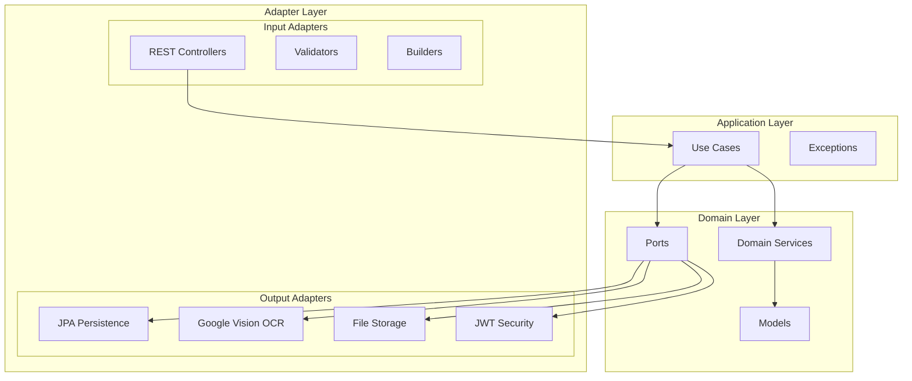
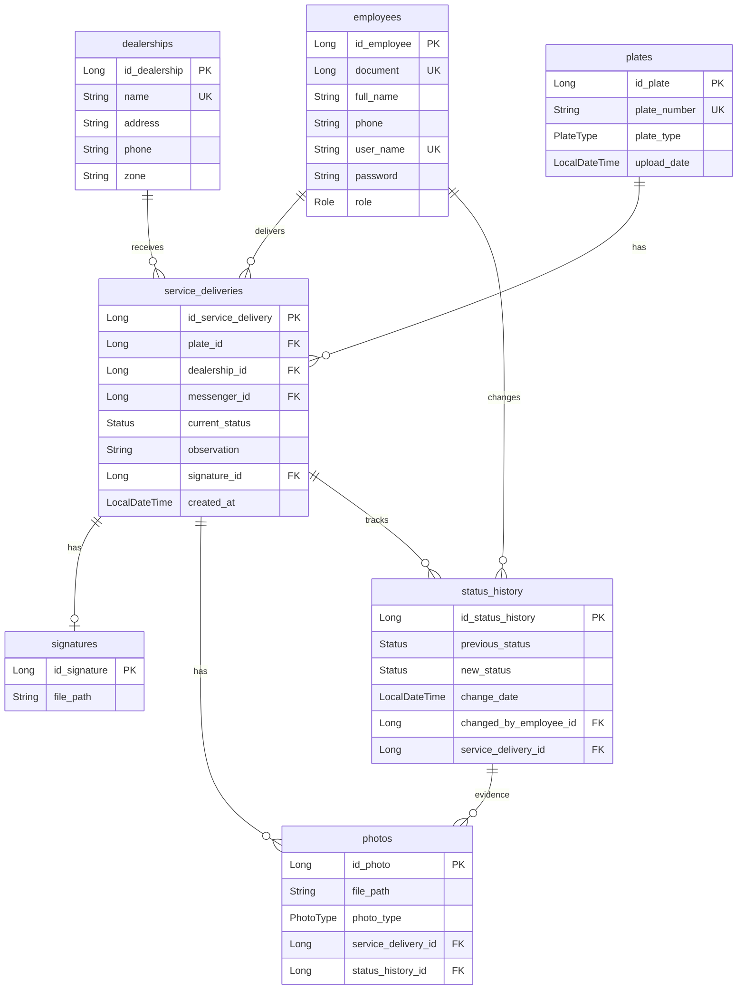
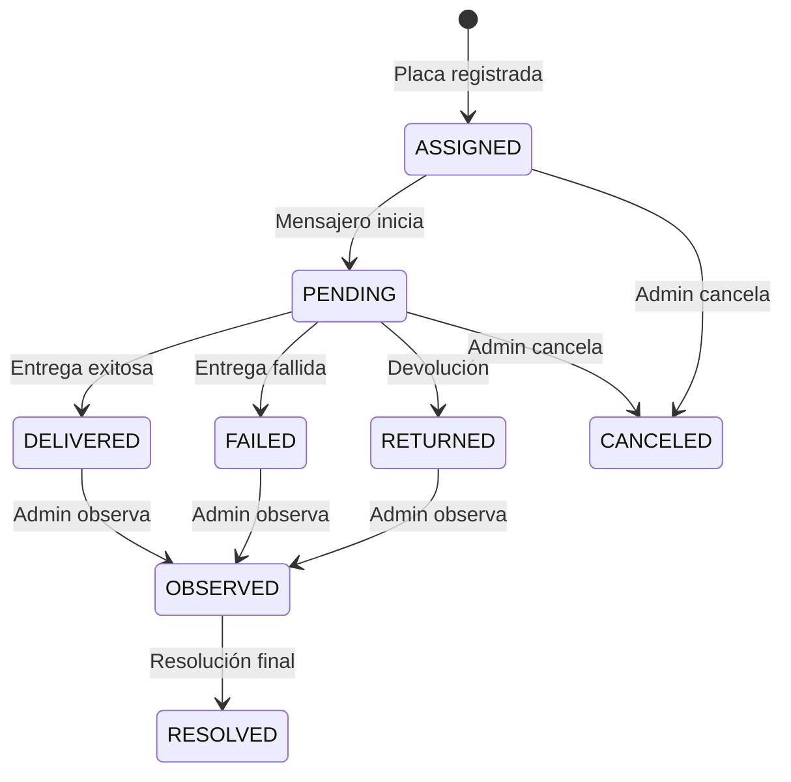

# 🚀 Messenger Backend API

Sistema de gestión de entregas y mensajería para operaciones de tránsito. Backend REST API con reconocimiento automático de placas vehiculares mediante OCR.

## 📋 Tabla de Contenidos

- [Arquitectura](#-arquitectura)
- [Stack Tecnológico](#-stack-tecnológico)
- [Estructura del Proyecto](#-estructura-del-proyecto)
- [API Endpoints](#-api-endpoints)
- [Esquema de Base de Datos](#-esquema-de-base-de-datos)
- [Flujo de Estados](#-flujo-de-estados)
- [Seguridad](#-seguridad)
- [Configuración e Instalación](#️-configuración-e-instalación)
- [Colección Postman](#-colección-postman)

---

## 🏗 Arquitectura

El proyecto implementa **Arquitectura Hexagonal (Ports & Adapters)** para mantener el dominio aislado de las dependencias externas.



---

## 💻 Stack Tecnológico

| Componente | Tecnología |
|------------|------------|
| **Framework** | Spring Boot 4.0.0 |
| **Lenguaje** | Java 21 |
| **Base de Datos** | MySQL 8.0+ |
| **Seguridad** | JWT + BCrypt |
| **OCR** | Google Cloud Vision API |
| **Build** | Maven 3.9+ |
| **Validación** | Spring Validation |

---

## 📁 Estructura del Proyecto

```
messenger/
├── src/main/java/app/
│   ├── MessengerApplication.java
│   ├── adapter/
│   │   ├── in/                          # Adaptadores de entrada
│   │   │   ├── builder/                 # Constructores de objetos
│   │   │   ├── rest/
│   │   │   │   ├── controllers/         # 5 REST Controllers
│   │   │   │   ├── mapper/              # Mappers Request/Response
│   │   │   │   ├── request/             # DTOs de entrada
│   │   │   │   └── response/            # DTOs de salida
│   │   │   └── validators/              # Validadores de entrada
│   │   └── out/                         # Adaptadores de salida
│   │       ├── files/                   # Almacenamiento de archivos
│   │       ├── ocr/                     # Google Vision OCR
│   │       ├── persistence/             # JPA Adapters
│   │       └── security/                # JWT Adapter
│   ├── application/
│   │   ├── exceptions/                  # BusinessException, InputsException
│   │   └── usecase/                     # 4 Use Cases
│   ├── domain/
│   │   ├── model/                       # 7 Modelos de dominio + enums
│   │   ├── ports/                       # 7 Puertos (interfaces)
│   │   └── services/                    # 15 Servicios de dominio
│   └── infrastructure/
│       ├── persistence/
│       │   ├── entities/                # 7 Entidades JPA
│       │   ├── mapper/                  # Entity ↔ Domain mappers
│       │   └── repository/              # Spring Data Repositories
│       └── security/                    # SecurityConfig, JwtFilter
└── src/main/resources/
    └── application.properties
```

---

## 🔌 API Endpoints

### Autenticación (`/auth`)

| Método | Endpoint | Descripción | Auth |
|--------|----------|-------------|------|
| `POST` | `/auth/login` | Iniciar sesión | 🔓 Público |

### Empleados (`/employees`) - Solo ADMIN

| Método | Endpoint | Descripción |
|--------|----------|-------------|
| `POST` | `/employees` | Crear empleado |
| `GET` | `/employees` | Listar todos |
| `GET` | `/employees/{id}` | Obtener por ID |
| `PUT` | `/employees/{id}` | Actualizar |
| `DELETE` | `/employees/{id}` | Eliminar |

### Concesionarios (`/dealerships`)

| Método | Endpoint | Descripción | Auth |
|--------|----------|-------------|------|
| `POST` | `/dealerships` | Crear | ADMIN |
| `GET` | `/dealerships` | Listar | Autenticado |
| `GET` | `/dealerships/{id}` | Obtener por ID | Autenticado |
| `PUT` | `/dealerships/{id}` | Actualizar | ADMIN |
| `DELETE` | `/dealerships/{id}` | Eliminar | ADMIN |

### Servicios de Entrega (`/services`)

| Método | Endpoint | Descripción |
|--------|----------|-------------|
| `POST` | `/services/create` | Crear servicio (multipart: image, dealershipId, messengerDocument, manualPlateNumber) |
| `PUT` | `/services/{id}/status` | Actualizar estado (multipart: status, observation, signature, photos) |
| `GET` | `/services` | Listar todos (ADMIN) o propios (MESSENGER) |
| `GET` | `/services/{id}` | Obtener por ID |
| `GET` | `/services/messenger/{doc}` | Filtrar por mensajero |
| `GET` | `/services/dealership/{id}` | Filtrar por concesionario |
| `GET` | `/services/status/{status}` | Filtrar por estado |

### Archivos (`/api/files`)

| Método | Endpoint | Descripción | Auth |
|--------|----------|-------------|------|
| `GET` | `/api/files/{filename}` | Obtener archivo | 🔓 Público |

---

## 🗄 Esquema de Base de Datos



### Enums

**Role:** `ADMIN`, `MESSENGER`

**PlateType:** `CAR` (ABC 123), `MOTORCYCLE` (ABC 12A), `MOTORCAR` (123 ABC)

**Status:** `ASSIGNED`, `PENDING`, `DELIVERED`, `FAILED`, `RETURNED`, `CANCELED`, `OBSERVED`, `RESOLVED`

---

## 🔄 Flujo de Estados



### Requisitos de Evidencia

| Estado | Firma | Fotos | Observación |
|--------|:-----:|:-----:|:-----------:|
| `DELIVERED` | ✅ Requerida | ⚪ Opcional | ⚪ Opcional |
| `PENDING` | ✅ Requerida | ✅ Requeridas | ✅ Requerida |
| `FAILED` | ✅ Requerida | ✅ Requeridas | ✅ Requerida |
| `RETURNED` | ✅ Requerida | ✅ Requeridas | ✅ Requerida |
| `CANCELED` | ⚪ No aplica | ⚪ No aplica | ⚪ No aplica |
| `OBSERVED` | ⚪ No aplica | ⚪ No aplica | ⚪ No aplica |

---

## 🔐 Seguridad

### Autenticación JWT
- Tokens firmados con HMAC-SHA256
- Expiración: 30 minutos
- Header: `Authorization: Bearer <token>`

### Roles y Permisos
- **ADMIN**: Acceso completo a todos los endpoints
- **MESSENGER**: Solo puede ver/gestionar sus propios servicios

### CORS
Orígenes permitidos (desarrollo):
- `http://localhost:3000` (React)
- `http://localhost:4200` (Angular)
- `http://localhost:5173` (Vite)

---

## ⚙️ Configuración e Instalación

### Prerrequisitos
- Java 21+
- MySQL 8.0+
- Maven 3.9+
- Credenciales de Google Cloud Vision API

### 1. Clonar repositorio
```bash
git clone <repository-url>
cd messenger-backend/messenger
```

### 2. Configurar Base de Datos
```sql
CREATE DATABASE messenger;
```

### 3. Configurar `application.properties`
```properties
# Base de Datos
spring.datasource.url=jdbc:mysql://localhost:3306/messenger
spring.datasource.username=root
spring.datasource.password=<tu-password>

# Almacenamiento de archivos
app.storage.path=/ruta/a/uploads

# Google Cloud Vision
google.cloud.credentials.path=config/google-vision-credentials.json

# JWT
jwt.secret=<tu-clave-secreta-base64>
jwt.expiration=1800000
```

### 4. Configurar Google Cloud Vision
Coloca tu archivo de credenciales en:
```
messenger/config/google-vision-credentials.json
```

### 5. Ejecutar
```bash
./mvnw spring-boot:run
```

La API estará disponible en `http://localhost:8080`

---

## 📬 Colección Postman

Importa la colección incluida para probar todos los endpoints:

📄 **[Messenger_API.postman_collection.json](./Messenger_API.postman_collection.json)**

### Características:
- ✅ Guardado automático de token JWT
- ✅ Variables de entorno preconfiguradas
- ✅ Ejemplos de payloads para todos los endpoints
- ✅ Documentación inline de cada request

### Uso:
1. Importar colección en Postman
2. Ejecutar "Login" primero (el token se guarda automáticamente)
3. Los demás endpoints usarán el token guardado

---

## 📄 Licencia

Ver archivo [LICENSE](./LICENSE) para detalles.
