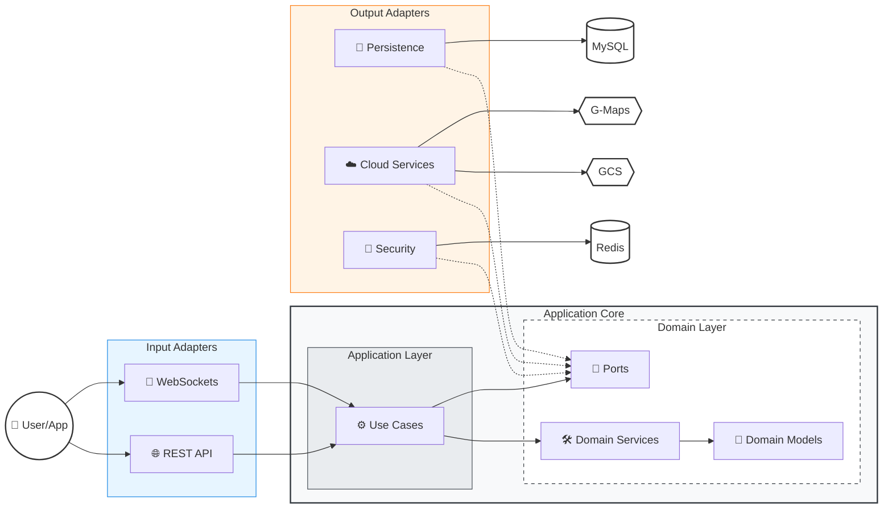
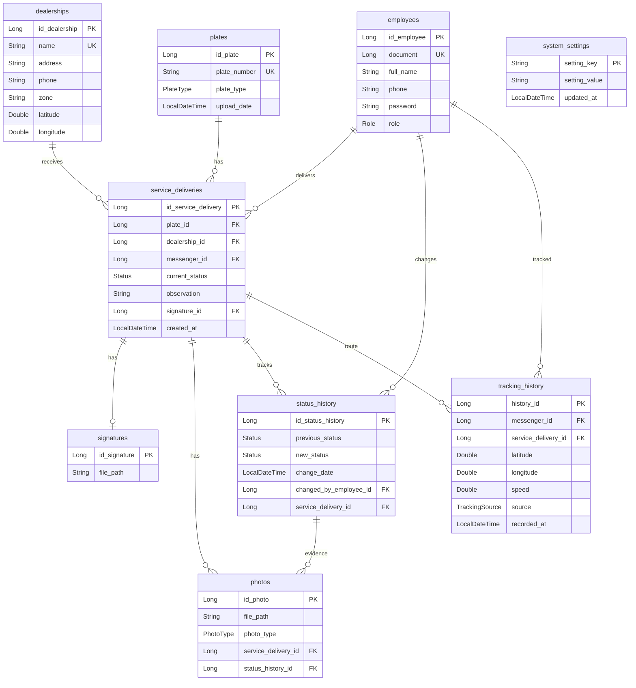
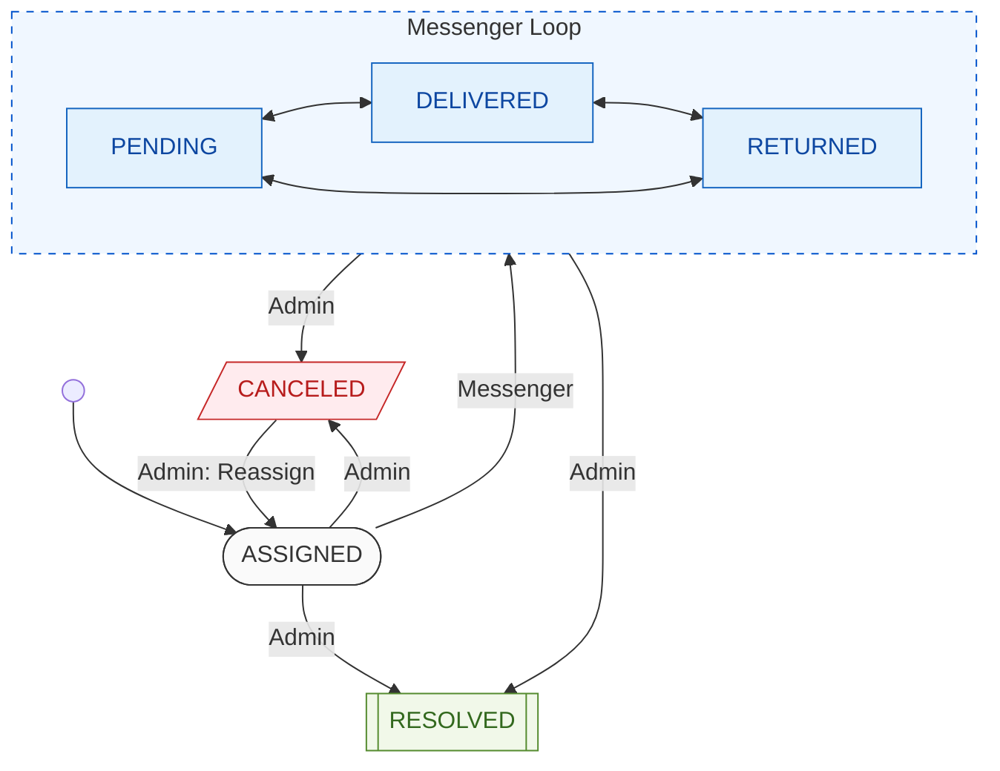
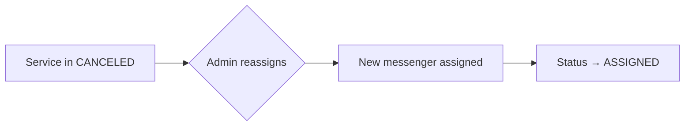

> **Copyright (C) 2025 Mateo Valencia Ardila. All rights reserved. Confidential and Proprietary.**

<div align="center">

# 🚀 Messenger Backend API

[](https://openjdk.org/)
[](https://spring.io/projects/spring-boot)
[](https://www.mysql.com/)
[](https://redis.io/)

**Delivery management system with automatic license plate recognition via OCR.**

[🇪🇸 Versión en Español](./README.es.md)

</div>

---

## 📋 Table of Contents

- [Architecture](#-architecture)
- [Tech Stack](#-tech-stack)
- [Project Structure](#-project-structure)
- [Environment Profiles](#-environment-profiles)
- [API Endpoints](#-api-endpoints)
- [Database Schema](#-database-schema)
- [Real-Time Tracking](#-real-time-tracking)
- [State Flow](#-state-flow)
- [Security](#-security)
- [Observability](#-observability)
- [Auditing](#-auditing)
- [Setup & Installation](#️-setup--installation)
- [CI/CD](#-cicd)
- [Testing](#-testing)
- [Postman Collection](#-postman-collection)

---

## 🏗 Architecture

The project implements **Hexagonal Architecture (Ports & Adapters)** to keep the domain isolated from external dependencies.


```mermaid
graph LR
    %% External Actors
    USER((👤 User/App))
    MAPS{{G-Maps}}
    GCS{{GCS}}
    DB[(MySQL)]
    REDIS[(Redis)]

    subgraph IN [Input Adapters]
        direction TB
        REST[🌐 REST API]
        SOC[🔌 WebSockets]
    end

    subgraph CORE [Application Core]
        direction TB
        subgraph APP [Application Layer]
            UC[⚙️ Use Cases]
        end
        subgraph DOMAIN [Domain Layer]
            SVC[🛠️ Domain Services]
            PORTS[🎯 Ports]
            MODEL[💎 Domain Models]
        end
    end

    subgraph OUT [Output Adapters]
        direction TB
        PERS[💾 Persistence]
        CLD[☁️ Cloud Services]
        SEC[🔐 Security]
    end

    %% Inbound Flow
    USER --> REST & SOC
    REST & SOC --> UC

    %% Application Logic
    UC --> SVC
    UC --> PORTS
    SVC --> MODEL

    %% Outbound Flow (Dependency Inversion)
    PERS -.-> PORTS
    CLD -.-> PORTS
    SEC -.-> PORTS

    %% Infrastructure Connections
    PERS --> DB
    CLD --> GCS & MAPS
    SEC --> REDIS

    %% Styling
    style CORE fill:#f8f9fa,stroke:#343a40,stroke-width:2px
    style DOMAIN fill:#ffffff,stroke:#343a40,stroke-dasharray: 5 5
    style APP fill:#e9ecef,stroke:#495057
    style IN fill:#e7f5ff,stroke:#228be6
    style OUT fill:#fff4e6,stroke:#fd7e14
    
    classDef actor fill:#fff,stroke:#333,stroke-width:2px
    class USER,MAPS,GCS,DB,REDIS actor
```

---

## 💻 Tech Stack

| Component | Technology |
|-----------|------------|
| **Framework** | Spring Boot 4.x |
| **Language** | Java 17 |
| **Database** | MySQL 8.0+ |
| **Migrations** | Flyway |
| **Cache/Streaming** | Redis |
| **Security** | JWT + BCrypt + Bucket4j (Rate Limiting) |
| **Documentation** | OpenAPI / Swagger UI |
| **OCR** | Google Cloud Vision API |
| **Storage** | Google Cloud Storage |
| **Maps** | Google Maps Platform |
| **Real-Time** | WebSocket + Redis |
| **Build** | Maven 3.9+ |
| **Monitoring** | Spring Boot Actuator (Health, Metrics) |
| **Auditing** | JPA Callbacks + AOP (Aspect Oriented Programming) |
| **CI/CD** | GitHub Actions |
| **Architecture Testing** | ArchUnit |
| **Performance** | Database Indices (Optimization for pagination) |

---

## 📁 Project Structure

```
messenger/
├── src/main/java/app/
│   ├── MessengerApplication.java
│   ├── adapter/
│   │   ├── in/                          # Input Adapters
│   │   │   ├── builder/                 # Object Builders
│   │   │   ├── rest/
│   │   │   │   ├── controllers/         # 9 REST Controllers
│   │   │   │   ├── mapper/              # Request/Response Mappers
│   │   │   │   ├── request/             # Input DTOs
│   │   │   │   └── response/            # Output DTOs
│   │   │   └── validators/              # Input Validators
│   │   └── out/                         # Output Adapters
│   │       ├── maps/                    # Google Maps Integration
│   │       ├── ocr/                     # Google Vision OCR
│   │       ├── security/                # JWT Adapter
│   │       ├── storage/                 # Google Cloud Storage
│   │       └── tracking/                # Location Tracking
│   ├── application/
│   │   ├── exceptions/                  # BusinessException, InputsException
│   │   └── usecase/                     # 11 Use Cases (Monitoring, Settings, Location...)
│   ├── domain/
│   │   ├── model/                       # 12+ Models + 7 Enums + Auth
│   │   ├── ports/                       # 10 Ports (interfaces)
│   │   └── services/                    # Domain Services
│   └── infrastructure/
│       ├── persistence/
│       │   ├── entities/                # JPA Entities
│       │   ├── mapper/                  # Entity ↔ Domain mappers
│       │   └── repository/              # Spring Data Repositories
│       └── security/                    # SecurityConfig, JwtFilter
└── src/main/resources/
    ├── application.properties           # Base Configuration
    ├── application-local.properties     # Local Development (H2)
    ├── application-dev.properties       # Development with APIs
    ├── application-test.properties      # Automated Testing
    ├── application-prod.properties      # Production
    └── db/migration/                    # Flyway Migrations
```

---

## 🌍 Environment Profiles

| Profile | Purpose | Database | External APIs | JWT Exp. |
|---------|---------|----------|---------------|----------|
| `local` | Local development without dependencies | H2 In-Memory | Mock/Disabled | 8 hours |
| `dev` | Development with real services | MySQL | Enabled | 8 hours |
| `test` | Automated testing (CI/CD) | H2 In-Memory | Mock | 1 hour |
| `prod` | Production (Cloud Run) | MySQL (SSL) | Enabled (JSON Logs) | 30 min |

### Profile Characteristics

<details>
<summary><b>🏠 Local</b> - No external dependencies</summary>

- H2 in-memory database
- Simulated OCR (placeholder)
- Local file storage
- Detailed logging
- Perfect for offline development

</details>

<details>
<summary><b>🔧 Dev</b> - Development with APIs</summary>

- MySQL development database
- Google Cloud APIs enabled
- SQL visible for debugging
- Actuator endpoints enabled
- Tracking interval: 15 seconds

</details>

<details>
<summary><b>🧪 Test</b> - Automated testing</summary>

- H2 in-memory (isolation)
- Mock services
- No external dependencies
- GitHub Actions compatible

</details>

<details>
<summary><b>🚀 Prod</b> - Production (Cloud Run Optimized)</summary>

- MySQL with mandatory SSL
- Optimized connection pool (HikariCP)
- **Structured JSON Logging** (Logstash Encoder)
- Graceful shutdown enabled (30s timeout)
- Security headers (HSTS, HTTP-only cookies)
- Compression enabled
- No exposed stack traces
- Cloud Run Proxy support (Forwarded Headers)

</details>

### Activation

```bash
# Environment variable (recommended)
export SPRING_PROFILES_ACTIVE=dev

# Command line
./mvnw spring-boot:run -Dspring.profiles.active=dev

# Docker
docker run -e SPRING_PROFILES_ACTIVE=prod messenger-api
```

---

## 🔌 API Endpoints

### Authentication (`/auth`)

| Method | Endpoint | Description |
|--------|----------|-------------|
| `POST` | `/auth/login` | Login and receive access + refresh tokens |
| `POST` | `/auth/refresh` | Renew access token with refresh token |

---

### Employees (`/employees`) - ADMIN only

| Method | Endpoint | Description |
|--------|----------|-------------|
| `POST` | `/employees/createEmployee` | Create new employee |
| `GET` | `/employees/allEmployees` | List all employees |
| `GET` | `/employees/findByEmployeeId/{id}` | Get employee by ID |
| `PUT` | `/employees/updateEmployee/{id}` | Update existing employee |
| `DELETE` | `/employees/deleteEmployee/{id}` | Delete employee |

---

### Dealerships (`/dealerships`)

| Method | Endpoint | Description |
|--------|----------|-------------|
| `POST` | `/dealerships/createDealership` | Create dealership (ADMIN) |
| `GET` | `/dealerships/allDealerships` | List all dealerships |
| `GET` | `/dealerships/findByDealershipId/{id}` | Get by ID |
| `GET` | `/dealerships/findByDealershipName/{name}` | Get by Name |
| `PUT` | `/dealerships/updateDealership/{id}` | Update dealership (ADMIN) |
| `DELETE` | `/dealerships/deleteDealership/{id}` | Delete dealership (ADMIN) |
| `POST` | `/dealerships/geocodeDealership/{id}` | Geocode dealership address (ADMIN) |

---

### Service Deliveries (`/services`)

| Method | Endpoint | Description |
|--------|----------|-------------|
| `POST` | `/services/createService` | Create service (multipart: image + data) |
| `PUT` | `/services/updateService/{id}` | Update status (multipart: status + evidence) |
| `PUT` | `/services/reassign/{id}` | Reassign to another messenger (ADMIN/CANCELED) |
| `GET` | `/services/findByServiceId/{id}` | Get service by ID |
| `GET` | `/services/allServices` | List services (filtered by role) |
| `GET` | `/services/allServicesPageable` | List services with **pagination & search** |
| `GET` | `/services/stats/daily` | Daily stats (requires messengerId, from, to) |
| `DELETE` | `/services/deleteService/{id}` | Move to trash (ADMIN) |
| `GET` | `/services/trash` | List deleted services (ADMIN) |
| `POST` | `/services/trash/restore/{id}` | Restore from trash (ADMIN) |
| `DELETE` | `/services/trash/empty` | Empty trash permanently (ADMIN) |
| `DELETE` | `/services/trash/{id}` | Permanent delete individual item (ADMIN) |

---

### System Settings (`/settings`) - ADMIN only

| Method | Endpoint | Description |
|--------|----------|-------------|
| `GET` | `/settings/status-colors` | Get status color configuration |
| `PUT` | `/settings/status-colors` | Update status color configuration |

---

### Locations & Routes (`/locations`)

| Method | Endpoint | Description |
|--------|----------|-------------|
| `POST` | `/locations/geocode` | Address to coordinates |
| `POST` | `/locations/route` | Calculate optimized route |
| `GET` | `/locations/distance` | Distance + time estimate between points |
| `GET` | `/locations/reverse` | Coordinates to address |

---

### Files (`/files`)

| Method | Endpoint | Description |
|--------|----------|-------------|
| `GET` | `/files/{filename}` | Download protected file (photos/signatures) |

---

### Real-Time Tracking (`/tracking`)

| Method | Endpoint | Description |
|--------|----------|-------------|
| `POST` | `/tracking/update` | Update messenger live location |
| `GET` | `/tracking/messenger/{id}` | Get last known location (ADMIN) |
| `GET` | `/tracking/active` | Get all active messengers (ADMIN) |
| `GET` | `/tracking/history/{id}` | Get history by date (`?date=YYYY-MM-DD`) |
| `GET` | `/tracking/service/{id}` | Get history for a specific service |

---

### Monitoring (`/monitoring`) - ADMIN only

| Method | Endpoint | Description |
|--------|----------|-------------|
| `GET` | `/monitoring/messenger/{id}/activity` | Get daily activity timeline + stats for a messenger |

---

## 🗄 Database Schema


```mermaid
erDiagram
    employees {
        Long id_employee PK
        Long document UK
        String full_name
        String phone

        String password
        Role role
    }
    
    dealerships {
        Long id_dealership PK
        String name UK
        String address
        String phone
        String zone
        Double latitude
        Double longitude
    }
    
    plates {
        Long id_plate PK
        String plate_number UK
        PlateType plate_type
        LocalDateTime upload_date
    }
    
    service_deliveries {
        Long id_service_delivery PK
        Long plate_id FK
        Long dealership_id FK
        Long messenger_id FK
        Status current_status
        String observation
        Long signature_id FK
        LocalDateTime created_at
    }
    
    signatures {
        Long id_signature PK
        String file_path
    }
    
    photos {
        Long id_photo PK
        String file_path
        PhotoType photo_type
        Long service_delivery_id FK
        Long status_history_id FK
    }
    
    status_history {
        Long id_status_history PK
        Status previous_status
        Status new_status
        LocalDateTime change_date
        Long changed_by_employee_id FK
        Long service_delivery_id FK
    }
    
    tracking_history {
        Long history_id PK
        Long messenger_id FK
        Long service_delivery_id FK
        Double latitude
        Double longitude
        Double speed
        TrackingSource source
        LocalDateTime recorded_at
    }
    
    system_settings {
        String setting_key PK
        String setting_value
        LocalDateTime updated_at
    }
    
    employees ||--o{ service_deliveries : "delivers"
    dealerships ||--o{ service_deliveries : "receives"
    plates ||--o{ service_deliveries : "has"
    service_deliveries ||--o| signatures : "has"
    service_deliveries ||--o{ photos : "has"
    service_deliveries ||--o{ status_history : "tracks"
    employees ||--o{ status_history : "changes"
    status_history ||--o{ photos : "evidence"
    employees ||--o{ tracking_history : "tracked"
    service_deliveries ||--o{ tracking_history : "route"
```

### Enums

| Enum | Values |
|------|--------|
| **Role** | `ADMIN`, `MESSENGER` |
| **PlateType** | `CAR` (ABC 123), `MOTORCYCLE` (ABC 12A), `MOTORCAR` (123 ABC) |
| **Status** | `ASSIGNED`, `PENDING`, `DELIVERED`, `RETURNED`, `CANCELED`, `RESOLVED` |
| **PhotoType** | `EVIDENCE`, `SIGNATURE`, `PLATE` |
| **TrackingStatus** | `ACTIVE`, `INACTIVE`, `OFFLINE` |
| **TrackingSource** | `GPS`, `NETWORK`, `MANUAL` |

---

## 📡 Real-Time Tracking

GPS tracking system using **Redis** + **WebSocket** for messenger monitoring.

### Features

| Feature | Description |
|---------|-------------|
| 🔴 **Live location** | Updates every 30 seconds |
| 📍 **Delivery validation** | Maximum 200m radius from destination |
| 📊 **Complete history** | 30-day retention |
| ⚡ **Low latency** | Redis for location caching |
| 🌐 **WebSocket** | Real-time push notifications |

### Google Maps Integration

- **Geocoding**: Address ↔ Coordinates
- **Directions API**: Optimized routes
- **Distance Matrix**: Time estimation
- **Reverse Geocoding**: Coordinates → Address

---

## 🔄 State Flow


```mermaid
flowchart TD
    %% Entry
    S(( )) --> ASSIGNED([ASSIGNED])

    %% Operational Loop (Blue)
    subgraph OPERATIONAL [Messenger Loop]
        direction LR
        PENDING[PENDING]
        DELIVERED[DELIVERED]
        RETURNED[RETURNED]
        
        PENDING <--> DELIVERED
        DELIVERED <--> RETURNED
        RETURNED <--> PENDING
    end

    %% Administrative Transitions (Red/Green)
    CANCELED[/CANCELED/]
    RESOLVED[[RESOLVED]]

    %% Primary Flows
    ASSIGNED -- "Messenger" --> OPERATIONAL
    
    %% Exit arrows (Admin Only)
    ASSIGNED -- "Admin" --> CANCELED
    ASSIGNED -- "Admin" --> RESOLVED
    
    OPERATIONAL -- "Admin" --> CANCELED
    OPERATIONAL -- "Admin" --> RESOLVED

    %% Reassign Path
    CANCELED -- "Admin: Reassign" --> ASSIGNED

    %% Styling
    style OPERATIONAL fill:#f0f7ff,stroke:#0052cc,stroke-dasharray: 5 5
    classDef messenger fill:#e3f2fd,stroke:#1565c0,color:#0d47a1
    classDef cancel fill:#ffebee,stroke:#c62828,color:#b71c1c
    classDef resolve fill:#f1f8e9,stroke:#558b2f,color:#33691e
    classDef initial fill:#fafafa,stroke:#333
    
    class PENDING,DELIVERED,RETURNED messenger
    class CANCELED cancel
    class RESOLVED resolve
    class ASSIGNED initial
```

### Business Rules

> [!IMPORTANT]
> **Role-Based Status Transitions**
> - **MESSENGER** can only use: `PENDING`, `DELIVERED`, `RETURNED`.
> - **ADMIN** can only use: `CANCELED`, `RESOLVED`.
> - Services can be modified at any time regardless of their current state.
> - Admins can reassign **CANCELED** services to another messenger.

> [!NOTE]
> **Evidence Requirements**
> - **DELIVERED**: Signature is mandatory.
> - **PENDING** & **RETURNED**: Signature, at least one photo, and observation are mandatory.
> - **CANCELED** & **RESOLVED**: No additional evidence required.

> [!NOTE]
> **Soft Delete (Trash Bin)**
> Deleted services are moved to a **trash bin** and permanently deleted after **60 days**.
> Admins can restore services from the trash before permanent deletion.

### State Rules

| State | Messenger | Admin | Delete |
|-------|-----------|-------|--------|
| `ASSIGNED` | → `PENDING`, `DELIVERED`, `RETURNED` | → `CANCELED`, `RESOLVED` | ✅ Trash |
| `RETURNED` | → `PENDING`, `DELIVERED` | → `CANCELED`, `RESOLVED` | ✅ Trash |
| `PENDING` | → `DELIVERED`, `RETURNED` | → `CANCELED`, `RESOLVED` | ✅ Trash |
| `DELIVERED` | → `PENDING`, `RETURNED` | → `CANCELED`, `RESOLVED` | ✅ Trash |
| `CANCELED` | - | Admin can **reassign** → `ASSIGNED` | ✅ Trash |
| `RESOLVED` | - | - | ✅ Trash |

### Permissions Summary

| Role | Available States | Special Actions | Notes |
|------|------------------|-----------------|-------|
| **MESSENGER** | `PENDING`, `DELIVERED`, `RETURNED` | - | Can change services to any allowed state at any time |
| **ADMIN** | `CANCELED`, `RESOLVED` | **Reassign messenger** (from `CANCELED` only) | Can change services to admin states from any current state |

### Reassignment Flow


```mermaid
flowchart LR
    A[Service in CANCELED] --> B{Admin reassigns}
    B --> C[New messenger assigned]
    C --> D[Status → ASSIGNED]
```


### Trash Management (Soft Delete & Archive)

| Action | Endpoint | Description |
|--------|----------|-------------|
| Delete → Trash | `DELETE /services/{id}` | Moves to trash (soft delete) |
| View Trash | `GET /services/trash` | Lists deleted services (ADMIN) |
| Restore | `POST /services/trash/restore/{id}` | Restores from trash (ADMIN) |
| Empty Trash | `POST /services/trash/empty` | Archives all trash items (ADMIN) |
| Auto-Archive | Scheduled job (3 AM daily) | Archives services after 60 days |

**Archive System**: Services are permanently archived to dedicated tables (`deleted_services`, `deleted_status_history`, `deleted_photos`, `deleted_tracking_history`, `deleted_signatures`) instead of being deleted. All historical data is preserved for auditing and analytics.


---

## 🔐 Security

### JWT Authentication with Refresh Tokens

```
┌─────────────┐     ┌─────────────┐     ┌─────────────┐
│   Client    │────▶│   /login    │────▶│   Server    │
└─────────────┘     └─────────────┘     └─────────────┘
                           │
                           ▼
              ┌─────────────────────────┐
              │  {                      │
              │    token: "...",        │
              │    refreshToken: "...", │
              │    role: "ADMIN"        │
              │  }                      │
              └─────────────────────────┘
                           │
                           ▼
                   ┌───────────────┐
                   │  API Request  │
                   │  Header:      │
                   │  Authorization│
                   │  Bearer token │
                   └───────────────┘
                           │
                   Token expired?
                           │
                           ▼
                   ┌───────────────┐
                   │ /auth/refresh │
                   │ refreshToken  │
                   └───────────────┘
                           │
                           ▼
                   New token pair
```

| Token | Prod Duration | Dev Duration | Local Duration | Usage |
|-------|---------------|--------------|----------------|-------|
| **Access Token** | 30 minutes | 8 hours | 8 hours | Header `Authorization: Bearer <token>` |
| **Refresh Token** | 7 days | 7 days | 7 days | Endpoint `/auth/refresh` to renew |

### Security Features

- 🔄 **Token Rotation**: Each refresh generates a new token pair
- 🔒 **Stateless**: No tokens stored server-side (Redis only for data caching)
- ⏱️ **Auto Expiration**: Tokens expire automatically
- 🛡️ **HMAC-SHA256**: Robust digital signature algorithm

### Rate Limiting

- Implemented with **Bucket4j** to prevent abuse
- Limits applied per IP address
- Response headers: `X-Rate-Limit-Remaining`, `X-Rate-Limit-Retry-After-Seconds`

### Roles & Permissions

- **ADMIN**: Full access to all endpoints
- **MESSENGER**: Only manages own services and location

### Security Headers (Production)

- HSTS (HTTP Strict Transport Security)
- Cookies: `Secure`, `HttpOnly`, `SameSite=Strict`
- CORS configured by origin
- No stack trace exposure

---

## 📊 Observability

### Monitoring Endpoints (Actuator)

| Endpoint | Description | Profile |
|----------|-------------|---------|
| `/actuator/health` | Health status (DB, Redis, Disk) | All |
| `/actuator/metrics` | JVM and HTTP metrics | `dev`, `prod` |
| `/actuator/env` | Environment variables | `dev` |
| `/actuator/info` | Build information | All |

### Cloud Run Optimization

- **JSON Logging (Prod):** Structured output compatible with Google Cloud Logging
- **Graceful Shutdown:** Waits 30s to finish active connections
- **SSL Offloading:** Trusts proxy headers (`X-Forwarded-Proto`) from Cloud Run

### API Documentation

| Endpoint | Description |
|----------|-------------|
| `/swagger-ui/index.html` | Interactive Swagger UI |
| `/v3/api-docs` | OpenAPI 3.0 Specification (JSON) |
| `/v3/api-docs.yaml` | OpenAPI 3.0 Specification (YAML) |

> [!TIP]
> Swagger UI is publicly accessible in `dev` profile. In production, consider restricting access via security configuration.

---

## 📝 Auditing

### AOP-Based Audit System

The application includes a centralized **audit logging system** using Aspect-Oriented Programming (AOP). Critical actions are automatically logged with user context, timing, and results.

### Audited Actions

| Component | Action | Description |
|-----------|--------|-------------|
| **AuthController** | `LOGIN` | User login attempts |
| | `TOKEN_REFRESH` | Access token renewal |
| **ServiceDeliveryUseCase** | `CREATE_SERVICE` | Create service from OCR image |
| | `CREATE_SERVICE_MANUAL` | Create service with manual plate |
| | `UPDATE_STATUS` | Update service status |
| | `REASSIGN_MESSENGER` | Reassign service to another messenger |
| | `DELETE_SERVICE` | Move service to trash |
| | `RESTORE_SERVICE` | Restore service from trash |
| | `EMPTY_TRASH` | Permanently empty trash |
| **EmployeeUseCase** | `CREATE_EMPLOYEE` | Create new employee |
| | `UPDATE_EMPLOYEE` | Update employee information |
| | `DELETE_EMPLOYEE` | Delete employee |

---

## 🏗 Architecture Verification

The project includes **ArchUnit** tests to enforce structural integrity and ensure that the **Hexagonal Architecture** principles are never violated.

### Automated Rules
- **Layer Isolation**: Domain and Application layers must never depend on Infrastructure.
- **Dependency Flow**: Input adapters must only talk to Use Cases, and Use Cases must only interact with Domain services or Ports.
- **Package Integrity**: Controllers, entities, and repositories must reside in their respective adapter/infrastructure packages.

Run architecture tests:
```bash
mvn test -Dtest=HexagonalArchitectureTest
```

---

### Log Format

```
AUDIT | timestamp | user_document | action | method | params | status | duration | error
```

**Example:**
```
2025-12-21 00:42:00.123 [AUDIT] AUDIT | 2025-12-21 00:42:00 | 123456 | UPDATE_STATUS | ServiceDeliveryUseCase.updateStatus | [1, DELIVERED, "Delivered", ...] | SUCCESS | 125ms |
```

### Configuration

- **Logger Name:** `AUDIT`
- **Level:** `WARN` (always visible in all environments)
- **Output:** Console (Cloud Run captures stdout)
- **File Output:** Optional, enable `AUDIT_FILE` appender in `logback-spring.xml`

---

## ⚙️ Setup & Installation

> 🚀 **Deploying to Production?** See the complete [**Cloud Run Deployment Guide**](./DEPLOY_CLOUDRUN.md) for step-by-step instructions on deploying to Google Cloud.

### Prerequisites

| Requirement | Version |
|-------------|---------|
| Java | 17+ |
| MySQL | 8.0+ |
| Redis | 6.0+ |
| Maven | 3.9+ |

### Environment Variables

<details>
<summary><b>🔐 Required Variables</b></summary>

```bash
# Database
DB_HOST=localhost
DB_PORT=3306
DB_NAME=messenger
DB_USERNAME=root
DB_PASSWORD=your_password

# JWT
JWT_SECRET=your_base64_encoded_secret_key

# Redis
REDIS_HOST=localhost
REDIS_PORT=6379
REDIS_PASSWORD=            # Production only

# Google Cloud
GCP_PROJECT_ID=your_project_id
GCS_BUCKET_NAME=your_bucket_name
GOOGLE_MAPS_API_KEY=your_api_key
GOOGLE_APPLICATION_CREDENTIALS=/path/to/credentials.json
```

</details>

### Quick Start

```bash
# 1. Clone
git clone <repository-url>
cd messenger-backend/messenger

# 2. Configure variables (see above section)

# 3. Start Redis
redis-server

# 4. Run
./mvnw spring-boot:run -Dspring.profiles.active=dev
```

API available at `http://localhost:8080`

---

## 🔄 CI/CD

Automated pipeline with **GitHub Actions**:

```yaml
# .github/workflows/maven.yml
on:
  push:
    branches: [ "main" ]
  pull_request:
    branches: [ "main" ]
```

### Features

| Feature | Description |
|---------|-------------|
| ✅ Automated build | Java 17 + Maven |
| ✅ Dependency caching | Faster builds |
| ✅ Secure secrets | Credential injection |
| ✅ Testing | `test` profile with H2 |

### Required GitHub Secrets

```
GOOGLE_APPLICATION_CREDENTIALS_JSON
```

> [!NOTE]
> Database and API secrets are no longer required for the CI pipeline as it uses an isolated H2 environment with mocked services.

---

## 🧪 Testing

- **Unit Tests**: Comprehensive coverage for all adapters
- **Integration Tests**: JPA repositories and domain services
- **Test Profile**: Isolated H2 database, no external dependencies
- **Coverage**: 100+ tests across adapters, use cases, and repositories

---

## 📬 Postman Collection

📄 **[Messenger_API.postman_collection.json](./Messenger_API.postman_collection.json)**

### Features

- ✅ **JWT and Refresh Token** saved automatically
- ✅ **Environment variables** preconfigured (`baseUrl`, `token`, `refreshToken`)
- ✅ **Automated tests** that save tokens to collection variables
- ✅ **Payload examples** for all endpoints
- ✅ **7 controllers** fully documented:
  - 🔐 Authentication (Login + Refresh)
  - 👥 Employees
  - 🏢 Dealerships
  - 📍 Locations
  - 📡 Tracking
  - 📦 Service Deliveries
  - 📁 Files

### Usage

1. Import collection in Postman
2. Configure `baseUrl` variable (default: `http://localhost:8080`)
3. Run **"Login"** first
4. Tokens (`token` and `refreshToken`) are saved automatically
5. All other endpoints use the token automatically
6. When access token expires, run **"Refresh Token"**

---

## 📧 Support & Contact

**Official Documentation:**
- [Spring Boot Documentation](https://spring.io/projects/spring-boot)
- [Google Cloud Run](https://cloud.google.com/run/docs)

### 📚 Documentation
- [🔐 **GitHub Secrets Guide**](./.github/SECRETS.md)
- [🛡️ **Security Policy**](./.github/SECURITY.md)

**Project Specific:**
- Repository: `messenger-backend`
- Author: Matteo
- Email: valenciaardila988@icloud.com
- Last update: December 2025

---

## 📄 License

See [LICENSE](./LICENSE) file for details.

---

<div align="center">

**Made with ❤️ using Spring Boot 4.0**

</div>

> **Copyright (C) 2025 Mateo Valencia Ardila. All rights reserved. Confidential and Proprietary.**
