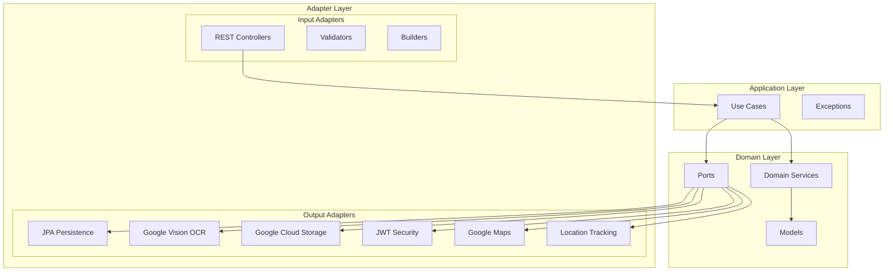
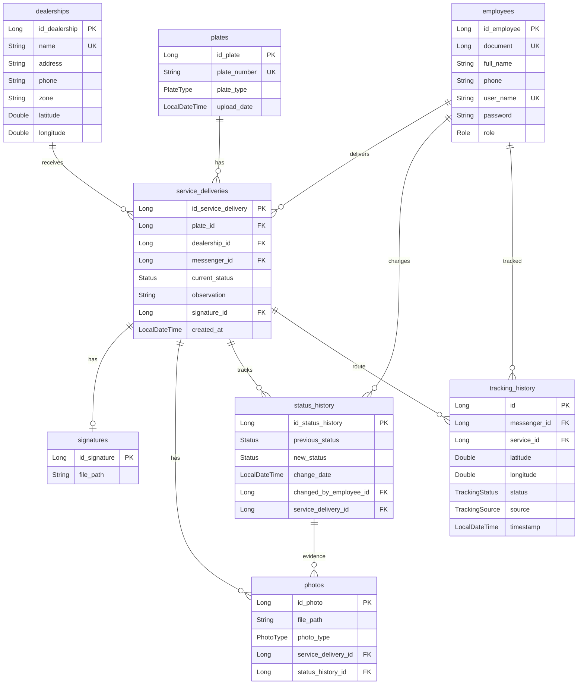
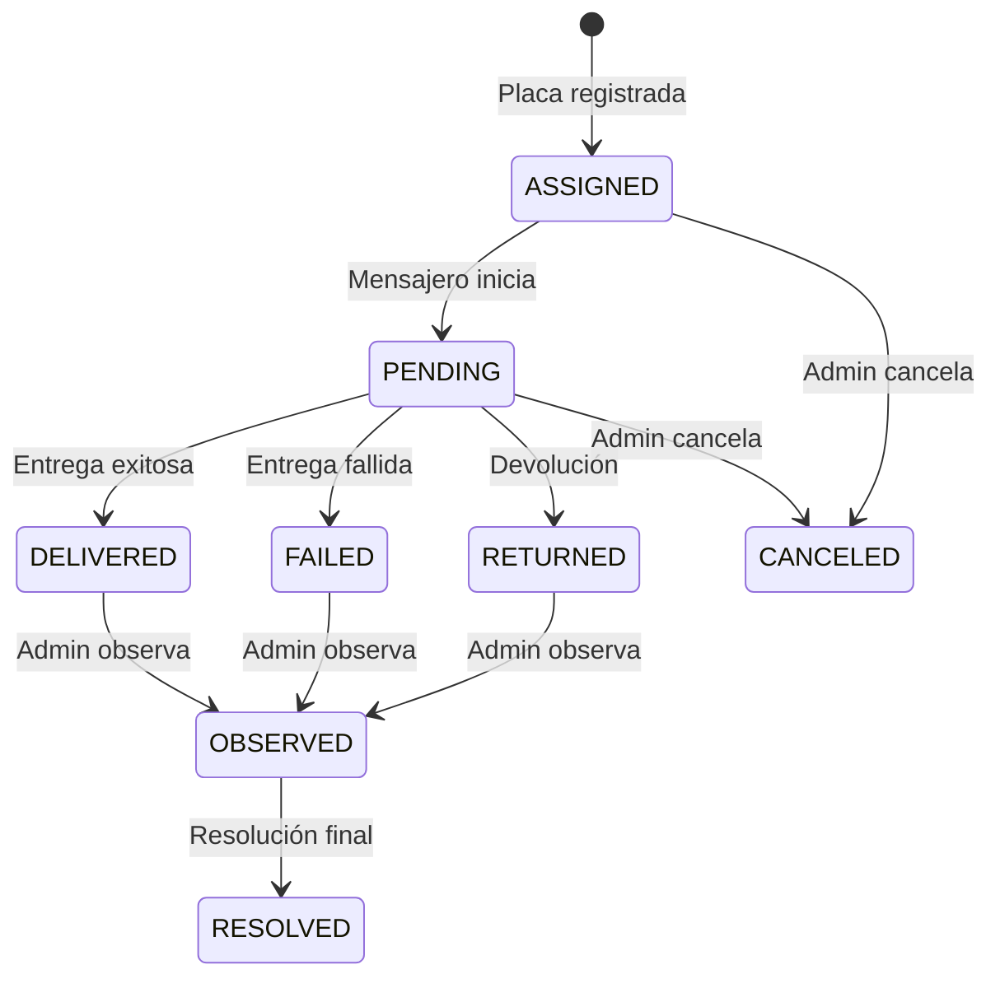

<div align="center">

# 🚀 Messenger Backend API

[](https://openjdk.org/)
[](https://spring.io/projects/spring-boot)
[](https://www.mysql.com/)
[](https://redis.io/)
[](./LICENSE)

**Sistema de gestión de entregas y mensajería con reconocimiento automático de placas vehiculares mediante OCR.**

*Delivery and courier management system with automatic license plate recognition via OCR.*

</div>

---

<details>
<summary><b>🇺🇸 English Version</b> (Click to expand)</summary>

## 📋 Table of Contents

- [Architecture](#-architecture)
- [Tech Stack](#-tech-stack)
- [Project Structure](#-project-structure)
- [Environment Profiles](#-environment-profiles)
- [API Endpoints](#-api-endpoints)
- [Database Schema](#-database-schema)
- [Real-Time Tracking](#-real-time-tracking)
- [Security](#-security)
- [Setup & Installation](#️-setup--installation)
- [CI/CD](#-cicd)

---

### 🏗 Architecture

The project implements **Hexagonal Architecture (Ports & Adapters)** to keep the domain isolated from external dependencies.


```mermaid
graph TB
    subgraph "Adapter Layer"
        subgraph "Input Adapters"
            REST[REST Controllers]
            VAL[Validators]
            BUILD[Builders]
        end
        subgraph "Output Adapters"
            PERSIST[JPA Persistence]
            OCR[Google Vision OCR]
            STORAGE[Google Cloud Storage]
            SEC[JWT Security]
            MAPS[Google Maps]
            TRACKING[Location Tracking]
        end
    end
    
    subgraph "Application Layer"
        UC[Use Cases]
        EXC[Exceptions]
    end
    
    subgraph "Domain Layer"
        MOD[Models]
        PORTS[Ports]
        SVC[Domain Services]
    end
    
    REST --> UC
    UC --> PORTS
    PORTS --> PERSIST
    PORTS --> OCR
    PORTS --> STORAGE
    PORTS --> SEC
    PORTS --> MAPS
    PORTS --> TRACKING
    UC --> SVC
    SVC --> MOD
```

---

### 💻 Tech Stack

| Component | Technology |
|-----------|------------|
| **Framework** | Spring Boot 4.0.0 |
| **Language** | Java 21 |
| **Database** | MySQL 8.0+ |
| **Migrations** | Flyway |
| **Cache/Streaming** | Redis |
| **Security** | JWT + BCrypt + Refresh Tokens |
| **OCR** | Google Cloud Vision API |
| **Storage** | Google Cloud Storage |
| **Maps** | Google Maps Platform |
| **Real-Time** | WebSocket + Redis |
| **Build** | Maven 3.9+ |
| **CI/CD** | GitHub Actions |

---

### 🌍 Environment Profiles

| Profile | Purpose | Database | External APIs |
|---------|---------|----------|---------------|
| `local` | Local development | H2 In-Memory | Mock/Disabled |
| `dev` | Development with APIs | MySQL | Enabled |
| `test` | Automated testing | H2 In-Memory | Mock |
| `prod` | Production | MySQL (SSL) | Enabled |

**Activation:**
```bash
# Environment variable
export SPRING_PROFILES_ACTIVE=dev

# Command line
./mvnw spring-boot:run -Dspring.profiles.active=dev
```

---

### 🔌 API Endpoints

<details>
<summary><b>Authentication</b> <code>/auth</code></summary>

| Method | Endpoint | Description |
|--------|----------|-------------|
| `POST` | `/auth/login` | Login with credentials and receive access + refresh tokens |
| `POST` | `/auth/refresh` | Refresh access token using refresh token |

**Login Response:**
```json
{
  "token": "eyJhbGciOiJIUzI1NiIs...",
  "refreshToken": "eyJhbGciOiJIUzI1NiIs...",
  "role": "ADMIN"
}
```

</details>

<details>
<summary><b>Employees</b> <code>/employees</code> - Admin only</summary>

| Method | Endpoint | Description |
|--------|----------|-------------|
| `POST` | `/employees` | Create employee |
| `GET` | `/employees` | List all |
| `GET` | `/employees/{id}` | Get by ID |
| `PUT` | `/employees/{id}` | Update |
| `DELETE` | `/employees/{id}` | Delete |

</details>

<details>
<summary><b>Dealerships</b> <code>/dealerships</code></summary>

| Method | Endpoint | Description | Auth |
|--------|----------|-------------|------|
| `POST` | `/dealerships` | Create | ADMIN |
| `GET` | `/dealerships` | List | Authenticated |
| `GET` | `/dealerships/{id}` | Get by ID | Authenticated |
| `PUT` | `/dealerships/{id}` | Update | ADMIN |
| `DELETE` | `/dealerships/{id}` | Delete | ADMIN |

</details>

<details>
<summary><b>Service Deliveries</b> <code>/services</code></summary>

| Method | Endpoint | Description |
|--------|----------|-------------|
| `POST` | `/services/create` | Create service (multipart) |
| `PUT` | `/services/{id}/status` | Update status |
| `GET` | `/services` | List all (ADMIN) or own (MESSENGER) |
| `GET` | `/services/{id}` | Get by ID |
| `GET` | `/services/messenger/{doc}` | Filter by messenger |
| `GET` | `/services/dealership/{id}` | Filter by dealership |
| `GET` | `/services/status/{status}` | Filter by status |

</details>

<details>
<summary><b>Locations & Routes</b> <code>/locations</code></summary>

| Method | Endpoint | Description |
|--------|----------|-------------|
| `POST` | `/locations/geocode` | Address to coordinates |
| `POST` | `/locations/route` | Calculate optimized route |
| `GET` | `/locations/distance` | Distance between points |
| `GET` | `/locations/reverse` | Coordinates to address |

</details>

<details>
<summary><b>Real-Time Tracking</b> <code>/api/tracking</code></summary>

| Method | Endpoint | Description | Auth |
|--------|----------|-------------|------|
| `POST` | `/api/tracking/update` | Update messenger location | MESSENGER/ADMIN |
| `GET` | `/api/tracking/messenger/{id}` | Get last location | ADMIN |
| `GET` | `/api/tracking/active` | List active messengers | ADMIN |
| `GET` | `/api/tracking/history/{id}` | Tracking history by date | MESSENGER/ADMIN |
| `GET` | `/api/tracking/service/{id}` | Tracking history by service | MESSENGER/ADMIN |

</details>

---

### 🔐 Security

**JWT Authentication with Refresh Tokens:**

The system implements a dual-token authentication strategy:
- **Access Token**: Short-lived JWT for API requests
  - Production: 30 minutes
  - Development: 2 hours
  - Local: 8 hours
- **Refresh Token**: Long-lived JWT for session renewal
  - Duration: 7 days
  - Used to obtain new access tokens without re-login
- **Algorithm**: HMAC-SHA256
- **Storage**: Tokens managed client-side (never stored server-side)

**Roles:**
- `ADMIN`: Full access to all endpoints and resources
- `MESSENGER`: Limited access to own services and location updates

**Refresh Flow:**
1. Login returns both `token` and `refreshToken`
2. Use `token` for API requests in `Authorization: Bearer <token>` header
3. When `token` expires, call `/auth/refresh` with `refreshToken`
4. Receive new `token` and `refreshToken` pair
5. Refresh token rotation ensures enhanced security

---

### ⚙️ Setup & Installation

**Prerequisites:**
- Java 21+
- MySQL 8.0+
- Redis 6.0+
- Maven 3.9+
- Google Cloud credentials

**Quick Start:**
```bash
# Clone
git clone <repository-url>
cd messenger-backend/messenger

# Configure environment
export JWT_SECRET="your-secret-key-base64"
export DB_HOST="localhost"
export DB_PORT="3306"
export DB_NAME="messenger"
export DB_USERNAME="root"
export DB_PASSWORD="password"

# Run
./mvnw spring-boot:run -Dspring.profiles.active=dev
```

---

### 🔄 CI/CD

Automated pipeline via GitHub Actions:
- ✅ Build on push/PR to `main`
- ✅ Java 21 + Maven caching
- ✅ Secure secrets injection
- ✅ Google Cloud credentials handling
- ✅ Automated testing with H2 in-memory database

### 🧪 Testing

- **Unit Tests**: Comprehensive coverage for all adapters
- **Integration Tests**: JPA repositories and domain services
- **Test Profile**: Isolated H2 database, no external dependencies
- **Coverage**: 100+ tests across adapters, use cases, and repositories

</details>

---

## 📋 Tabla de Contenidos

- [Arquitectura](#-arquitectura)
- [Stack Tecnológico](#-stack-tecnológico)
- [Estructura del Proyecto](#-estructura-del-proyecto)
- [Perfiles de Ambiente](#-perfiles-de-ambiente)
- [API Endpoints](#-api-endpoints-1)
- [Esquema de Base de Datos](#-esquema-de-base-de-datos)
- [Tracking en Tiempo Real](#-tracking-en-tiempo-real)
- [Flujo de Estados](#-flujo-de-estados)
- [Seguridad](#-seguridad)
- [Configuración e Instalación](#️-configuración-e-instalación)
- [CI/CD](#-cicd-1)
- [Colección Postman](#-colección-postman)

---

## 🏗 Arquitectura

El proyecto implementa **Arquitectura Hexagonal (Ports & Adapters)** para mantener el dominio aislado de las dependencias externas.


```mermaid
graph TB
    subgraph "Adapter Layer"
        subgraph "Input Adapters"
            REST[REST Controllers]
            VAL[Validators]
            BUILD[Builders]
        end
        subgraph "Output Adapters"
            PERSIST[JPA Persistence]
            OCR[Google Vision OCR]
            STORAGE[Google Cloud Storage]
            SEC[JWT Security]
            MAPS[Google Maps]
            TRACKING[Location Tracking]
        end
    end
    
    subgraph "Application Layer"
        UC[Use Cases]
        EXC[Exceptions]
    end
    
    subgraph "Domain Layer"
        MOD[Models]
        PORTS[Ports]
        SVC[Domain Services]
    end
    
    REST --> UC
    UC --> PORTS
    PORTS --> PERSIST
    PORTS --> OCR
    PORTS --> STORAGE
    PORTS --> SEC
    PORTS --> MAPS
    PORTS --> TRACKING
    UC --> SVC
    SVC --> MOD
```

---

## 💻 Stack Tecnológico

| Componente | Tecnología |
|------------|------------|
| **Framework** | Spring Boot 4.0.0 |
| **Lenguaje** | Java 21 |
| **Base de Datos** | MySQL 8.0+ |
| **Migraciones** | Flyway |
| **Cache/Streaming** | Redis |
| **Seguridad** | JWT + BCrypt + Refresh Tokens |
| **OCR** | Google Cloud Vision API |
| **Almacenamiento** | Google Cloud Storage |
| **Mapas** | Google Maps Platform |
| **Tiempo Real** | WebSocket + Redis |
| **Build** | Maven 3.9+ |
| **CI/CD** | GitHub Actions |

---

## 📁 Estructura del Proyecto

```
messenger/
├── src/main/java/app/
│   ├── MessengerApplication.java
│   ├── adapter/
│   │   ├── in/                          # Adaptadores de entrada
│   │   │   ├── builder/                 # Constructores de objetos
│   │   │   ├── rest/
│   │   │   │   ├── controllers/         # 5 REST Controllers
│   │   │   │   ├── mapper/              # Mappers Request/Response
│   │   │   │   ├── request/             # DTOs de entrada
│   │   │   │   └── response/            # DTOs de salida
│   │   │   └── validators/              # Validadores de entrada
│   │   └── out/                         # Adaptadores de salida
│   │       ├── maps/                    # Google Maps Integration
│   │       ├── ocr/                     # Google Vision OCR
│   │       ├── persistence/             # JPA Adapters
│   │       ├── security/                # JWT Adapter
│   │       ├── storage/                 # Google Cloud Storage
│   │       └── tracking/                # Location Tracking
│   ├── application/
│   │   ├── exceptions/                  # BusinessException, InputsException
│   │   └── usecase/                     # 4 Use Cases
│   ├── domain/
│   │   ├── model/                       # 11 Modelos + 7 Enums + Auth
│   │   ├── ports/                       # 7 Puertos (interfaces)
│   │   └── services/                    # 15 Servicios de dominio
│   └── infrastructure/
│       ├── persistence/
│       │   ├── entities/                # Entidades JPA
│       │   ├── mapper/                  # Entity ↔ Domain mappers
│       │   └── repository/              # Spring Data Repositories
│       └── security/                    # SecurityConfig, JwtFilter
└── src/main/resources/
    ├── application.properties           # Configuración base
    ├── application-local.properties     # Desarrollo local (H2)
    ├── application-dev.properties       # Desarrollo con APIs
    ├── application-test.properties      # Testing automatizado
    ├── application-prod.properties      # Producción
    └── db/migration/                    # Migraciones Flyway
```

---

## 🌍 Perfiles de Ambiente

| Perfil | Propósito | Base de Datos | APIs Externas | JWT Exp. |
|--------|-----------|---------------|---------------|----------|
| `local` | Desarrollo local sin dependencias | H2 In-Memory | Mock/Deshabilitado | 8 horas |
| `dev` | Desarrollo con servicios reales | MySQL | Habilitado | 2 horas |
| `test` | Testing automatizado (CI/CD) | H2 In-Memory | Mock | 1 hora |
| `prod` | Producción optimizada | MySQL (SSL) | Habilitado | 30 min |

### Características por Perfil

<details>
<summary><b>🏠 Local</b> - Sin dependencias externas</summary>

- Base de datos H2 en memoria
- OCR simulado (placeholder)
- Almacenamiento en sistema de archivos
- Logs detallados
- Perfecto para desarrollo offline

</details>

<details>
<summary><b>🔧 Dev</b> - Desarrollo con APIs</summary>

- MySQL de desarrollo
- Google Cloud APIs habilitadas
- SQL visible para debugging
- Actuator endpoints habilitados
- Tracking interval: 15 segundos

</details>

<details>
<summary><b>🧪 Test</b> - Testing automatizado</summary>

- H2 en memoria (aislamiento)
- Servicios mock
- Sin dependencias externas
- Compatible con GitHub Actions

</details>

<details>
<summary><b>🚀 Prod</b> - Producción</summary>

- MySQL con SSL obligatorio
- Pool de conexiones optimizado (HikariCP)
- Logs mínimos (WARN/INFO)
- Graceful shutdown habilitado
- Headers de seguridad (HSTS, HTTP-only cookies)
- Compresión habilitada
- Sin stack traces expuestos

</details>

### Activación

```bash
# Variable de entorno (recomendado)
export SPRING_PROFILES_ACTIVE=dev

# Línea de comandos
./mvnw spring-boot:run -Dspring.profiles.active=dev

# Docker
docker run -e SPRING_PROFILES_ACTIVE=prod messenger-api
```

---

## 🔌 API Endpoints

### Autenticación (`/auth`)

| Método | Endpoint | Descripción | Auth |
|--------|----------|-------------|------|
| `POST` | `/auth/login` | Iniciar sesión y obtener tokens | 🔓 Público |
| `POST` | `/auth/refresh` | Renovar access token con refresh token | 🔓 Público |

**Respuesta de Login:**
```json
{
  "token": "eyJhbGciOiJIUzI1NiIs...",
  "refreshToken": "eyJhbGciOiJIUzI1NiIs...",
  "role": "ADMIN"
}
```

**Solicitud de Refresh:**
```json
{
  "refreshToken": "eyJhbGciOiJIUzI1NiIs..."
}
```

---

### Empleados (`/employees`) - Solo ADMIN

| Método | Endpoint | Descripción |
|--------|----------|-------------|
| `POST` | `/employees` | Crear empleado |
| `GET` | `/employees` | Listar todos |
| `GET` | `/employees/{id}` | Obtener por ID |
| `PUT` | `/employees/{id}` | Actualizar |
| `DELETE` | `/employees/{id}` | Eliminar |

---

### Concesionarios (`/dealerships`)

| Método | Endpoint | Descripción | Auth |
|--------|----------|-------------|------|
| `POST` | `/dealerships` | Crear | ADMIN |
| `GET` | `/dealerships` | Listar | Autenticado |
| `GET` | `/dealerships/{id}` | Obtener por ID | Autenticado |
| `PUT` | `/dealerships/{id}` | Actualizar | ADMIN |
| `DELETE` | `/dealerships/{id}` | Eliminar | ADMIN |

---

### Servicios de Entrega (`/services`)

| Método | Endpoint | Descripción |
|--------|----------|-------------|
| `POST` | `/services/create` | Crear servicio (multipart) |
| `PUT` | `/services/{id}/status` | Actualizar estado |
| `GET` | `/services` | Listar todos (ADMIN) o propios (MESSENGER) |
| `GET` | `/services/{id}` | Obtener por ID |
| `GET` | `/services/messenger/{doc}` | Filtrar por mensajero |
| `GET` | `/services/dealership/{id}` | Filtrar por concesionario |
| `GET` | `/services/status/{status}` | Filtrar por estado |

---

### Ubicaciones y Rutas (`/locations`)

| Método | Endpoint | Descripción |
|--------|----------|-------------|
| `POST` | `/locations/geocode` | Convertir dirección a coordenadas |
| `POST` | `/locations/route` | Calcular ruta optimizada |
| `GET` | `/locations/distance` | Distancia entre dos puntos |
| `GET` | `/locations/reverse` | Coordenadas a dirección |

---

### Tracking en Tiempo Real (`/api/tracking`)

| Método | Endpoint | Descripción | Auth |
|--------|----------|-------------|------|
| `POST` | `/api/tracking/update` | Actualizar ubicación | MESSENGER/ADMIN |
| `GET` | `/api/tracking/messenger/{id}` | Última ubicación | ADMIN |
| `GET` | `/api/tracking/active` | Mensajeros activos | ADMIN |
| `GET` | `/api/tracking/history/{id}` | Historial por fecha | MESSENGER/ADMIN |
| `GET` | `/api/tracking/service/{id}` | Historial por servicio | MESSENGER/ADMIN |

---

## 🗄 Esquema de Base de Datos


```mermaid
erDiagram
    employees {
        Long id_employee PK
        Long document UK
        String full_name
        String phone
        String user_name UK
        String password
        Role role
    }
    
    dealerships {
        Long id_dealership PK
        String name UK
        String address
        String phone
        String zone
        Double latitude
        Double longitude
    }
    
    plates {
        Long id_plate PK
        String plate_number UK
        PlateType plate_type
        LocalDateTime upload_date
    }
    
    service_deliveries {
        Long id_service_delivery PK
        Long plate_id FK
        Long dealership_id FK
        Long messenger_id FK
        Status current_status
        String observation
        Long signature_id FK
        LocalDateTime created_at
    }
    
    signatures {
        Long id_signature PK
        String file_path
    }
    
    photos {
        Long id_photo PK
        String file_path
        PhotoType photo_type
        Long service_delivery_id FK
        Long status_history_id FK
    }
    
    status_history {
        Long id_status_history PK
        Status previous_status
        Status new_status
        LocalDateTime change_date
        Long changed_by_employee_id FK
        Long service_delivery_id FK
    }
    
    tracking_history {
        Long id PK
        Long messenger_id FK
        Long service_id FK
        Double latitude
        Double longitude
        TrackingStatus status
        TrackingSource source
        LocalDateTime timestamp
    }
    
    employees ||--o{ service_deliveries : "delivers"
    dealerships ||--o{ service_deliveries : "receives"
    plates ||--o{ service_deliveries : "has"
    service_deliveries ||--o| signatures : "has"
    service_deliveries ||--o{ photos : "has"
    service_deliveries ||--o{ status_history : "tracks"
    employees ||--o{ status_history : "changes"
    status_history ||--o{ photos : "evidence"
    employees ||--o{ tracking_history : "tracked"
    service_deliveries ||--o{ tracking_history : "route"
```

### Enums

| Enum | Valores |
|------|---------|
| **Role** | `ADMIN`, `MESSENGER` |
| **PlateType** | `CAR` (ABC 123), `MOTORCYCLE` (ABC 12A), `MOTORCAR` (123 ABC) |
| **Status** | `ASSIGNED`, `PENDING`, `DELIVERED`, `FAILED`, `RETURNED`, `CANCELED`, `OBSERVED`, `RESOLVED` |
| **PhotoType** | `EVIDENCE`, `SIGNATURE`, `PLATE` |
| **TrackingStatus** | `ACTIVE`, `INACTIVE`, `OFFLINE` |
| **TrackingSource** | `GPS`, `NETWORK`, `MANUAL` |

---

## 📡 Tracking en Tiempo Real

Sistema de tracking GPS usando **Redis** + **WebSocket** para monitoreo de mensajeros.

### Características

| Feature | Descripción |
|---------|-------------|
| 🔴 **Ubicación en vivo** | Actualización cada 30 segundos |
| 📍 **Validación de entrega** | Radio máximo de 200m del destino |
| 📊 **Historial completo** | Retención de 30 días |
| ⚡ **Baja latencia** | Redis para caché de ubicaciones |
| 🌐 **WebSocket** | Notificaciones push en tiempo real |

### Integración Google Maps

- **Geocoding**: Dirección ↔ Coordenadas
- **Directions API**: Rutas optimizadas
- **Distance Matrix**: Estimación de tiempos
- **Reverse Geocoding**: Coordenadas → Dirección

---

## 🔄 Flujo de Estados


```mermaid
stateDiagram-v2
    [*] --> ASSIGNED: Placa registrada
    ASSIGNED --> PENDING: Mensajero inicia
    PENDING --> DELIVERED: Entrega exitosa
    PENDING --> FAILED: Entrega fallida
    PENDING --> RETURNED: Devolución
    DELIVERED --> OBSERVED: Admin observa
    FAILED --> OBSERVED: Admin observa
    RETURNED --> OBSERVED: Admin observa
    OBSERVED --> RESOLVED: Resolución final
    ASSIGNED --> CANCELED: Admin cancela
    PENDING --> CANCELED: Admin cancela
```

### Requisitos de Evidencia

| Estado | Firma | Fotos | Observación |
|--------|:-----:|:-----:|:-----------:|
| `DELIVERED` | ✅ | ⚪ | ⚪ |
| `PENDING` | ✅ | ✅ | ✅ |
| `FAILED` | ✅ | ✅ | ✅ |
| `RETURNED` | ✅ | ✅ | ✅ |
| `CANCELED` | ⚪ | ⚪ | ⚪ |
| `OBSERVED` | ⚪ | ⚪ | ⚪ |

---

## 🔐 Seguridad

### Autenticación JWT con Refresh Tokens

```
┌─────────────┐     ┌─────────────┐     ┌─────────────┐
│   Client    │────▶│   /login    │────▶│   Server    │
└─────────────┘     └─────────────┘     └─────────────┘
                           │
                           ▼
              ┌─────────────────────────┐
              │  {                      │
              │    token: "...",        │
              │    refreshToken: "...", │
              │    role: "ADMIN"        │
              │  }                      │
              └─────────────────────────┘
                           │
                           ▼
                   ┌───────────────┐
                   │  API Request  │
                   │  Header:      │
                   │  Authorization│
                   │  Bearer token │
                   └───────────────┘
                           │
                  Token expired?
                           │
                           ▼
                   ┌───────────────┐
                   │ /auth/refresh │
                   │ refreshToken  │
                   └───────────────┘
                           │
                           ▼
                   New token pair
```

| Token | Duración (prod) | Duración (dev) | Duración (local) | Uso |
|-------|-----------------|----------------|------------------|-----|
| **Access Token** | 30 minutos | 2 horas | 8 horas | Header `Authorization: Bearer <token>` |
| **Refresh Token** | 7 días | 7 días | 7 días | Endpoint `/auth/refresh` para renovar |

**Características de Seguridad:**
- 🔄 **Token Rotation**: Cada refresh genera un nuevo par de tokens
- 🔒 **Stateless**: No se almacenan tokens en el servidor (Redis solo para caché de datos)
- ⏱️ **Expiración Automática**: Tokens expire automáticamente
- 🛡️ **HMAC-SHA256**: Algoritmo robusto de firma digital

### Roles y Permisos

- **ADMIN**: Acceso completo a todos los endpoints
- **MESSENGER**: Solo gestiona sus propios servicios y ubicación

### Headers de Seguridad (Producción)

- HSTS (HTTP Strict Transport Security)
- Cookies: `Secure`, `HttpOnly`, `SameSite=Strict`
- CORS configurado por origen
- Sin exposición de stack traces

---

## ⚙️ Configuración e Instalación

### Prerrequisitos

| Requisito | Versión |
|-----------|---------|
| Java | 21+ |
| MySQL | 8.0+ |
| Redis | 6.0+ |
| Maven | 3.9+ |

### Variables de Entorno

<details>
<summary><b>🔐 Variables Requeridas</b></summary>

```bash
# Base de Datos
DB_HOST=localhost
DB_PORT=3306
DB_NAME=messenger
DB_USERNAME=root
DB_PASSWORD=your_password

# JWT
JWT_SECRET=your_base64_encoded_secret_key

# Redis
REDIS_HOST=localhost
REDIS_PORT=6379
REDIS_PASSWORD=            # Solo producción

# Google Cloud
GCP_PROJECT_ID=your_project_id
GCS_BUCKET_NAME=your_bucket_name
GOOGLE_MAPS_API_KEY=your_api_key
GOOGLE_APPLICATION_CREDENTIALS=/path/to/credentials.json
```

</details>

### Instalación Rápida

```bash
# 1. Clonar
git clone <repository-url>
cd messenger-backend/messenger

# 2. Configurar variables (ver sección anterior)

# 3. Iniciar Redis
redis-server

# 4. Ejecutar
./mvnw spring-boot:run -Dspring.profiles.active=dev
```

La API estará disponible en `http://localhost:8080`

---

## 🔄 CI/CD

Pipeline automatizado con **GitHub Actions**:

```yaml
# .github/workflows/maven.yml
on:
  push:
    branches: [ "main" ]
  pull_request:
    branches: [ "main" ]
```

### Características

| Feature | Descripción |
|---------|-------------|
| ✅ Build automático | Java 21 + Maven |
| ✅ Caché de dependencias | Builds más rápidos |
| ✅ Secrets seguros | Inyección de credenciales |
| ✅ Testing | Profile `test` con H2 |

### Secrets de GitHub Requeridos

```
DB_HOST, DB_PORT, DB_USERNAME
JWT_SECRET
REDIS_HOST, REDIS_PORT
GCP_PROJECT_ID, GCS_BUCKET_NAME
GOOGLE_MAPS_API_KEY
GOOGLE_APPLICATION_CREDENTIALS_JSON
```

---

## 📬 Colección Postman

📄 **[Messenger_API.postman_collection.json](./Messenger_API.postman_collection.json)**

### Características

- ✅ **Token JWT y Refresh Token** guardados automáticamente
- ✅ **Variables de entorno** preconfiguradas (`baseUrl`, `token`, `refreshToken`)
- ✅ **Tests automáticos** que guardan tokens en variables de colección
- ✅ **Ejemplos de payloads** para todos los endpoints
- ✅ **7 controladores** completamente documentados:
  - 🔐 Authentication (Login + Refresh)
  - 👥 Employees
  - 🏢 Dealerships
  - 📍 Locations
  - 📡 Tracking
  - 📦 Service Deliveries
  - 📁 Files

### Uso

1. Importar colección en Postman
2. Configurar variable `baseUrl` (default: `http://localhost:8080`)
3. Ejecutar **"Login"** primero
4. Los tokens (`token` y `refreshToken`) se guardan automáticamente
5. Todos los demás endpoints usan el token automáticamente
6. Cuando el access token expire, ejecutar **"Refresh Token"**

### Actualización Reciente

> **Última actualización**: Diciembre 2024
> - ✨ Añadido endpoint de refresh token
> - 🔄 Mejorado manejo automático de tokens
> - 📝 Actualizada documentación de respuestas

---

## 📄 Licencia

Ver archivo [LICENSE](./LICENSE) para detalles.

---

<div align="center">

**Made with ❤️ using Spring Boot 4.0**

</div>
