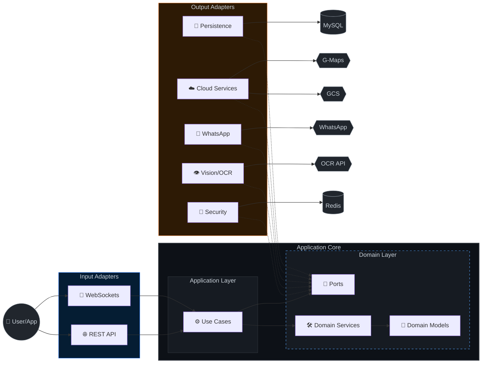
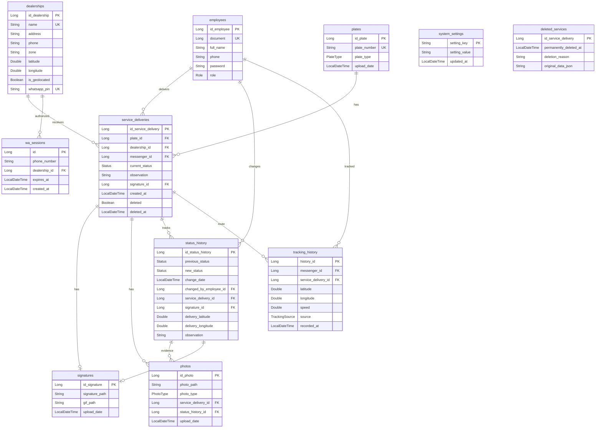
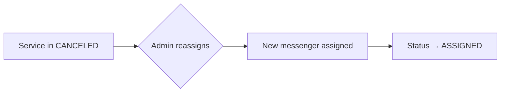

> **Copyright (C) 2026 Mateo Valencia Ardila. All rights reserved. Confidential and Proprietary.**

<div align="center">

# 🚀 Messenger Backend API

[](https://openjdk.org/)
[](https://spring.io/projects/spring-boot)
[](https://www.mysql.com/)
[](https://redis.io/)
[](https://cloud.google.com/)
[](LICENSE)

**Delivery management system with automatic license plate recognition via OCR.**

[🇪🇸 Versión en Español](./README.es.md)

</div>

---

## 📋 Table of Contents

- [Architecture](#-architecture)
- [Tech Stack](#-tech-stack)
- [Project Structure](#-project-structure)
- [Environment Profiles](#-environment-profiles)
- [API Endpoints](#-api-endpoints)
- [Database Schema](#-database-schema)
- [Real-Time Tracking](#-real-time-tracking)
- [State Flow](#-state-flow)
- [Security](#-security)
- [Observability](#-observability)
- [Auditing](#-auditing)
- [Setup & Installation](#️-setup--installation)
- [CI/CD](#-cicd)
- [Testing](#-testing)
- [Performance Optimization](#-performance-optimization)
- [Postman Collection](#-postman-collection)

---

## 🏗 Architecture
<details>

The project implements **Hexagonal Architecture (Ports & Adapters)** to keep the domain isolated from external dependencies.


```mermaid
graph LR
    %% External Actors
    USER((👤 User/App))
    MAPS{{G-Maps}}
    GCS{{GCS}}
    WAPP{{WhatsApp}}
    OCR_EXT{{OCR API}}
    DB[(MySQL)]
    REDIS[(Redis)]

    subgraph IN [Input Adapters]
        direction TB
        REST[🌐 REST API]
        SOC[🔌 WebSockets]
    end

    subgraph CORE [Application Core]
        direction TB
        subgraph APP [Application Layer]
            UC[⚙️ Use Cases]
        end
        subgraph DOMAIN [Domain Layer]
            SVC[🛠️ Domain Services]
            PORTS[🎯 Ports]
            MODEL[💎 Domain Models]
        end
    end

    subgraph OUT [Output Adapters]
        direction TB
        PERS[💾 Persistence]
        CLD[☁️ Cloud Services]
        WABA[📱 WhatsApp]
        VIS[👁️ Vision/OCR]
        SEC[🔐 Security]
    end

    %% Inbound Flow
    USER --> REST & SOC
    REST & SOC --> UC

    %% Application Logic
    UC --> SVC
    UC --> PORTS
    SVC --> MODEL

    %% Outbound Flow (Dependency Inversion)
    PERS -.-> PORTS
    CLD -.-> PORTS
    WABA -.-> PORTS
    VIS -.-> PORTS
    SEC -.-> PORTS

    %% Infrastructure Connections
    PERS --> DB
    CLD --> GCS & MAPS
    WABA --> WAPP
    VIS --> OCR_EXT
    SEC --> REDIS

    %% Styling
    style CORE fill:#0d1117,stroke:#30363d,stroke-width:2px,color:#c9d1d9
    style DOMAIN fill:#161b22,stroke:#58a6ff,stroke-dasharray: 5 5,color:#c9d1d9
    style APP fill:#161b22,stroke:#30363d,color:#c9d1d9
    style IN fill:#051d33,stroke:#1f6feb,color:#c9d1d9
    style OUT fill:#2d1a05,stroke:#f0883e,color:#c9d1d9
    
    classDef actor fill:#21262d,stroke:#8b949e,color:#c9d1d9
    class USER,MAPS,GCS,WAPP,OCR_EXT,DB,REDIS actor
```
</details>

---

## 💻 Tech Stack
<details>

| Component | Technology |
|-----------|------------|
| **Framework** | Spring Boot 3.5.10 |
| **Language** | Java 17 |
| **Database** | MySQL 8.0+ |
| **Migrations** | Flyway |
| **Cache/Streaming** | Redis |
| **Security** | JWT + BCrypt + Cloudflare Turnstile (Bot Protection) + Bucket4j (Distributed Rate Limiting with Redis) |
| **Documentation** | OpenAPI / Swagger UI |
| **OCR** | Plate Recognizer API |
| **Speech-to-Text** | Google Cloud Speech-to-Text |
| **Storage** | Google Cloud Storage |
| **Maps** | Google Maps Platform |
| **WhatsApp** | WhatsApp Cloud API (Meta) |
| **Real-Time** | WebSocket + Redis |
| **Build** | Maven 3.9+ |
| **Monitoring** | Spring Boot Actuator (Health, Metrics) |
| **Auditing** | JPA Callbacks + AOP (Aspect Oriented Programming) |
| **CI/CD** | GitHub Actions |
| **Architecture Testing** | ArchUnit |
| **Performance** | Spring Cache + Redis, Hibernate L2 Cache, Lazy Loading, Database Indices |
</details>

---

## 📁 Project Structure
<details>

```
messenger/
├── src/main/java/app/
│   ├── MessengerApplication.java
│   ├── adapter/
│   │   ├── in/                          # Input Adapters
│   │   │   ├── builder/                 # Object Builders
│   │   │   ├── rest/
│   │   │   │   ├── controllers/         # REST Controllers
│   │   │   │   ├── mapper/              # Request/Response Mappers
│   │   │   │   ├── request/             # Input DTOs
│   │   │   │   └── response/            # Output DTOs
│   │   │   └── websocket/               # Real-time tracking
│   │   └── out/                         # Output Adapters
│   │       ├── maps/                    # Google Maps Integration
│   │       ├── ocr/                     # Plate Recognizer OCR
│   │       ├── persistence/             # JPA Adapters
│   │       ├── security/                # JWT Adapter
│   │       ├── storage/                 # Google Cloud Storage
│   │       ├── tracking/                # Location Tracking
│   │       └── whatsapp/                # WhatsApp Cloud API
│   ├── application/
│   │   └── usecase/                     # 11 Use Cases (Monitoring, Settings, Location...)
│   ├── domain/
│   │   ├── exception/                   # BusinessException, InputsException...
│   │   ├── model/                       # 14+ Models + 7 Enums + Auth
│   │   │   └── enums/                   # Role, Status, PlateType...
│   │   ├── ports/                       # 14 Ports (interfaces)
│   │   └── services/                    # Domain Services
│   └── infrastructure/
│       ├── audit/                       # AOP Audit System
│       ├── config/                      # Spring Configuration
│       ├── exception/                   # Global Error Handler
│       ├── persistence/
│       │   └── entities/                # JPA Entities
│       ├── scheduler/                   # Trash Cleanup Jobs
│       └── security/                    # Spring Security Config / Filters
└── src/main/resources/
    ├── application.properties           # Base Configuration
    ├── application-local.properties     # Local Development (H2)
    ├── application-dev.properties       # Development with APIs
    ├── application-test.properties      # Automated Testing
    ├── application-prod.properties      # Production
    └── db/migration/                    # Flyway Migrations
```
</details>

---

## 🌍 Environment Profiles
<details>

| Profile | Purpose | Database | External APIs | JWT Exp. |
|---------|---------|----------|---------------|----------|
| `local` | Local development without dependencies | MySQL Local | Mock/Disabled | 8 hours |
| `dev` | Development with real services | MySQL | Enabled | 8 hours |
| `test` | Automated testing (CI/CD) | Testcontainers (MySQL/Redis) | Mock | 1 hour |
| `prod` | Production (Cloud Run) | Cloud SQL (MySQL 8) | Enabled | 30 min |

### 🚀 Quick Start (Docker Zero-Config)

For a quick demonstration without manual setup, use Docker Compose. This will spin up the frontend, backend, database, and redis automatically.

1. Navigate to backend root: `cd messenger-backend`
2. Run: `docker-compose up --build`
3. Access: `http://localhost`

> [!TIP]
> Check the **[Quick Start Guide](./GUIA_RAPIDA.md)** (Spanish) for more details on test credentials and phpMyAdmin access.

---

### 🌍 Profiles

<details>
<summary><b>🏠 Local</b> - No external dependencies</summary>

- MySQL Local database (Dockerized)
- **Zero-Config**: Pre-configured with test keys and Mocks
- **Data Seeding**: Automatic user initialization (Admin/Messenger) via `DataInitializer`
- Simulated OCR (MockOcrAdapter)
- Local file storage (LocalStorageAdapter)
- Detailed logging
- Perfect for quick demos and offline development

</details>

<details>
<summary><b>🔧 Dev</b> - Development with APIs</summary>

- MySQL development database
- Google Cloud APIs enabled
- SQL visible for debugging
- Actuator endpoints enabled
- Tracking interval: 15 seconds

</details>

<details>
<summary><b>🧪 Test</b> - Automated testing</summary>

- **Testcontainers integration**: Automated lifecycle for MySQL 8.0 and Redis 7.2.
- **Hierarchical Singleton Pattern**: BaseContainerTest ensures infrastructure starts once per JVM.
- **Data Isolation**: Each execution environment is clean and isolated.
- **Real Migrations**: Full parity with production database schema via Flyway.

</details>

<details>
<summary><b>🚀 Prod</b> - Production (Cloud Run Optimized)</summary>

- MySQL with mandatory SSL
- Optimized connection pool (HikariCP)
- **Structured JSON Logging** (Logstash Encoder)
- Graceful shutdown enabled (30s timeout)
- Security headers (HSTS, HTTP-only cookies)
- Compression enabled
- No exposed stack traces
- Cloud Run Proxy support (Forwarded Headers)

</details>

### Activation

```bash
# Environment variable (recommended)
export SPRING_PROFILES_ACTIVE=dev

# Command line
./mvnw spring-boot:run -Dspring.profiles.active=dev

# Docker
docker run -e SPRING_PROFILES_ACTIVE=prod messenger-api
```
</details>

---

## 🔌 API Endpoints
<details>

### Authentication (`/auth`)

| Method | Endpoint | Description |
|--------|----------|-------------|
| `POST` | `/auth/login` | Login and receive access + refresh tokens (Requires `turnstileToken`) |
| `POST` | `/auth/refresh` | Renew access token with refresh token |
| `GET` | `/auth/ws-token` | Get temporary token for WebSocket connection |
| `POST` | `/auth/logout` | Logout and clear authentication cookies |

---

### Employees (`/employees`) - ADMIN only

| Method | Endpoint | Description |
|--------|----------|-------------|
| `POST` | `/employees/createEmployee` | Create new employee |
| `GET` | `/employees/allEmployees` | List all employees |
| `GET` | `/employees/findByEmployeeId/{id}` | Get employee by ID |
| `PUT` | `/employees/updateEmployee/{id}` | Update existing employee |
| `DELETE` | `/employees/deleteEmployee/{id}` | Delete employee |

---

### Dealerships (`/dealerships`)

| Method | Endpoint | Description |
|--------|----------|-------------|
| `POST` | `/dealerships/createDealership` | Create dealership (ADMIN) |
| `GET` | `/dealerships/allDealerships` | List all dealerships |
| `GET` | `/dealerships/findByDealershipId/{id}` | Get by ID |
| `GET` | `/dealerships/findByDealershipName/{name}` | Get by Name |
| `PUT` | `/dealerships/updateDealership/{id}` | Update dealership (ADMIN) |
| `DELETE` | `/dealerships/deleteDealership/{id}` | Delete dealership (ADMIN) |
| `POST` | `/dealerships/geocodeDealership/{id}` | Geocode dealership address (ADMIN) |

---

### Service Deliveries (`/services`)

| Method | Endpoint | Description |
|--------|----------|-------------|
| `POST` | `/services/extractPlate` | Extract plate from image using OCR (preview before creating) |
| `POST` | `/services/createService` | Create service (multipart: image + data) |
| `PUT` | `/services/updateService/{id}` | Update status (multipart: status + evidence + GIF) |
| `PUT` | `/services/reassign/{id}` | Reassign to another messenger (ADMIN/CANCELED) |
| `GET` | `/services/findByServiceId/{id}` | Get service by ID |
| `GET` | `/services/allServicesPageable` | List services with **pagination, search & sorting** |
| `GET` | `/services/stats/daily` | DISABLED - Daily stats (requires messengerId, from, to) |
| `DELETE` | `/services/deleteService/{id}` | Move to trash (ADMIN) |
| `GET` | `/services/trash` | List deleted services (ADMIN) |
| `POST` | `/services/trash/restore/{id}` | Restore from trash (ADMIN) |
| `DELETE` | `/services/trash/empty` | Empty trash permanently (ADMIN) |
| `DELETE` | `/services/trash/{id}` | Permanent delete individual item (ADMIN) |

---

### Transcription (`/api/transcribe`)

| `POST` | `/api/transcribe` | Transcribe audio file to text using Google Cloud STT |

---

### WhatsApp (`/api/whatsapp`)

| Method | Endpoint | Description |
|--------|----------|-------------|
| `GET`  | `/api/whatsapp/webhook` | Webhook verification (required by Meta) |
| `POST` | `/api/whatsapp/webhook` | Receive incoming messages (Validated with HMAC-SHA256) |

> [!TIP]
> **WhatsApp Bot Workflow**:
> 1. User sends a message.
> 2. Bot requests a 4-digit PIN (requested every 12 hours).
> 3. After authentication, the user can query plate status or list pending deliveries.


> [!CAUTION]
> **File Constraints**:
> - **Images**: Max 10MB (JPEG/PNG)
> - **GIFs**: Max 5MB (GIF87a/GIF89a)
> - **Signatures**: Max 2MB (SVG/PNG)

---

### System Settings (`/settings`) - ADMIN only

| Method | Endpoint | Description |
|--------|----------|-------------|
| `GET` | `/settings/status-colors` | Get status color configuration |
| `PUT` | `/settings/status-colors` | Update status color configuration |

---

### Locations & Routes (`/locations`)

| Method | Endpoint | Description |
|--------|----------|-------------|
| `POST` | `/locations/geocode` | Address to coordinates |
| `POST` | `/locations/route` | DISABLED - Calculate optimized route |
| `GET` | `/locations/distance` | Distance + time estimate between points |
| `GET` | `/locations/reverse` | Coordinates to address |

---

### Files (`/files`)

| Method | Endpoint | Description |
|--------|----------|-------------|
| `GET` | `/files/{filename}` | Download protected file (photos/signatures/GIFs) |

---

### Real-Time Tracking (`/tracking` & WebSocket)

| Method | Endpoint | Description |
|--------|----------|-------------|
| `WS` | `/ws/tracking/update` | Update location via WebSocket (with Heartbeat) |
| `POST` | `/tracking/update` | DISABLED - REST alternative for location updates |
| `GET` | `/tracking/messenger/{id}` | Get last known location (ADMIN) |
| `GET` | `/tracking/active` | Get all active messengers (ADMIN) |
| `GET` | `/tracking/history/{id}` | Get history by date (`?date=YYYY-MM-DD`) |
| `GET` | `/tracking/service/{id}` | Get history for a specific service |

---

### Monitoring (`/monitoring`) - ADMIN only

| Method | Endpoint | Description |
|--------|----------|-------------|
| `GET` | `/monitoring/messenger/{id}/activity` | Get daily activity timeline + stats for a messenger |
</details>

---

## 🗄 Database Schema
<details>


```mermaid
erDiagram
    employees {
        Long id_employee PK
        Long document UK
        String full_name
        String phone

        String password
        Role role
    }
    
    dealerships {
        Long id_dealership PK
        String name UK
        String address
        String phone
        String zone
        Double latitude
        Double longitude
        Boolean is_geolocated
        String whatsapp_pin UK
    }
    
    plates {
        Long id_plate PK
        String plate_number UK
        PlateType plate_type
        LocalDateTime upload_date
    }
    
    service_deliveries {
        Long id_service_delivery PK
        Long plate_id FK
        Long dealership_id FK
        Long messenger_id FK
        Status current_status
        String observation
        Long signature_id FK
        LocalDateTime created_at
        Boolean deleted
        LocalDateTime deleted_at
    }
    
    signatures {
        Long id_signature PK
        String signature_path
        String gif_path
        LocalDateTime upload_date
    }
    
    photos {
        Long id_photo PK
        String photo_path
        PhotoType photo_type
        Long service_delivery_id FK
        Long status_history_id FK
        LocalDateTime upload_date
    }
    
    status_history {
        Long id_status_history PK
        Status previous_status
        Status new_status
        LocalDateTime change_date
        Long changed_by_employee_id FK
        Long service_delivery_id FK
        Long signature_id FK
        Double delivery_latitude
        Double delivery_longitude
        String observation
    }
    
    tracking_history {
        Long history_id PK
        Long messenger_id FK
        Long service_delivery_id FK
        Double latitude
        Double longitude
        Double speed
        TrackingSource source
        LocalDateTime recorded_at
    }
    
    system_settings {
        String setting_key PK
        String setting_value
        LocalDateTime updated_at
    }

    deleted_services {
        Long id_service_delivery PK
        LocalDateTime permanently_deleted_at
        String deletion_reason
        String original_data_json
    }

    wa_sessions {
        Long id PK
        String phone_number
        Long dealership_id FK
        LocalDateTime expires_at
        LocalDateTime created_at
    }
    
    employees ||--o{ service_deliveries : "delivers"
    dealerships ||--o{ service_deliveries : "receives"
    plates ||--o{ service_deliveries : "has"
    service_deliveries ||--o| signatures : "has"
    service_deliveries ||--o{ photos : "has"
    service_deliveries ||--o{ status_history : "tracks"
    employees ||--o{ status_history : "changes"
    status_history ||--o{ photos : "evidence"
    status_history ||--o| signatures : "verified_by"
    employees ||--o{ tracking_history : "tracked"
    service_deliveries ||--o{ tracking_history : "route"
    dealerships ||--o{ wa_sessions : "authorized"
```

### Enums

| Enum | Values |
|------|--------|
| **Role** | `ADMIN`, `MESSENGER` |
| **PlateType** | `CAR` (ABC 123), `MOTORCYCLE` (ABC 12A), `MOTORCAR` (123 ABC) |
| **Status** | `ASSIGNED`, `PENDING`, `DELIVERED`, `RETURNED`, `CANCELED`, `RESOLVED`, `FAILED`(DISABLED), `DELETED` |
| **PhotoType** | `PLATE_DETECTION`, `EVIDENCE` |
| **TrackingStatus** | `ACTIVE`, `INACTIVE`, `OFFLINE` |
| **TrackingSource** | `GPS`, `NETWORK`, `MANUAL` |
</details>

---

## 📡 Real-Time Tracking
<details>

GPS tracking system using **Redis** + **WebSocket** for messenger monitoring.

### Features

| Feature | Description |
|---------|-------------|
| 🔴 **Live location** | Updates every 45 seconds (5s rate limit) |
| 📍 **Delivery validation** | DISABLED - Maximum 200m radius from destination |
| 🎯 **Technical accuracy** | < 100m GPS error filtered for history |
| 📊 **Complete history** | Permanent retention (Historical Archive) |
| ⚡ **Low latency** | Redis for location caching |
| 🌐 **WebSocket** | Real-time data updates (Server Push) |

### WebSocket API

Connection URL: `ws://localhost:8080/ws/tracking`

| Type | Destination | Description |
|------|-------------|-------------|
| `SEND` | `/app/tracking/update` | Send GPS location update |
| `SEND` | `/app/tracking/heartbeat` | Send keep-alive signal (no GPS) |
| `SUB` | `/topic/tracking/{id}` | Receive updates for specific messenger |
| `SUB` | `/topic/tracking/all` | Receive updates for all messengers (Admin) |

### Google Maps Integration

- **Geocoding**: Address ↔ Coordinates
- **Directions API**: DISABLED - Optimized routes
- **Distance Matrix**: Time estimation
- **Reverse Geocoding**: Coordinates → Address

---

### Business Rules

> [!IMPORTANT]
> **Role-Based Status Transitions**
> - **MESSENGER** can only use: `PENDING`, `DELIVERED`, `RETURNED`.
> - **ADMIN** can only use: `CANCELED`, `RESOLVED`.
> - Services can be modified at any time regardless of their current state.
> - Admins can reassign **CANCELED** services to another messenger.

> [!NOTE]
> **Evidence Requirements**
> - **DELIVERED**: Signature and GIF verification are mandatory.
> - **PENDING**: Signature, GIF verification, at least one photo, and observation are mandatory.
> - **RETURNED**: At least one photo and observation are mandatory (no signature required).
> - **CANCELED** & **RESOLVED**: No additional evidence required.

> [!NOTE]
> **Soft Delete (Trash Bin)**
> Deleted services are moved to a **trash bin** and permanently deleted after **60 days**.
> Admins can restore services from the trash before permanent deletion.

### State Rules

| State | Messenger | Admin | Delete |
|-------|-----------|-------|--------|
| `ASSIGNED` | → `PENDING`, `DELIVERED`, `RETURNED` | → `CANCELED`, `RESOLVED` | ✅ Trash |
| `RETURNED` | → `PENDING`, `DELIVERED` | → `CANCELED`, `RESOLVED` | ✅ Trash |
| `PENDING` | → `DELIVERED`, `RETURNED` | → `CANCELED`, `RESOLVED` | ✅ Trash |
| `DELIVERED` | → `PENDING`, `RETURNED` | → `CANCELED`, `RESOLVED` | ✅ Trash |
| `CANCELED` | - | Admin can **reassign** → `ASSIGNED` | ✅ Trash |
| `RESOLVED` | - | - | ✅ Trash |

### Permissions Summary

| Role | Available States | Special Actions | Notes |
|------|------------------|-----------------|-------|
| **MESSENGER** | `PENDING`, `DELIVERED`, `RETURNED` | - | Can change services to any allowed state at any time |
| **ADMIN** | `CANCELED`, `RESOLVED` | **Reassign messenger** (from `CANCELED` only) | Can change services to admin states from any current state |

### Reassignment Flow


```mermaid
flowchart LR
    A[Service in CANCELED] --> B{Admin reassigns}
    B --> C[New messenger assigned]
    C --> D[Status → ASSIGNED]
```


### Trash Management (Soft Delete & Archive)

| Action | Endpoint | Description |
|--------|----------|-------------|
| Delete → Trash | `DELETE /services/{id}` | Moves to trash (soft delete) |
| View Trash | `GET /services/trash` | Lists deleted services (ADMIN) |
| Restore | `POST /services/trash/restore/{id}` | Restores from trash (ADMIN) |
| Empty Trash | `POST /services/trash/empty` | Archives all trash items (ADMIN) |
| Auto-Archive | Scheduled job (3 AM daily) | Archives services after 60 days |

**Archive System**: Services are permanently archived to dedicated tables (`deleted_services`, `deleted_status_history`, `deleted_photos`, `deleted_tracking_history`, `deleted_signatures`) instead of being deleted. All historical data is preserved for auditing and analytics.
</details>

---

## 🔐 Security
<details>

### JWT Authentication with Refresh Tokens

```
┌─────────────┐     ┌─────────────┐     ┌─────────────┐
│   Client    │────▶│   /login    │────▶│   Server    │
└─────────────┘     └─────────────┘     └─────────────┘
                           │
                           ▼
              ┌─────────────────────────┐
              │  {                      │
              │    token: "...",        │
              │    refreshToken: "...", │
              │    role: "ADMIN"        │
              │  }                      │
              └─────────────────────────┘
                           │
                           ▼
                   ┌───────────────┐
                   │  API Request  │
                   │  Header:      │
                   │  Authorization│
                   │  Bearer token │
                   └───────────────┘
                           │
                   Token expired?
                           │
                           ▼
                   ┌───────────────┐
                   │ /auth/refresh │
                   │ refreshToken  │
                   └───────────────┘
                           │
                           ▼
                   New token pair
```

| Token | Prod Duration | Dev Duration | Local Duration | Usage |
|-------|---------------|--------------|----------------|-------|
| **Access Token** | 30 minutes | 8 hours | 8 hours | Header `Authorization: Bearer <token>` |
| **Refresh Token** | 12 hours | 8 days | 8 days | Endpoint `/auth/refresh` to renew |

### Security Features

- 🔄 **Token Rotation**: Each refresh generates a new token pair
- 🔒 **Stateless**: No tokens stored server-side (Redis only for data caching)
- ⏱️ **Auto Expiration**: Tokens expire automatically
- 🛡️ **HMAC-SHA256**: Robust digital signature algorithm
- 🕵️ **File Validation**: Magic bytes check for GIF/Images to prevent content spoofing

### Distributed Rate Limiting

- **Cloudflare Turnstile**: Mandatory bot protection for all login attempts to prevent automated attacks.
- **Redis-Backed Throttling**:
  - Global enforcement across multiple instances (Cloud Run compatible).
  - `AUTH`: 10 requests / minute (Brute-force protection).
  - `GENERAL`: 100 requests / minute.
- **Resilience**:
  - Automatic fallback to in-memory rate limiting if Redis is unavailable.
  - Memory-efficient TTL management for Redis keys.
- **WebSocket Throttling**: 5 seconds minimum interval between updates per messenger.
- **WhatsApp Security**:
  - **Webhook validation**: Uses HMAC-SHA256 with Meta's App Secret to verify request origin.
  - **PIN Protection**: 4-digit PIN authentication required to access dealership data.
  - **Brute-force protection**: Bot access is blocked for 15 minutes after 3 failed PIN attempts, with progressive delays between attempts.
- Response headers: `X-Rate-Limit-Remaining`, `X-Rate-Limit-Retry-After-Seconds`

### Roles & Permissions

- **ADMIN**: Full access to all endpoints
- **MESSENGER**: Only manages own services and location

### Security Headers (Production)

- HSTS (HTTP Strict Transport Security)
- Cookies: `Secure`, `HttpOnly`, `SameSite=Strict`
- CORS configured by origin
- No stack trace exposure
</details>

---

## 📊 Observability
<details>

### Monitoring Endpoints (Actuator)

| Endpoint | Description | Profile | Access |
|----------|-------------|---------|--------|
| `/actuator/health` | Health status (DB, Redis, Disk) | All | Public |
| `/actuator/metrics` | JVM and HTTP metrics | `dev`, `local` | Private (JWT) |
| `/actuator/info` | Build information | All | Private (JWT) |

### Cloud Run Optimization

- **JSON Logging (Prod):** Structured output compatible with Google Cloud Logging
- **Graceful Shutdown:** Waits 30s to finish active connections
- **SSL Offloading:** Trusts proxy headers (`X-Forwarded-Proto`) from Cloud Run

### API Documentation

| Endpoint | Description |
|----------|-------------|
| `/swagger-ui/index.html` | Interactive Swagger UI |
| `/v3/api-docs` | OpenAPI 3.0 Specification (JSON) |
| `/v3/api-docs.yaml` | OpenAPI 3.0 Specification (YAML) |

> [!TIP]
> Swagger UI is publicly accessible in `dev` profile. In production, consider restricting access via security configuration.
</details>

---

## 📝 Auditing
<details>

### AOP-Based Audit System

The application includes a centralized **audit logging system** using Aspect-Oriented Programming (AOP). Critical actions are automatically logged with user context, timing, and results.

### Audited Actions

| Component | Action | Description |
|-----------|--------|-------------|
| **AuthController** | `LOGIN` | User login attempts |
| | `TOKEN_REFRESH` | Access token renewal |
| **ServiceDeliveryUseCase** | `CREATE_SERVICE` | Create service from OCR image |
| | `CREATE_SERVICE_MANUAL` | Create service with manual plate |
| | `UPDATE_STATUS` | Update service status |
| | `REASSIGN_MESSENGER` | Reassign service to another messenger |
| | `DELETE_SERVICE` | Move service to trash |
| | `RESTORE_SERVICE` | Restore service from trash |
| | `EMPTY_TRASH` | Permanently empty trash |
| | `ARCHIVE_SERVICE` | Manually archive service from trash |
| **EmployeeUseCase** | `CREATE_EMPLOYEE` | Create new employee |
| | `UPDATE_EMPLOYEE` | Update employee information |
| | `DELETE_EMPLOYEE` | Delete employee |
</details>

---

## 🏗 Architecture Verification
<details>

The project includes **ArchUnit** tests to enforce structural integrity and ensure that the **Hexagonal Architecture** principles are never violated.

### Automated Rules

- **Layer Isolation**: Domain and Application layers must never depend on Infrastructure.
- **Dependency Flow**: Input adapters must only talk to Use Cases, and Use Cases must only interact with Domain services or Ports.
- **Package Integrity**: Controllers, entities, and repositories must reside in their respective adapter/infrastructure packages.

Run architecture tests:
```bash
mvn test -Dtest=HexagonalArchitectureTest
```

---

### Log Format

```
AUDIT | timestamp | user_document | action | method | params | status | duration | error
```

**Example:**
```
2025-12-21 00:42:00.123 [AUDIT] AUDIT | 2025-12-21 00:42:00 | 123456 | UPDATE_STATUS | ServiceDeliveryUseCase.updateStatus | [1, DELIVERED, "Delivered", ...] | SUCCESS | 125ms |
```

### Configuration

- **Logger Name:** `AUDIT`
- **Level:** `WARN` (always visible in all environments)
- **Output:** Console (Cloud Run captures stdout)
- **File Output:** Optional, enable `AUDIT_FILE` appender in `logback-spring.xml`
</details>

---
 
## ⚡ Performance Optimization
<details>

The system includes multiple optimization layers to ensure high performance and low latency.
 
### 🚀 Caching Strategy (Redis)
 
- **Spring Cache Abstraction**: Application-level caching using `@Cacheable` and `@CacheEvict`.
  - `Dealerships`: TTL 30 minutes.
  - `Employees`: TTL 15 minutes.
- **Hibernate Second-Level Cache (L2)**: Entity-level caching via Redisson to reduce database load.
  - Enabled for `DealershipEntity`, `EmployeeEntity`, and `PlateEntity`.
- **Custom Serialization**: Optimized `ObjectMapper` with `JavaTimeModule` support for `LocalDateTime`.
 
### 📉 Data Fetching Optimization
 
- **Lazy Loading**: Most relationships in `ServiceDeliveryEntity` are configured as `FetchType.LAZY` to avoid loading unnecessary data.
- **Entity Graphs**: Explicit `@EntityGraph` definitions in repositories to solve the N+1 problem by fetching only required associations in a single query.

### 🖼️ Image Optimization

- **Automatic Resizing**: Images are automatically resized to a maximum of 1280px preserving aspect ratio.
- **Smart Compression**: Quality reduction to 75% for JPEG files using the `Thumbnailator` library.

### 🔌 Connection Pool Tuning (HikariCP)

- **Optimized for Cloud SQL**: Fine-tuned parameters for low-resource environments (db-f1-micro).
- **Leak Detection**: Active threshold to identify and prevent connection leaks.
</details>

---

## ⚙️ Setup & Installation
<details>

### Prerequisites

| Requirement | Version |
|-------------|---------|
| Java | 17+ |
| MySQL | 8.0+ |
| Redis | 6.0+ |
| Maven | 3.9+ |

### 🔐 Environment Variables Required

| Variable | Description | Default/Example |
|----------|-------------|-----------------|
| `DB_NAME` | MySQL Database Name | `messenger_db` |
| `DB_USERNAME` | Database User | `root` |
| `DB_PASSWORD` | Database Password | `******` |
| `REDIS_HOST` | Redis Server Host | `localhost` |
| `JWT_SECRET` | 256-bit Key for Tokens | `openssl rand -base64 64` |
| `GOOGLE_MAPS_API_KEY` | Google Maps Platform Key | `AIza...` |
| `GCS_BUCKET_NAME` | Bucket for evidence | `plak-evidence` |
| `TURNSTILE_SECRET_KEY`| Cloudflare Secret Key | `0x4AAAAAA...` |
| `CORS_ALLOWED_ORIGINS`| Allowed Frontend URLs | `http://localhost:5173` |
| `WHATSAPP_PHONE_NUMBER_ID`| WhatsApp Phone ID | `123456789...` |
| `WHATSAPP_ACCESS_TOKEN`| Meta Permanent Token | `EAAG...` |
| `WHATSAPP_VERIFY_TOKEN`| Custom Webhook Token | `my_secret_token` |
| `WHATSAPP_APP_SECRET`  | Meta App Secret | `abc123...` |

### Quick Start (Docker) - Recommended

Run the full stack locally with one command.

#### Prerequisites

- Docker & Docker Compose
- Git

#### Steps

1. **Clone the repository**
   ```bash
   git clone https://github.com/StartApp-FTT/messenger-backend.git
   cd messenger-backend
   ```

2. **Configure Environment**
   ```bash
   cd messenger
   cp .env.example .env
   # Edit .env with your Google Maps Key & Credentials
   ```

3. **Run with Docker**
   ```bash
   cd ..
   docker-compose up --build
   ```

The API will be available at `http://localhost:8080`.

### Manual Quick Start

```bash
# 1. Clone
git clone <repository-url>
cd messenger-backend/messenger

# 2. Configure variables (see above section)

# 3. Start Redis
redis-server

# 4. Run
./mvnw spring-boot:run -Dspring.profiles.active=dev
```

API available at `http://localhost:8080`
</details>

---

## 🔄 CI/CD
<details>

Automated pipeline with **GitHub Actions**:

```yaml
# .github/workflows/maven.yml
on:
  push:
    branches: [ "main", "develop" ]
  pull_request:
    branches: [ "main", "develop" ]
```

### Features

| Feature | Description |
|---------|-------------|
| ✅ Automated build | Java 17 + Maven |
| ✅ Dependency caching | Faster builds |
| ✅ Secure secrets | Credential injection |
| ✅ Testing | Profile test with Docker (MySQL/Redis) |

### Required GitHub Secrets

```
GOOGLE_APPLICATION_CREDENTIALS_JSON
```

> [!NOTE]
> The CI pipeline uses an ephemeral **Docker** environment (MySQL + Redis) for integration tests, ensuring maximum parity with production. No external DB secrets are required.
</details>

---

## 🧪 Testing
<details>

The project implements a robust testing strategy across all layers of the hexagonal architecture.

| Level | Strategy | Technology |
|-------|----------|------------|
| **Unit** | Isolated logic verification | JUnit 5 + Mockito |
| **Integration** | Infrastructure & Service validation | Spring Boot Test + **Testcontainers** |
| **Persistence** | Data mapping & Query validation | `@DataJpaTest` + Real MySQL |
| **Architecture** | Hexagonal rules enforcement | **ArchUnit** |
| **Mutation** | Test effectiveness measurement | **Pitest** |

### 🛠️ Key Features

- **Testcontainers (MySQL & Redis)**: No manual Docker setup needed. Tests automatically pull and manage required containers.
- **Hierarchical Singleton Pattern**: Using `BaseContainerTest` to share infrastructure across multiple test contexts, drastically reducing startup time and resource usage.
- **Mutation Testing**: Metrics that go beyond simple line coverage by injecting faults to verify test assertions.
- **Flyway Parity**: Integration tests run against the exact same migrations used in production.

### 🚀 Running Tests

```bash
# Standard tests (Unit + Integration)
./mvnw test

# Mutation Testing (Pitest)
./mvnw org.pitest:pitest-maven:mutationCoverage
```
</details>

---

## 📬 Postman Collection
<details>

📄 **[Messenger_API.postman_collection.json](./Messenger_API.postman_collection.json)**

### Features

- ✅ **JWT and Refresh Token** saved automatically
- ✅ **Environment variables** preconfigured (`baseUrl`, `token`, `refreshToken`)
- ✅ **Automated tests** that save tokens to collection variables
- ✅ **Payload examples** for all endpoints
- ✅ **10 controllers** fully documented:
  - 🔐 Authentication (Login + Refresh)
  - 👥 Employees
  - 🏢 Dealerships
  - 📍 Locations
  - 📡 Tracking
  - 📦 Service Deliveries
  - 📁 Files
  - 📊 Monitoring
  - ⚙️ System Settings
  - 🎙️ Transcription

### Usage

1. Import collection in Postman
2. Configure `baseUrl` variable (default: `http://localhost:8080`)
3. Run **"Login"** first
4. Tokens (`token` and `refreshToken`) are saved automatically
5. All other endpoints use the token automatically
6. When access token expires, run **"Refresh Token"**
</details>

---

## 📧 Support & Contact

**Official Documentation:**
- [Spring Boot Documentation](https://spring.io/projects/spring-boot)
- [Google Cloud Run](https://cloud.google.com/run/docs)

**Documentation:**
- [🔐 **GitHub Secrets Guide**](./.github/SECRETS.md)
- [🛡️ **Security Policy**](./.github/SECURITY.md)

**Project Specific:**
- Repository: `messenger-backend`
- Author: [Mateo Valencia Ardila](https://github.com/fttmatteo)
- Email: [contacto@plak.digital](mailto:contacto@plak.digital)

---

## 📄 License

See [LICENSE](./LICENSE).

> **Copyright (C) 2026 Mateo Valencia Ardila. All rights reserved. Confidential and Proprietary.**
