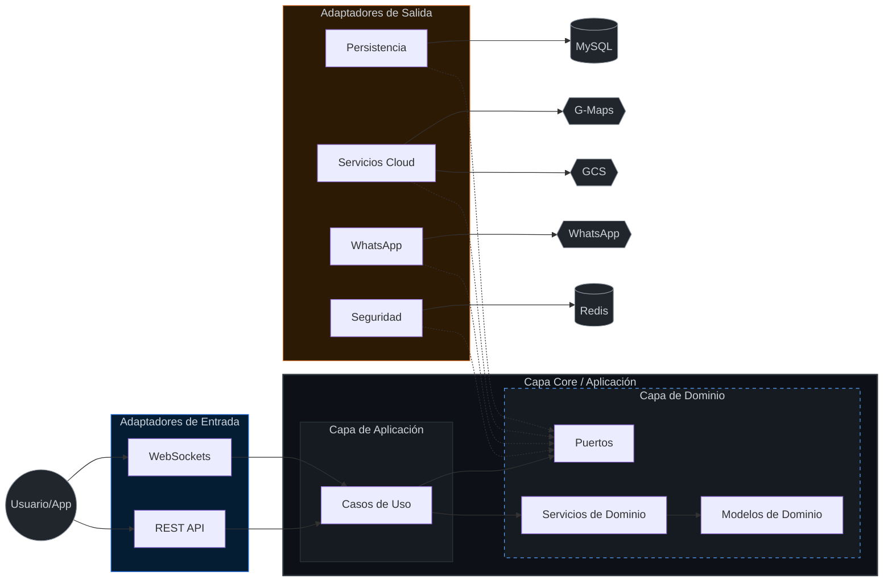
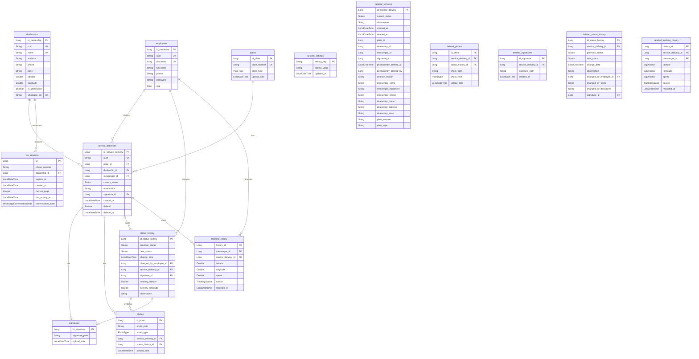
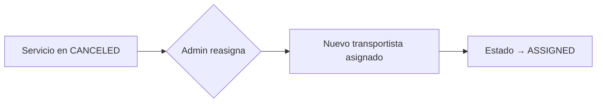

> **Copyright (C) 2026 Mateo Valencia Ardila. Todos los derechos reservados. El código fuente de esta aplicación está protegido por las leyes de derechos de autor. Registro DNDA No. 13-108-139. Queda estrictamente prohibida su copia, distribución o modificación sin autorización expresa.**

<div align="center">

# Messenger Backend API


[](https://openjdk.org/)
[](https://spring.io/projects/spring-boot)
[](https://www.mysql.com/)
[](https://redis.io/)
[](https://cloud.google.com/)
[](LICENSE)

**Sistema de gestión de entregas de motocicletas por chasis y monitoreo de transportistas.**
Plataforma inteligente para el control logístico y distribución de motocicletas identificadas por número de chasis, integrada con rastreo satelital continuo de los transportistas en ruta.

[🇺🇸 English Version](./README.en.md)

</div>

---

## Tabla de Contenidos

- [Arquitectura](#arquitectura)
- [Stack Tecnológico](#stack-tecnológico)
- [Estructura del Proyecto](#estructura-del-proyecto)
- [Perfiles de Ambiente](#perfiles-de-ambiente)
- [API Endpoints](#api-endpoints)
- [Esquema de Base de Datos](#esquema-de-base-de-datos)
- [Tracking en Tiempo Real](#tracking-en-tiempo-real)
- [Reglas de Negocio](#reglas-de-negocio)
- [Gestión de Papelera (Soft Delete y Archivo)](#gestión-de-papelera-soft-delete-y-archivo)
- [Seguridad](#seguridad)
- [Observabilidad](#observabilidad)
- [Verificación de Arquitectura](#verificación-de-arquitectura)
- [Optimización de Rendimiento](#optimización-de-rendimiento)
- [Configuración e Instalación](#configuración-e-instalación)
- [CI/CD](#cicd)
- [Testing](#testing)
- [Colección Postman](#colección-postman)
- [Integración Android](#integración-android)
- [Soporte y Contacto](#soporte-y-contacto) 

---

## Arquitectura

El proyecto implementa **Arquitectura Hexagonal (Ports & Adapters)** para mantener el dominio aislado de las dependencias externas.


```mermaid
graph LR
    %% Actores Externos
    USER((Usuario/App))
    MAPS{{G-Maps}}
    GCS{{GCS}}
    WAPP{{WhatsApp}}

    DB[(MySQL)]
    REDIS[(Redis)]

    subgraph IN [Adaptadores de Entrada]
        direction TB
        REST[REST API]
        SOC[WebSockets]
    end

    subgraph CORE [Capa Core / Aplicación]
        direction TB
        subgraph APP [Capa de Aplicación]
            UC[Casos de Uso]
        end
        subgraph DOMAIN [Capa de Dominio]
            SVC[Servicios de Dominio]
            PORTS[Puertos]
            MODEL[Modelos de Dominio]
        end
    end

    subgraph OUT [Adaptadores de Salida]
        direction TB
        PERS[Persistencia]
        CLD[Servicios Cloud]
        WABA[WhatsApp]

        SEC[Seguridad]
    end

    %% Flujo de Entrada
    USER --> REST & SOC
    REST & SOC --> UC

    %% Lógica de Aplicación
    UC --> SVC
    UC --> PORTS
    SVC --> MODEL

    %% Flujo de Salida (Inversión de Dependencia)
    PERS -.-> PORTS
    CLD -.-> PORTS
    WABA -.-> PORTS
    SEC -.-> PORTS

    %% Conexiones de Infraestructura
    PERS --> DB
    CLD --> GCS & MAPS
    WABA --> WAPP

    SEC --> REDIS

    %% Estilos
    style CORE fill:#0d1117,stroke:#30363d,stroke-width:2px,color:#c9d1d9
    style DOMAIN fill:#161b22,stroke:#58a6ff,stroke-dasharray: 5 5,color:#c9d1d9
    style APP fill:#161b22,stroke:#30363d,color:#c9d1d9
    style IN fill:#051d33,stroke:#1f6feb,color:#c9d1d9
    style OUT fill:#2d1a05,stroke:#f0883e,color:#c9d1d9

    classDef actor fill:#21262d,stroke:#8b949e,color:#c9d1d9
    class USER,MAPS,GCS,WAPP,DB,REDIS actor
```

---

## Stack Tecnológico

| Componente                | Tecnología                                                                                                    |
| ------------------------- | ------------------------------------------------------------------------------------------------------------- |
| **Framework**             | Spring Boot 3.5.14                                                                                            |
| **Lenguaje**              | Java 17                                                                                                       |
| **Base de Datos**         | MySQL 8.0+                                                                                                    |
| **Cache/Streaming**       | Redis                                                                                                         |
| **Seguridad**             | JWT + BCrypt + Cloudflare Turnstile (Protección contra Bots) + Bucket4j (Rate Limiting Distribuido con Redis) |
| **Documentación**         | OpenAPI / Swagger UI                                                                                          |
| **Almacenamiento**        | Google Cloud Storage                                                                                          |
| **Mapas**                 | Google Maps Platform                                                                                          |
| **Cliente Móvil**         | Capacitor (Generación de App Android)                                                                         |
| **WhatsApp**              | WhatsApp Cloud API (Meta)                                                                                     |
| **Tiempo Real**           | WebSocket + Redis                                                                                             |
| **Build**                 | Maven 3.9+                                                                                                    |
| **Migraciones**           | Flyway (Versionamiento de base de datos)                                                                      |
| **Monitoreo**             | Spring Boot Actuator (Health, Metrics)                                                                        |
| **CI/CD**                 | GitHub Actions                                                                                                |
| **Tests de Arquitectura** | ArchUnit                                                                                                      |
| **Rendimiento**           | Spring Cache + Redis, Hibernate L2 Cache, Lazy Loading, Índices de Base de Datos                              |

---

## Estructura del Proyecto

```
messenger/
├── src/main/java/app/
│   ├── MessengerApplication.java
│   ├── adapter/
│   │   ├── in/                          # Adaptadores de entrada
│   │   │   ├── builder/                 # Constructores de objetos
│   │   │   ├── rest/
│   │   │   │   ├── controllers/         # REST Controllers
│   │   │   │   ├── mapper/              # Mappers Request/Response
│   │   │   │   ├── request/             # DTOs de entrada
│   │   │   │   ├── response/            # DTOs de salida
│   │   │   │   └── validators/          # Validadores de entrada
│   │   │   └── websocket/               # Tracking en tiempo real
│   │   └── out/                         # Adaptadores de salida
│   │       ├── maps/                    # Google Maps Integration
│   │       ├── persistence/             # Adaptadores JPA
│   │       │   ├── adapter/             # Implementación de Puertos JPA
│   │       │   ├── entities/            # Entidades JPA
│   │       │   ├── mapper/              # Mappers de Entidad a Dominio
│   │       │   └── repository/          # Interfaces Spring Data JPA
│   │       ├── security/                # JWT Adapter
│   │       ├── storage/                 # Google Cloud Storage
│   │       ├── tracking/                # Location Tracking
│   │       └── whatsapp/                # WhatsApp Cloud API
│   ├── application/
│   │   └── usecase/                     # 11 Casos de Uso (Monitoreo, Location, Tracking...)
│   ├── domain/
│   │   ├── events/                      # Eventos de dominio
│   │   ├── exception/                   # BusinessException, InputsException...
│   │   ├── model/                       # 14+ Modelos + 7 Enums + Auth
│   │   │   └── enums/                   # Role, Status, PlateType...
│   │   ├── ports/                       # 14 Puertos (interfaces)
│   │   ├── services/                    # Servicios de dominio
│   │   └── util/                        # Utilidades de dominio
│   └── infrastructure/
│       ├── config/                      # Configuración de Spring
│       ├── exception/                   # Manejo global de errores
│       ├── health/                      # Indicadores de salud (Actuator)
│       ├── helper/                      # Utilidades varias (File, etc.)
│       ├── scheduler/                   # Tareas programadas (Trash, Timeouts)
│       ├── security/                    # Filtros y configuración de seguridad web
│       ├── service/                     # Servicios de infraestructura
│       └── storage/                     # Utilidades locales (ImageOptimizer)
└── src/main/resources/
    ├── application.properties           # Configuración base
    ├── application-local.properties     # Desarrollo local (H2)
    ├── application-dev.properties       # Desarrollo con APIs
    ├── application-test.properties      # Testing automatizado
    ├── application-prod.properties      # Producción
    └── db/migration/                    # Migraciones Flyway
```

---

## Perfiles de Ambiente

| Perfil  | Propósito                         | Base de Datos                | APIs Externas      | JWT Exp. |
| ------- | --------------------------------- | ---------------------------- | ------------------ | -------- |
| `local` | Desarrollo local sin dependencias | MySQL Local                  | Mock/Deshabilitado | 8 horas  |
| `dev`   | Desarrollo con servicios reales   | MySQL                        | Habilitado         | 8 horas  |
| `test`  | Testing automatizado (CI/CD)      | Testcontainers (MySQL/Redis) | Mock               | 1 hora   |
| `prod`  | Producción (Cloud Run)            | Cloud SQL (MySQL 8)          | Habilitado         | 30 min   |

### Perfiles

<details>
<summary><b>Local</b> - Sin dependencias externas</summary>

- Base de datos MySQL Local (Dockerizada)
- **Zero-Config**: Perfil pre-configurado con llaves de prueba y Mocks
- **Carga de Datos**: Inicialización automática de usuarios (Admin/Messenger) via `DataInitializer`
- Almacenamiento local (LocalStorageAdapter)
- Logs detallados
- Perfecto para demostraciones rápidas y desarrollo offline

</details>

<details>
<summary><b>Dev</b> - Desarrollo con APIs</summary>

- MySQL de desarrollo
- Google Cloud APIs habilitadas
- SQL visible para debugging
- Actuator endpoints habilitados
- Tracking interval: 15 segundos

</details>

<details>
<summary><b>Test</b> - Testing automatizado</summary>

- **Integración con Testcontainers**: Ciclo de vida automatizado para MySQL 8.0 y Redis 7.2.
- **Patrón Singleton Jerárquico**: `BaseContainerTest` asegura que la infraestructura se inicie una sola vez por JVM.
- **Aislamiento de Datos**: Cada ejecución ocurre en un entorno limpio y aislado.
- **Paridad con Flyway**: Los tests corren contra el mismo esquema de migraciones que producción.

</details>

<details>
<summary><b>Prod</b> - Producción (Optimizado Cloud Run)</summary>

- MySQL con SSL obligatorio
- Pool de conexiones optimizado (HikariCP)
- **Logging Estructurado JSON** (Logstash Encoder)
- Graceful shutdown habilitado (30s timeout)
- Headers de seguridad (HSTS, HTTP-only cookies)
- Compresión habilitada
- Sin stack traces expuestos
- Soporte Proxy Cloud Run (Forwarded Headers)

</details>

### Activación

```bash
# Variable de entorno (recomendado)
export SPRING_PROFILES_ACTIVE=local

# Línea de comandos
./mvnw spring-boot:run -Dspring.profiles.active=local

# Docker
docker run -e SPRING_PROFILES_ACTIVE=local
```

---

## API Endpoints

### Autenticación (`/auth`)

| Método | Endpoint         | Descripción                                                                     |
| ------ | ---------------- | ------------------------------------------------------------------------------- |
| `POST` | `/auth/login`    | Iniciar sesión y obtener tokens de acceso + refresh (Requiere `turnstileToken`) |
| `POST` | `/auth/refresh`  | Renovar token de acceso con refresh token                                       |
| `POST` | `/auth/ws-token` | Obtener token temporal para conexión WebSocket                                  |
| `POST` | `/auth/logout`   | Cerrar sesión y limpiar cookies de autenticación                                |
| `GET`  | `/profile/me`    | Obtener perfil del usuario autenticado (ADMIN/MESSENGER)                        |
| `PUT`  | `/profile/me`    | Actualizar perfil (nombre, teléfono, contraseña - mín. 6 caracteres)            |

### Empleados (`/employees`) - Solo ADMIN

| Método   | Endpoint                             | Descripción                   |
| -------- | ------------------------------------ | ----------------------------- |
| `POST`   | `/employees/createEmployee`          | Crear nuevo empleado          |
| `GET`    | `/employees/allEmployees`            | Listar todos los empleados    |
| `GET`    | `/employees/findByEmployeeId/{uuid}` | Obtener empleado por UUID     |
| `PUT`    | `/employees/updateEmployee/{uuid}`   | Actualizar empleado existente |
| `DELETE` | `/employees/deleteEmployee/{uuid}`   | Eliminar empleado             |

### Concesionarios (`/dealerships`)

| Método   | Endpoint                                     | Descripción                                     |
| -------- | -------------------------------------------- | ----------------------------------------------- |
| `POST`   | `/dealerships/createDealership`              | Crear concesionario (ADMIN)                     |
| `GET`    | `/dealerships/allDealerships`                | Listar todos los concesionarios                 |
| `GET`    | `/dealerships/findByDealershipId/{uuid}`     | Obtener por UUID                                |
| `GET`    | `/dealerships/findByDealershipName/{name}`   | Obtener por Nombre                              |
| `PUT`    | `/dealerships/updateDealership/{uuid}`       | Actualizar concesionario (ADMIN)                |
| `DELETE` | `/dealerships/deleteDealership/{uuid}`       | Eliminar concesionario (ADMIN)                  |
| `POST`   | `/dealerships/geocodeDealership/{uuid}`      | Geocodificar dirección de concesionario (ADMIN) |

### Servicios de Entrega (`/services`)

| Método   | Endpoint                         | Descripción                                                          |
| -------- | -------------------------------- | -------------------------------------------------------------------- |
| `POST`   | `/services/createService`        | Crear servicio                                                       |
| `PUT`    | `/services/updateService/{uuid}` | Actualizar estado (multipart: estado + evidencias)                   |
| `PUT`    | `/services/reassign/{uuid}`      | Reasignar a otro transportista (ADMIN/CANCELED)                          |
| `GET`    | `/services/findByServiceId/{uuid}`| Obtener servicio por UUID                                            |
| `GET`    | `/services/allServicesPageable`  | Listar servicios con **paginación, búsqueda y ordenamiento**         |

### WhatsApp (`/api/whatsapp`)

| Método | Endpoint                | Descripción                                                |
| ------ | ----------------------- | ---------------------------------------------------------- |
| `GET`  | `/api/whatsapp/webhook` | Verificación de webhook (requerido por Meta)               |
| `POST` | `/api/whatsapp/webhook` | Recepción de mensajes entrantes (Validado con HMAC-SHA256) |

> [!TIP]
> **Flujo del Bot de WhatsApp**:
>
> 1. El usuario envía un mensaje.
> 2. El bot solicita un PIN de acceso de 4 dígitos (se solicita cada 12 horas o al cerrar sesión).
> 3. Tras la autenticación, el usuario puede consultar estados de chasis o listar entregas pendientes del concesionario al que pertenece el PIN.
> 4. **Llave Maestra (Master PIN)**: Si se ingresa el PIN maestro global, el usuario inicia sesión con el rol de **"Llave Maestra"** (sin asociar a un concesionario específico), lo que le permite consultar los chasis y eventos de **todos los concesionarios** de forma consolidada.

> [!IMPORTANT]
> **Seguridad del Bot**:
>
> - **Validación de Webhook**: Usa HMAC-SHA256 con el App Secret de Meta para verificar el origen de la petición.
> - **Protección por PIN**: Autenticación por PIN de 4 dígitos requerida para acceder a los datos de concesionarios (expira cada 12 horas).
> - **Llave Maestra (Master PIN)**: Acceso global mediante un PIN maestro para la visualización unificada de todos los concesionarios.
> - **Protección Fuerza Bruta**: El acceso al bot se bloquea por 15 minutos tras 3 intentos fallidos de PIN, gestionado via Redis.

> [!CAUTION]
> **Restricciones de Archivos**:
>
> - **Imágenes**: Máx 10MB (WebP)
> - **Firmas (Estáticas)**: Máx 2MB (WebP)

### Configuraciones del Sistema (`/settings`) - Solo ADMIN

| Método | Endpoint                  | Descripción                                    |
| ------ | ------------------------- | ---------------------------------------------- |
| `GET`  | `/settings/status-colors` | Obtener configuración de colores de estados    |
| `PUT`  | `/settings/status-colors` | Actualizar configuración de colores de estados |

### Ubicaciones y Rutas (`/locations`)

| Método | Endpoint              | Descripción                              |
| ------ | --------------------- | ---------------------------------------- |
| `POST` | `/locations/geocode`  | Dirección a coordenadas                  |
| `POST` | `/locations/route`    | Calcular ruta optimizada  |
| `GET`  | `/locations/distance` | Distancia + tiempo estimado entre puntos |
| `GET`  | `/locations/reverse`  | Coordenadas a dirección                  |

### Archivos (`/files`)

| Método | Endpoint            | Descripción                                     |
| ------ | ------------------- | ----------------------------------------------- |
| `GET`  | `/files/{filename}` | Descargar archivo protegido (fotos/firmas) |

### Tracking en Tiempo Real (`/tracking` & WebSocket)

| Método | Endpoint                   | Descripción                                               |
| ------ | -------------------------- | --------------------------------------------------------- |
| `WS`   | `/ws/tracking/update`             | Actualizar ubicación vía WebSocket (con Heartbeat) - Usado por App Web (React) |
| `POST` | `/tracking/update`         | Actualizar ubicación vía REST POST - Usado por la App Móvil en segundo plano (Foreground Service) |
| `GET`  | `/tracking/messenger/{uuid}`      | Obtener última ubicación conocida (ADMIN)                  |
| `POST` | `/tracking/messengers/bulk-locations`| Obtener última ubicación de varios transportistas (ADMIN)  |
| `GET`  | `/tracking/active`                | Listar todos los transportistas activos (ADMIN)            |
| `GET`  | `/tracking/history/pageable/{uuid}`| Obtener historial de ubicaciones con **paginación**       |
| `GET`  | `/tracking/service/{uuid}`        | Obtener historial para un servicio específico              |

### Monitoreo (`/monitoring`) - Solo ADMIN

| Método | Endpoint                              | Descripción                                            |
| ------ | ------------------------------------- | ------------------------------------------------------ |
| `GET`  | `/monitoring/messenger/{uuid}/activity` | Línea de tiempo y estadísticas diarias de un transportista |

---

## Esquema de Base de Datos


```mermaid
erDiagram
    employees {
        Long id_employee PK
        String uuid UK
        Long document UK
        String full_name
        String phone
        String password
        Role role
    }

    dealerships {
        Long id_dealership PK
        String uuid UK
        String name UK
        String address
        String phone
        String zone
        Double latitude
        Double longitude
        Boolean is_geolocated
        String whatsapp_pin UK
    }

    plates {
        Long id_plate PK
        String plate_number UK
        PlateType plate_type
        LocalDateTime upload_date
    }

    service_deliveries {
        Long id_service_delivery PK
        String uuid UK
        Long plate_id FK
        Long dealership_id FK
        Long messenger_id FK
        Status current_status
        String observation
        Long signature_id FK
        LocalDateTime created_at
        Boolean deleted
        LocalDateTime deleted_at
    }

    signatures {
        Long id_signature PK
        String signature_path
        LocalDateTime upload_date
    }

    photos {
        Long id_photo PK
        String photo_path
        PhotoType photo_type
        Long service_delivery_id FK
        Long status_history_id FK
        LocalDateTime upload_date
    }

    status_history {
        Long id_status_history PK
        Status previous_status
        Status new_status
        LocalDateTime change_date
        Long changed_by_employee_id FK
        Long service_delivery_id FK
        Long signature_id FK
        Double delivery_latitude
        Double delivery_longitude
        String observation
    }

    tracking_history {
        Long history_id PK
        Long messenger_id FK
        Long service_delivery_id FK
        Double latitude
        Double longitude
        Double speed
        TrackingSource source
        LocalDateTime recorded_at
    }

    system_settings {
        String setting_key PK
        String setting_value
        LocalDateTime updated_at
    }

    deleted_services {
        Long id_service_delivery PK
        Status current_status
        String observation
        LocalDateTime created_at
        LocalDateTime deleted_at

        Long plate_id
        Long dealership_id
        Long messenger_id
        Long signature_id
        LocalDateTime permanently_deleted_at
        Long permanently_deleted_by
        String deletion_reason
        String messenger_name
        String messenger_document
        String messenger_phone
        String dealership_name
        String dealership_address
        String dealership_zone
        String plate_number
        String plate_type
    }

    wa_sessions {
        Long id PK
        String phone_number
        Long dealership_id FK
        LocalDateTime expires_at
        LocalDateTime created_at
        Integer current_page
        LocalDateTime last_activity_at
        WhatsAppConversationState conversation_state
    }

    deleted_photos {
        Long id_photo PK
        Long service_delivery_id FK
        Long status_history_id FK
        String photo_path
        PhotoType photo_type
        LocalDateTime upload_date
    }

    deleted_signatures {
        Long id_signature PK
        Long service_delivery_id FK
        String signature_path
        LocalDateTime created_at
    }

    deleted_status_history {
        Long id_status_history PK
        Long service_delivery_id FK
        Status previous_status
        Status new_status
        LocalDateTime change_date
        String observation
        Long changed_by_employee_id FK
        String changed_by_name
        String changed_by_document
        Long signature_id FK
    }

    deleted_tracking_history {
        Long history_id PK
        Long service_delivery_id FK
        Long messenger_id FK
        BigDecimal latitude
        BigDecimal longitude
        BigDecimal speed
        TrackingSource source
        LocalDateTime recorded_at
    }

    employees ||--o{ service_deliveries : "delivers"
    dealerships ||--o{ service_deliveries : "receives"
    plates ||--o{ service_deliveries : "has"
    service_deliveries ||--o| signatures : "has"
    service_deliveries ||--o{ photos : "has"
    service_deliveries ||--o{ status_history : "tracks"
    employees ||--o{ status_history : "changes"
    status_history ||--o{ photos : "evidence"
    status_history ||--o| signatures : "verified_by"
    employees ||--o{ tracking_history : "tracked"
    service_deliveries ||--o{ tracking_history : "route"
    dealerships ||--o{ wa_sessions : "authorized"
```

### Enums

| Enum               | Valores                                                                                                   |
| ------------------ | --------------------------------------------------------------------------------------------------------- |
| **Role**           | `ADMIN`, `MESSENGER`                                                                                      |
| **PlateType**      | `MOTORCYCLE`                                             |
| **Status**         | `ASSIGNED`, `PENDING`, `DELIVERED`, `RETURNED`, `CANCELED`, `RESOLVED`, `DELETED` |
| **PhotoType**      | `EVIDENCE`                                                                             |
| **TrackingStatus** | `ACTIVE`, `INACTIVE`, `OFFLINE`                                                                           |
| **TrackingSource** | `GPS`, `NETWORK`, `MANUAL`                                                                                |

---

## Tracking en Tiempo Real

Sistema de tracking GPS híbrido para el monitoreo de transportistas en tiempo real, adaptado según el cliente y su estado:
*   **Aplicación Web (React)**: Utiliza una conexión bidireccional **WebSocket** para enviar la ubicación y señal de vida (`heartbeat`) cuando la interfaz del transportista está activa en primer plano.
*   **Aplicación Móvil (Android)**: Utiliza el endpoint **REST POST** (`/tracking/update`) desde un servicio en segundo plano (`Foreground Service`) para reportar ubicaciones de manera periódica, reduciendo el consumo de batería y previniendo la desconexión del socket por políticas del sistema operativo.

Las ubicaciones se procesan con baja latencia mediante **Redis** para el estado activo y se archivan de forma persistente en MySQL.

### Características

| Feature                   | Descripción                                           |
| ------------------------- | ----------------------------------------------------- |
| **Ubicación en vivo**     | Actualización cada 45 seg (mín. 5s)                   |
| **Precisión técnica**     | Filtro de error GPS < 100m para historial             |
| **Historial completo**    | Retención permanente (Archivado histórico)            |
| **Baja latencia**         | Redis para caché de ubicaciones                       |
| **WebSocket**             | Actualizaciones en tiempo real (Server Push hacia el panel de administración) |

### API WebSocket

URL de conexión: `ws://localhost:8080/ws/tracking`

| Tipo   | Destino                   | Descripción                              |
| ------ | ------------------------- | ---------------------------------------- |
| `SEND` | `/app/tracking/update`    | Enviar actualización de GPS (Cliente Web / React) |
| `SEND` | `/app/tracking/heartbeat` | Enviar señal de vida (sin GPS, Cliente Web / React) |
| `SUB`  | `/topic/tracking/{id}`    | Recibir actualizaciones de un transportista (Panel ADMIN en React) |
| `SUB`  | `/topic/tracking/all`     | Recibir actualizaciones de todos (Panel ADMIN en React) |

## Reglas de Negocio

> [!IMPORTANT]
> **Transiciones de Estado por Rol**
>
> - **MESSENGER** solo puede cambiar a los estados: `PENDING`, `DELIVERED`, `RETURNED`.
> - **ADMIN** puede cambiar a todos los estados permitidos (`ASSIGNED`, `PENDING`, `DELIVERED`, `RETURNED`, `CANCELED`, `RESOLVED`).
> - Los servicios pueden ser modificados en cualquier momento sin importar su estado actual.
> - Los administradores pueden reasignar servicios en estado **CANCELED** a otro transportista.

> [!NOTE]
> **Requisitos de Evidencia**
>
> - **DELIVERED**: Firma del asesor obligatoria. Las fotos (máximo 10) y observaciones son opcionales.
> - **PENDING**: Firma, fotos (máximo 10) y observaciones opcionales (no obligatorio).
> - **RETURNED**: Firma, fotos (máximo 10) y observaciones opcionales (no obligatorio).
> - **CANCELED** & **RESOLVED**: No requieren evidencia adicional.

> [!NOTE]
> **Eliminación Suave (Papelera)**
> Los servicios eliminados se mueven a una **papelera** y se archivan permanentemente después de **60 días**.
> Los administradores pueden restaurar servicios de la papelera antes de la eliminación permanente.

### Reglas de Estados

| Estado      | Transportista                        | Admin                    | Eliminar    |
| ----------- | ------------------------------------ | ------------------------ | ----------- |
| `ASSIGNED`  | → `PENDING`, `DELIVERED`, `RETURNED` | → `Cualquier estado`     | ✅ Papelera |
| `RETURNED`  | → `PENDING`, `DELIVERED`             | → `Cualquier estado`     | ✅ Papelera |
| `PENDING`   | → `DELIVERED`, `RETURNED`            | → `Cualquier estado`     | ✅ Papelera |
| `DELIVERED` | -                                    | → `Cualquier estado`     | ✅ Papelera |
| `CANCELED`  | -                                    | → `Cualquier estado` (Reasignar → `ASSIGNED`) | ✅ Papelera |
| `RESOLVED`  | -                                    | → `Cualquier estado`     | ✅ Papelera |

### Flujo de Reasignación


```mermaid
flowchart LR
    A[Servicio en CANCELED] --> B{Admin reasigna}
    B --> C[Nuevo transportista asignado]
    C --> D[Estado → ASSIGNED]
```

## Gestión de Papelera (Soft Delete y Archivo)

| Acción              | Endpoint                              | Descripción                                        |
| ------------------- | ------------------------------------- | -------------------------------------------------- |
| Eliminar → Papelera | `DELETE /services/deleteService/{uuid}` | Mueve a papelera (soft delete)                     |
| Ver Papelera        | `GET /services/trash`                 | Lista servicios eliminados (ADMIN)                 |
| Restaurar           | `POST /services/trash/restore/{uuid}` | Restaura desde papelera (ADMIN)                    |
| Vaciar Papelera     | `DELETE /services/trash/empty`        | Archiva todos los elementos de la papelera (ADMIN) |
| Eliminar Permanente | `DELETE /services/trash/{uuid}`        | Eliminación individual permanente (ADMIN)          |
| Archivo Automático  | Job programado (3 AM diario)        | Archiva servicios después de 60 días               |

**Sistema de Archivo**: Los servicios se archivan permanentemente en tablas dedicadas (`deleted_services`, `deleted_status_history`, `deleted_photos`, `deleted_tracking_history`, `deleted_signatures`) en lugar de ser eliminados. Todos los datos históricos se preservan para auditoría y análisis.

---

## Seguridad

### Rate Limiting (Protección contra DoS)
El sistema implementa un filtro de limitación de tasa basado en IP para prevenir abusos y ataques de fuerza bruta:
- **Límites**: 100 peticiones/min para endpoints generales, 10 peticiones/min para `/auth/**`.
- **Persistencia**: Los contadores se mantienen en **Redis** (compartido entre nodos).
- **Fallback**: Si Redis falla, el sistema conmuta automáticamente a una caché local en memoria para mantener la protección.
- **Header**: En caso de bloqueo (HTTP 429), se incluye el header `Retry-After` con los segundos de espera requeridos.
- **Compatibilidad con Proxy / Cloudflare**: Detecta la IP real del cliente usando los headers `CF-Connecting-IP` y `X-Forwarded-For`, evitando bloquear por error a los servidores proxy de Cloudflare.

### Roles y Permisos

- **ADMIN**: Acceso completo a todos los endpoints
- **MESSENGER**: Solo gestiona sus propios servicios y ubicación

### Headers de Seguridad (Producción)

- HSTS (HTTP Strict Transport Security)
- Cookies: `Secure`, `HttpOnly`, `SameSite=Strict`
- CORS configurado por origen
- Sin exposición de stack traces

---

## Observabilidad

### Endpoints de Monitoreo (Actuator)

| Endpoint            | Descripción                        | Perfil         | Acceso        |
| ------------------- | ---------------------------------- | -------------- | ------------- |
| `/actuator/health`  | Estado de salud (DB, Redis, Disco) | Todos          | Público       |
| `/actuator/metrics` | Métricas de JVM y HTTP             | `dev`, `local` | Privado (JWT) |
| `/actuator/info`    | Información de la build            | Todos          | Privado (JWT) |

### Optimización para Cloud Run

- **Logging JSON (Prod):** Salida estructurada compatible con Google Cloud Logging
- **Graceful Shutdown:** Espera 30s para terminar conexiones activas
- **SSL Offloading:** Confía en headers de proxy (`X-Forwarded-Proto`) de Cloud Run

### Documentación API

| Endpoint                 | Descripción                       |
| ------------------------ | --------------------------------- |
| `/swagger-ui/index.html` | Interfaz Swagger UI interactiva   |
| `/v3/api-docs`           | Especificación OpenAPI 3.0 (JSON) |
| `/v3/api-docs.yaml`      | Especificación OpenAPI 3.0 (YAML) |

> [!TIP]
> Swagger UI es accesible públicamente en el perfil `dev`. En producción, considera restringir el acceso mediante configuración de seguridad.

---

## Verificación de Arquitectura

El proyecto incluye pruebas de **ArchUnit** para forzar la integridad estructural y asegurar que los principios de la **Arquitectura Hexagonal** nunca sean violados.

### Reglas Automatizadas

- **Aislamiento de Capas**: Las capas de Dominio y Aplicación nunca deben depender de la Infraestructura.
- **Flujo de Dependencias**: Los adaptadores de entrada solo deben hablar con los Casos de Uso, y los Casos de Uso solo deben interactuar con servicios de Dominio o Puertos.
- **Integridad de Paquetes**: Controladores, entidades y repositorios deben residir en sus respectivos paquetes de adaptador/infraestructura.

Ejecutar pruebas de arquitectura:

```bash
mvn test -Dtest=HexagonalArchitectureTest
```

---

## Optimización de Rendimiento

El sistema incluye múltiples capas de optimización para garantizar un alto rendimiento y baja latencia.

### Estrategia de Caché (Redis)

- **Abstracción de Spring Cache**: Caché a nivel de aplicación usando `@Cacheable` y `@CacheEvict`.
  - `Dealerships` (Concesionarios): TTL 30 minutos.
  - `Employees` (Empleados): TTL 15 minutos.
- **Hibernate Second-Level Cache (L2)**: Caché a nivel de entidad vía Redisson para reducir la carga en la base de datos.
  - Habilitado para `DealershipEntity`, `EmployeeEntity`, y `PlateEntity`.
- **Serialización Personalizada**: `ObjectMapper` optimizado con soporte para `JavaTimeModule` para manejar `LocalDateTime`.

### Optimización de Carga de Datos

- **Lazy Loading (Carga Perezosa)**: La mayoría de las relaciones en `ServiceDeliveryEntity` están configuradas como `FetchType.LAZY` para evitar cargar datos innecesarios.
- **Entity Graphs**: Definiciones explícitas de `@EntityGraph` en los repositorios para resolver el problema N+1, cargando solo las asociaciones requeridas en una única consulta.

### Optimización de Imágenes

- **Pipeline WebP Dual**: El frontend realiza una pre-compresión a WebP (calidad 0.85) antes de la subida para ahorrar ancho de banda móvil. El backend recibe, valida y aplica un segundo paso de optimización y saneamiento de metadatos.
- **Calidades Diferenciadas**: Calidad de **0.85** para fotos (optimizado para tamaño) y **0.95** para firmas digitales (máxima nitidez).
- **Eliminación de Metadatos**: Limpieza automática de metadatos EXIF durante la re-codificación para mejorar la privacidad y reducir el peso del archivo.

### Tuning del Pool de Conexiones (HikariCP)

- **Optimizado para Cloud SQL**: Parámetros ajustados para entornos de recursos limitados (db-f1-micro).
- **Detección de Fugas**: Umbral activo para identificar y prevenir fugas de conexiones.
- **Caché de Statements**: Habilitado para mejorar el rendimiento de ejecución de consultas.

---

## Configuración e Instalación

### Prerrequisitos

| Requisito | Versión |
| --------- | ------- |
| Java      | 17+     |
| MySQL     | 8.0+    |
| Redis     | 6.0+    |
| Maven     | 3.9+    |

### Variables de Entorno Requeridas

El sistema requiere las siguientes variables de entorno para su correcto funcionamiento. Para obtener instrucciones de configuración detalladas y guías según el entorno (CI/CD vs. Producción), consulta el documento de **[Gestión de Secretos](./.github/SECRETS.md)**.

### Inicio Rápido (Docker Zero-Config)

Para una demostración rápida sin configurar dependencias, usa Docker Compose. Esto levantará el frontend, backend, base de datos y redis automáticamente.

1. Navega a la raíz del backend: `cd messenger-backend`
2. Ejecuta: `docker-compose -f docker-compose.local.yml up --build`
3. Accede a: `http://localhost`

### Desarrollo con Hot Reloading

Para desarrollo activo con recarga automática de código (sin necesidad de reiniciar los contenedores al hacer cambios):

```bash
docker-compose -f docker-compose.dev.yml up --build
```

> [!IMPORTANT]
> **Requisitos para el perfil de Desarrollo (dev)**:
> 
> - **Variables de entorno reales**: A diferencia del perfil local, el perfil `dev` requiere que definas variables de entorno reales en tu máquina host o mediante un archivo `.env` (como las claves de Google Maps, Turnstile y la API de WhatsApp).
> - **Credenciales de GCP**: El contenedor espera un archivo JSON de credenciales de Google Cloud Platform montado en el volumen de Docker. Por defecto está mapeado a `/***/***/***/gcp-json/messenger-backend.json` (puedes ajustar esta ruta de origen en el volumen de `docker-compose.dev.yml` si es necesario).

| Servicio            | URL                     | Descripción                               |
| ------------------- | ----------------------- | ----------------------------------------- |
| Frontend (Vite HMR) | `http://localhost:5173` | Se recarga automáticamente al guardar     |
| Backend API         | `http://localhost:8080` | Se reinicia automáticamente al recompilar |
| PHPMyAdmin          | `http://localhost:8081` | Gestión de base de datos                  |
| Debug Remoto        | Puerto `5005`           | Conectar debugger de IntelliJ/VS Code     |

> [!TIP]
> Consulta la **[Guía de Inicio Rápido](./GUIA_RAPIDA.md)** para más detalles sobre credenciales de prueba y acceso a phpMyAdmin.

---

## CI/CD

Pipeline automatizado con **GitHub Actions**:

```yaml
# .github/workflows/maven.yml
on:
  push:
    branches: ["main", "develop"]
  pull_request:
    branches: ["main", "develop"]
```

### Características

| Feature               | Descripción                             |
| --------------------- | --------------------------------------- |
| Build automático      | Java 17 + Maven                         |
| Caché de dependencias | Builds más rápidos                      |
| Secrets seguros       | Inyección de credenciales               |
| Testing               | Profile `test` con Docker (MySQL/Redis) |

### Secrets de GitHub Requeridos

> [!TIP]
> Para conocer la lista completa y cómo configurar los secretos necesarios para el CI/CD, consulta la guía de [Gestión de Secretos](./.github/SECRETS.md).

---

## Testing

El proyecto implementa una estrategia de pruebas robusta en todas las capas de la arquitectura hexagonal.

| Nivel            | Estrategia                                | Tecnología                               |
| ---------------- | ----------------------------------------- | ---------------------------------------- |
| **Unitario**     | Verificación lógica aislada               | JUnit 5 + Mockito                        |
| **Integración**  | Validación de infra y servicios           | Spring Boot Test + **Testcontainers**    |
| **Persistencia** | Validación de mapeos y queries            | `@DataJpaTest` + MySQL Real              |
| **Arquitectura** | Cumplimiento de reglas hexagonales        | **ArchUnit**                             |
| **Mutación**     | Medición de efectividad de tests          | **Pitest**                               |
| **E2E (Client)** | Validación de flujos completos de negocio | **Playwright** (en `messenger-frontend`) |

### Características Clave

- **Testcontainers (MySQL & Redis)**: No requiere configuración manual de Docker. Los tests descargan y gestionan los contenedores necesarios automáticamente.
- **Estrategia Integral (Full-Stack)**: El proyecto se complementa con una suite E2E en el frontend que valida la integración real con los endpoints del backend, incluyendo bypass de seguridad (Turnstile) y simulación de sensores (GPS/Cámara).
- **Patrón Singleton Jerárquico**: Uso de `BaseContainerTest` para compartir la infraestructura entre múltiples contextos de prueba, reduciendo drásticamente el tiempo de inicio.
- **Pruebas de Mutación**: Métricas que van más allá de la cobertura de líneas, inyectando fallos para verificar que los asertos de los tests realmente detecten errores.
- **Paridad con Flyway**: Los tests de integración corren exactamente sobre las mismas migraciones que se usan en producción.

### Ejecución de Pruebas

```bash
# Tests estándar (Unitarios + Integración)
./mvnw test

# Pruebas de Mutación (Pitest)
./mvnw org.pitest:pitest-maven:mutationCoverage
```

---

## Colección Postman

**[Messenger_API.postman_collection.json](./Messenger_API.postman_collection.json)**

### Características

- **Token JWT y Refresh Token** guardados automáticamente
- **Variables de entorno** preconfiguradas (`baseUrl`, `token`, `refreshToken`)
- **Tests automáticos** que guardan tokens en variables de colección
- **Ejemplos de payloads** para todos los endpoints
- **9 controladores** completamente documentados.

### Uso

1. Importar colección en Postman
2. Configurar variable `baseUrl` (default: `http://localhost:8080`)
3. Ejecutar **"Login"** primero
4. Los tokens (`token` y `refreshToken`) se guardan automáticamente
5. Todos los demás endpoints usan el token automáticamente
6. Cuando el access token expire, ejecutar **"Refresh Token"**

---

## Integración Android

El sistema incluye una aplicación nativa para Android construida con **Capacitor**, proporcionando una experiencia móvil fluida para los transportistas.

### Detalles Técnicos

- **App ID**: `com.plak.messenger`
- **Framework**: Ionic + Capacitor
- **Plugins**:
  - `CapacitorHttp`: Peticiones de red nativas optimizadas.
  - `StatusBar`: Personalización de la interfaz para una experiencia edge-to-edge.

### Características y Permisos

La aplicación requiere los siguientes permisos para su correcto funcionamiento:

- **Ubicación**: `ACCESS_FINE_LOCATION` y `ACCESS_BACKGROUND_LOCATION` para el seguimiento en tiempo real incluso cuando la app está minimizada.
- **Cámara**: `CAMERA` para las evidencias de entrega.
- **Notificaciones**: `POST_NOTIFICATIONS` para actualizaciones de servicios.
- **Servicio de Primer Plano**: Garantiza la persistencia del tracking durante las entregas.

### Configuración de Desarrollo (Emulador)

Para conectar el emulador de Android a tu entorno local de desarrollo:

1. Asegúrate de que el backend esté corriendo en `localhost:8080`.
2. El proyecto de Android está pre-configurado para usar `10.0.2.2` para acceder al `localhost` de la máquina host.
3. El tráfico de texto claro (HTTP) está permitido para `10.0.2.2` en `network_security_config.xml`.

### Comandos Útiles

Desde el directorio `messenger-frontend`:

```bash
# Sincronizar activos web con el proyecto Android
npx cap sync android

# Abrir el proyecto en Android Studio
npx cap open android
```

---

## Soporte y Contacto

**Documentación Oficial:**

- [Documentación de Spring Boot](https://spring.io/projects/spring-boot)
- [Google Cloud Run](https://cloud.google.com/run/docs)

**Documentación:**

- [**Gestión de Secretos**](./.github/SECRETS.md)
- [**Guía de Inicio Rápido**](./GUIA_RAPIDA.md)
- [**Colección Postman**](./Messenger_API.postman_collection.json)
- [**Guía de Contribución**](./COLABORACION.md)
- [**Versionamiento (v1.0.0)**](./VERSIONING.md)

**Scripts:**

- [**Levantar Servicios de Prueba**](./scripts/start-test-services.sh): Levanta bases de datos MySQL y Redis para pruebas de integración locales.
- [**Verificación de Flyway**](./messenger/verify_flyway.sh): Valida la conexión a la base de datos y el estado de las migraciones de Flyway.
- [**Prueba de Headers de Seguridad**](./test-security-headers.sh): Realiza auditoría automatizada sobre políticas CSP, CORS y headers de seguridad HTTP.
- [**Prueba de Limitación de Tasa**](./test-rate-limiting.sh): Simula ráfagas de peticiones para validar la efectividad de Rate Limiting.
- [**Sincronización de Versión**](./sync-version.sh): Sincroniza la versión del proyecto.

**Proyecto:**

- Repositorio: `messenger-backend`
- Autor: [Mateo Valencia Ardila](https://github.com/fttmatteo)
- Email: [contacto@plak.digital](mailto:contacto@plak.digital)

> **Copyright (C) 2026 Mateo Valencia Ardila. Todos los derechos reservados. El código fuente de esta aplicación está protegido por las leyes de derechos de autor. Registro DNDA No. 13-108-139. Queda estrictamente prohibida su copia, distribución o modificación sin autorización expresa.**