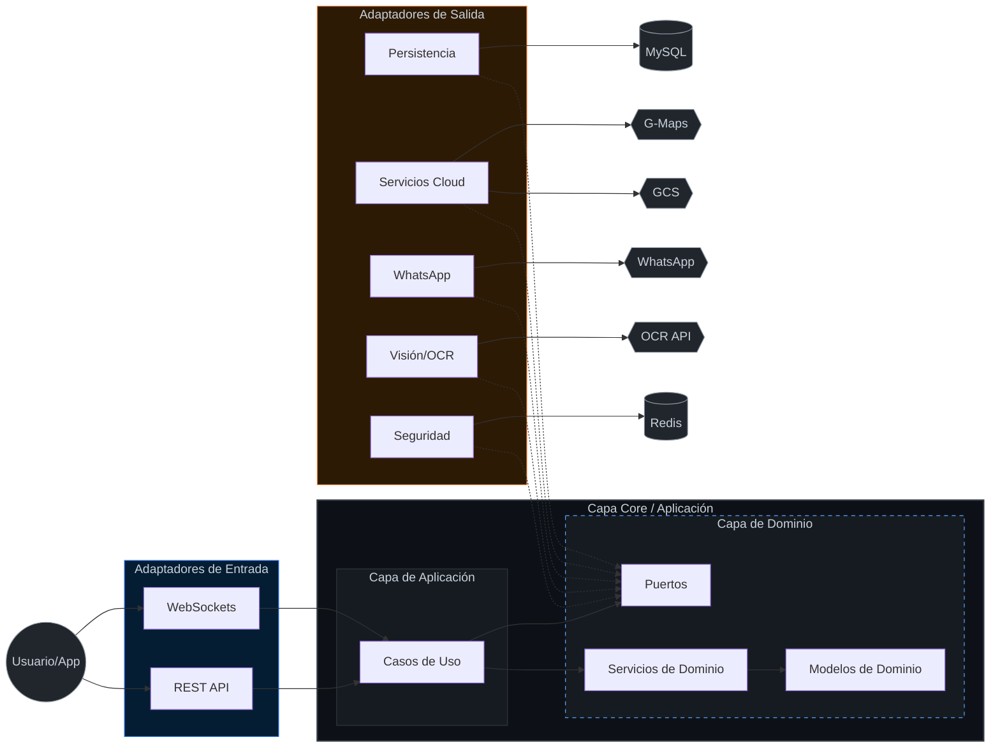
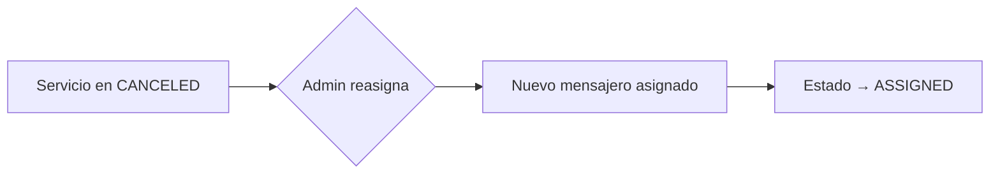

> **Copyright (C) 2026 Mateo Valencia Ardila. Todos los derechos reservados. El código fuente de esta aplicación está protegido por las leyes de derechos de autor. Registro DNDA No. 13-108-139. Queda estrictamente prohibida su copia, distribución o modificación sin autorización expresa.**

<div align="center">

# Messenger Backend API


[](https://openjdk.org/)
[](https://spring.io/projects/spring-boot)
[](https://www.mysql.com/)
[](https://redis.io/)
[](https://cloud.google.com/)
[](LICENSE)

**Sistema de entregas con reconocimiento automático de placas vehiculares mediante OCR.**

[🇺🇸 English Version](./README.en.md)

</div>

---

## Tabla de Contenidos

- [Arquitectura](#-arquitectura)
- [Stack Tecnológico](#-stack-tecnológico)
- [Estructura del Proyecto](#-estructura-del-proyecto)
- [Perfiles de Ambiente](#-perfiles-de-ambiente)
- [API Endpoints](#-api-endpoints)
- [Esquema de Base de Datos](#-esquema-de-base-datos)
- [Tracking en Tiempo Real](#-tracking-en-tiempo-real)
- [Flujo de Estados](#-flujo-de-estados)
- [Observabilidad](#-observabilidad)
- [Auditoría](#-auditoría)
- [Configuración e Instalación](#️-configuración-e-instalación)
- [CI/CD](#-cicd)
- [Testing](#-testing)
- [Optimización de Rendimiento](#-optimización-de-rendimiento)
- [Colección Postman](#-colección-postman)
- [Integración Android](#-integración-android)

---

## Arquitectura

El proyecto implementa **Arquitectura Hexagonal (Ports & Adapters)** para mantener el dominio aislado de las dependencias externas.


```mermaid
graph LR
    %% Actores Externos
    USER((Usuario/App))
    MAPS{{G-Maps}}
    GCS{{GCS}}
    WAPP{{WhatsApp}}
    OCR_EXT{{OCR API}}
    DB[(MySQL)]
    REDIS[(Redis)]

    subgraph IN [Adaptadores de Entrada]
        direction TB
        REST[REST API]
        SOC[WebSockets]
    end

    subgraph CORE [Capa Core / Aplicación]
        direction TB
        subgraph APP [Capa de Aplicación]
            UC[Casos de Uso]
        end
        subgraph DOMAIN [Capa de Dominio]
            SVC[Servicios de Dominio]
            PORTS[Puertos]
            MODEL[Modelos de Dominio]
        end
    end

    subgraph OUT [Adaptadores de Salida]
        direction TB
        PERS[Persistencia]
        CLD[Servicios Cloud]
        WABA[WhatsApp]
        VIS[Visión/OCR]
        SEC[Seguridad]
    end

    %% Flujo de Entrada
    USER --> REST & SOC
    REST & SOC --> UC

    %% Lógica de Aplicación
    UC --> SVC
    UC --> PORTS
    SVC --> MODEL

    %% Flujo de Salida (Inversión de Dependencia)
    PERS -.-> PORTS
    CLD -.-> PORTS
    WABA -.-> PORTS
    VIS -.-> PORTS
    SEC -.-> PORTS

    %% Conexiones de Infraestructura
    PERS --> DB
    CLD --> GCS & MAPS
    WABA --> WAPP
    VIS --> OCR_EXT
    SEC --> REDIS

    %% Estilos
    style CORE fill:#0d1117,stroke:#30363d,stroke-width:2px,color:#c9d1d9
    style DOMAIN fill:#161b22,stroke:#58a6ff,stroke-dasharray: 5 5,color:#c9d1d9
    style APP fill:#161b22,stroke:#30363d,color:#c9d1d9
    style IN fill:#051d33,stroke:#1f6feb,color:#c9d1d9
    style OUT fill:#2d1a05,stroke:#f0883e,color:#c9d1d9

    classDef actor fill:#21262d,stroke:#8b949e,color:#c9d1d9
    class USER,MAPS,GCS,WAPP,OCR_EXT,DB,REDIS actor
```

---

## Stack Tecnológico

| Componente                | Tecnología                                                                                                    |
| ------------------------- | ------------------------------------------------------------------------------------------------------------- |
| **Framework**             | Spring Boot 3.5.10                                                                                            |
| **Lenguaje**              | Java 17                                                                                                       |
| **Base de Datos**         | MySQL 8.0+                                                                                                    |
| **Migraciones**           | Flyway                                                                                                        |
| **Cache/Streaming**       | Redis                                                                                                         |
| **Seguridad**             | JWT + BCrypt + Cloudflare Turnstile (Protección contra Bots) + Bucket4j (Rate Limiting Distribuido con Redis) |
| **Documentación**         | OpenAPI / Swagger UI                                                                                          |
| **OCR**                   | Plate Recognizer API                                                                                          |
| **Speech-to-Text**        | Google Cloud Speech-to-Text                                                                                   |
| **Almacenamiento**        | Google Cloud Storage                                                                                          |
| **Mapas**                 | Google Maps Platform                                                                                          |
| **Cliente Móvil**         | Capacitor (Generación de App Android)                                                                         |
| **WhatsApp**              | WhatsApp Cloud API (Meta)                                                                                     |
| **Tiempo Real**           | WebSocket + Redis                                                                                             |
| **Build**                 | Maven 3.9+                                                                                                    |
| **Migraciones**           | Flyway (Versionamiento de base de datos)                                                                      |
| **Monitoreo**             | Spring Boot Actuator (Health, Metrics)                                                                        |
| **Auditoría**             | JPA Callbacks + AOP (Aspect Oriented Programming)                                                             |
| **CI/CD**                 | GitHub Actions                                                                                                |
| **Tests de Arquitectura** | ArchUnit                                                                                                      |
| **Rendimiento**           | Spring Cache + Redis, Hibernate L2 Cache, Lazy Loading, Índices de Base de Datos                              |

---

## Estructura del Proyecto

```
messenger/
├── src/main/java/app/
│   ├── MessengerApplication.java
│   ├── adapter/
│   │   ├── in/                          # Adaptadores de entrada
│   │   │   ├── builder/                 # Constructores de objetos
│   │   │   ├── rest/
│   │   │   │   ├── controllers/         # REST Controllers
│   │   │   │   ├── mapper/              # Mappers Request/Response
│   │   │   │   ├── request/             # DTOs de entrada
│   │   │   │   └── response/            # DTOs de salida
│   │   │   └── websocket/               # Tracking en tiempo real
│   │   └── out/                         # Adaptadores de salida
│   │       ├── maps/                    # Google Maps Integration
│   │       ├── ocr/                     # Plate Recognizer OCR
│   │       ├── persistence/             # Adaptadores JPA
│   │       ├── security/                # JWT Adapter
│   │       ├── storage/                 # Google Cloud Storage
│   │       ├── tracking/                # Location Tracking
│   │       └── whatsapp/                # WhatsApp Cloud API
│   ├── application/
│   │   └── usecase/                     # 11 Casos de Uso (Monitoreo, Location, Tracking...)
│   ├── domain/
│   │   ├── exception/                   # BusinessException, InputsException...
│   │   ├── model/                       # 14+ Modelos + 7 Enums + Auth
│   │   │   └── enums/                   # Role, Status, PlateType...
│   │   ├── ports/                       # 14 Puertos (interfaces)
│   │   └── services/                    # Servicios de dominio
│   └── infrastructure/
│       ├── audit/                       # Sistema de Auditoría AOP
│       ├── config/                      # Configuración de Spring
│       ├── exception/                   # Manejo global de errores
│       ├── persistence/
│       │   └── entities/                # Entidades JPA
│       ├── scheduler/                   # Tareas de limpieza (Trash)
│       └── security/                    # Configuración de Seguridad / Filtros
└── src/main/resources/
    ├── application.properties           # Configuración base
    ├── application-local.properties     # Desarrollo local (H2)
    ├── application-dev.properties       # Desarrollo con APIs
    ├── application-test.properties      # Testing automatizado
    ├── application-prod.properties      # Producción
    └── db/migration/                    # Migraciones Flyway
```

---

## Perfiles de Ambiente

| Perfil  | Propósito                         | Base de Datos                | APIs Externas      | JWT Exp. |
| ------- | --------------------------------- | ---------------------------- | ------------------ | -------- |
| `local` | Desarrollo local sin dependencias | MySQL Local                  | Mock/Deshabilitado | 8 horas  |
| `dev`   | Desarrollo con servicios reales   | MySQL                        | Habilitado         | 8 horas  |
| `test`  | Testing automatizado (CI/CD)      | Testcontainers (MySQL/Redis) | Mock               | 1 hora   |
| `prod`  | Producción (Cloud Run)            | Cloud SQL (MySQL 8)          | Habilitado         | 30 min   |

---

### Inicio Rápido (Docker Zero-Config)

Para una demostración rápida sin configurar dependencias, usa Docker Compose. Esto levantará el frontend, backend, base de datos y redis automáticamente.

1. Navega a la raíz del backend: `cd messenger-backend`
2. Ejecuta: `docker-compose -f docker-compose.local.yml up --build`
3. Accede a: `http://localhost`

---

### Desarrollo con Hot Reloading

Para desarrollo activo con recarga automática de código (sin necesidad de reiniciar los contenedores al hacer cambios):

```bash
docker-compose -f docker-compose.dev.yml up --build
```

| Servicio            | URL                     | Descripción                               |
| ------------------- | ----------------------- | ----------------------------------------- |
| Frontend (Vite HMR) | `http://localhost:5173` | Se recarga automáticamente al guardar     |
| Backend API         | `http://localhost:8080` | Se reinicia automáticamente al recompilar |
| PHPMyAdmin          | `http://localhost:8081` | Gestión de base de datos                  |
| Debug Remoto        | Puerto `5005`           | Conectar debugger de IntelliJ/VS Code     |

> [!TIP]
> Consulta la **[Guía de Inicio Rápido](./GUIA_RAPIDA.md)** para más detalles sobre credenciales de prueba y acceso a phpMyAdmin.

---

### Perfiles

<details>
<summary><b>Local</b> - Sin dependencias externas</summary>

- Base de datos MySQL Local (Dockerizada)
- **Zero-Config**: Perfil pre-configurado con llaves de prueba y Mocks
- **Carga de Datos**: Inicialización automática de usuarios (Admin/Messenger) via `DataInitializer`
- OCR simulado (MockOcrAdapter)
- Almacenamiento local (LocalStorageAdapter)
- Logs detallados
- Perfecto para demostraciones rápidas y desarrollo offline

</details>

<details>
<summary><b>Dev</b> - Desarrollo con APIs</summary>

- MySQL de desarrollo
- Google Cloud APIs habilitadas
- SQL visible para debugging
- Actuator endpoints habilitados
- Tracking interval: 15 segundos

</details>

<details>
<summary><b>Test</b> - Testing automatizado</summary>

- **Integración con Testcontainers**: Ciclo de vida automatizado para MySQL 8.0 y Redis 7.2.
- **Patrón Singleton Jerárquico**: `BaseContainerTest` asegura que la infraestructura se inicie una sola vez por JVM.
- **Aislamiento de Datos**: Cada ejecución ocurre en un entorno limpio y aislado.
- **Paridad con Flyway**: Los tests corren contra el mismo esquema de migraciones que producción.

</details>

<details>
<summary><b>Prod</b> - Producción (Optimizado Cloud Run)</summary>

- MySQL con SSL obligatorio
- Pool de conexiones optimizado (HikariCP)
- **Logging Estructurado JSON** (Logstash Encoder)
- Graceful shutdown habilitado (30s timeout)
- Headers de seguridad (HSTS, HTTP-only cookies)
- Compresión habilitada
- Sin stack traces expuestos
- Soporte Proxy Cloud Run (Forwarded Headers)

</details>

---

### Activación

```bash
# Variable de entorno (recomendado)
export SPRING_PROFILES_ACTIVE=dev

# Línea de comandos
./mvnw spring-boot:run -Dspring.profiles.active=dev

# Docker
docker run -e SPRING_PROFILES_ACTIVE=prod messenger-api
```

---

## API Endpoints

### Autenticación (`/auth`)

| Método | Endpoint         | Descripción                                                                     |
| ------ | ---------------- | ------------------------------------------------------------------------------- |
| `POST` | `/auth/login`    | Iniciar sesión y obtener tokens de acceso + refresh (Requiere `turnstileToken`) |
| `POST` | `/auth/refresh`  | Renovar token de acceso con refresh token                                       |
| `GET`  | `/auth/ws-token` | Obtener token temporal para conexión WebSocket                                  |
| `POST` | `/auth/logout`   | Cerrar sesión y limpiar cookies de autenticación                                |

---

### Empleados (`/employees`) - Solo ADMIN

| Método   | Endpoint                           | Descripción                   |
| -------- | ---------------------------------- | ----------------------------- |
| `POST`   | `/employees/createEmployee`        | Crear nuevo empleado          |
| `GET`    | `/employees/allEmployees`          | Listar todos los empleados    |
| `GET`    | `/employees/findByEmployeeId/{id}` | Obtener empleado por ID       |
| `PUT`    | `/employees/updateEmployee/{id}`   | Actualizar empleado existente |
| `DELETE` | `/employees/deleteEmployee/{id}`   | Eliminar empleado             |

---

### Concesionarios (`/dealerships`)

| Método   | Endpoint                                   | Descripción                                     |
| -------- | ------------------------------------------ | ----------------------------------------------- |
| `POST`   | `/dealerships/createDealership`            | Crear concesionario (ADMIN)                     |
| `GET`    | `/dealerships/allDealerships`              | Listar todos los concesionarios                 |
| `GET`    | `/dealerships/findByDealershipId/{id}`     | Obtener por ID                                  |
| `GET`    | `/dealerships/findByDealershipName/{name}` | Obtener por Nombre                              |
| `PUT`    | `/dealerships/updateDealership/{id}`       | Actualizar concesionario (ADMIN)                |
| `DELETE` | `/dealerships/deleteDealership/{id}`       | Eliminar concesionario (ADMIN)                  |
| `POST`   | `/dealerships/geocodeDealership/{id}`      | Geocodificar dirección de concesionario (ADMIN) |

---

### Servicios de Entrega (`/services`)

| Método   | Endpoint                         | Descripción                                                          |
| -------- | -------------------------------- | -------------------------------------------------------------------- |
| `POST`   | `/services/extractPlate`         | Extraer placa de imagen usando OCR (preview antes de crear)          |
| `POST`   | `/services/createService`        | Crear servicio (multipart: imagen + datos)                           |
| `PUT`    | `/services/updateService/{uuid}` | Actualizar estado (multipart: estado + evidencias + GIF)             |
| `PUT`    | `/services/reassign/{uuid}`      | Reasignar a otro mensajero (ADMIN/CANCELED)                          |
| `GET`    | `/services/findByServiceId/{uuid}`| Obtener servicio por UUID                                            |
| `GET`    | `/services/allServicesPageable`  | Listar servicios con **paginación, búsqueda y ordenamiento**         |
| `GET`    | `/services/stats/daily`          | INHABILITADO - Estadísticas diarias (requiere messengerId, from, to) |
| `DELETE` | `/services/deleteService/{uuid}` | Mover a papelera (ADMIN)                                             |
| `GET`    | `/services/trash`                | Listar servicios eliminados con **paginación** (ADMIN)               |
| `POST`   | `/services/trash/restore/{uuid}` | Restaurar desde papelera (ADMIN)                                     |
| `DELETE` | `/services/trash/empty`          | Vaciar papelera permanentemente (ADMIN)                              |
| `DELETE` | `/services/trash/{uuid}`         | Eliminación individual permanente (ADMIN)                            |

---

### Transcripción (`/api/transcribe`)

| `POST` | `/api/transcribe` | Transcribir archivo de audio a texto usando Google Cloud STT |

---

### WhatsApp (`/api/whatsapp`)

| Método | Endpoint                | Descripción                                                |
| ------ | ----------------------- | ---------------------------------------------------------- |
| `GET`  | `/api/whatsapp/webhook` | Verificación de webhook (requerido por Meta)               |
| `POST` | `/api/whatsapp/webhook` | Recepción de mensajes entrantes (Validado con HMAC-SHA256) |

> [!TIP]
> **Flujo del Bot de WhatsApp**:
>
> 1. El usuario envía un mensaje.
> 2. El bot solicita un PIN de acceso de 4 dígitos (se solicita cada 12 horas).
> 3. Tras la autenticación, el usuario puede consultar estados de placas o listar entregas pendientes.

> [!CAUTION]
> **Restricciones de Archivos**:
>
> - **Imágenes**: Máx 10MB (JPEG/PNG)
> - **GIFs**: Máx 5MB (GIF87a/GIF89a)
> - **Firmas**: Máx 2MB (SVG/PNG)

---

### Configuraciones del Sistema (`/settings`) - Solo ADMIN

| Método | Endpoint                  | Descripción                                    |
| ------ | ------------------------- | ---------------------------------------------- |
| `GET`  | `/settings/status-colors` | Obtener configuración de colores de estados    |
| `PUT`  | `/settings/status-colors` | Actualizar configuración de colores de estados |

---

### Ubicaciones y Rutas (`/locations`)

| Método | Endpoint              | Descripción                              |
| ------ | --------------------- | ---------------------------------------- |
| `POST` | `/locations/geocode`  | Dirección a coordenadas                  |
| `POST` | `/locations/route`    | INHABILITADO - Calcular ruta optimizada  |
| `GET`  | `/locations/distance` | Distancia + tiempo estimado entre puntos |
| `GET`  | `/locations/reverse`  | Coordenadas a dirección                  |

---

### Archivos (`/files`)

| Método | Endpoint            | Descripción                                     |
| ------ | ------------------- | ----------------------------------------------- |
| `GET`  | `/files/{filename}` | Descargar archivo protegido (fotos/firmas/GIFs) |

---

### Tracking en Tiempo Real (`/tracking` & WebSocket)

| Método | Endpoint                   | Descripción                                               |
| ------ | -------------------------- | --------------------------------------------------------- |
| `WS`   | `/ws/tracking/update`             | Actualizar ubicación vía WebSocket (con Heartbeat)         |
| `POST` | `/tracking/update`         | INHABILITADO - Alternativa REST para actualizar ubicación |
| `GET`  | `/tracking/messenger/{uuid}`      | Obtener última ubicación conocida (ADMIN)                  |
| `POST` | `/tracking/messengers/bulk-locations`| Obtener última ubicación de varios mensajeros (ADMIN)  |
| `GET`  | `/tracking/active`                | Listar todos los mensajeros activos (ADMIN)                |
| `GET`  | `/tracking/history/pageable/{uuid}`| Obtener historial de ubicaciones con **paginación**       |
| `GET`  | `/tracking/service/{uuid}`        | Obtener historial para un servicio específico              |

---

### Monitoreo (`/monitoring`) - Solo ADMIN

| Método | Endpoint                              | Descripción                                            |
| ------ | ------------------------------------- | ------------------------------------------------------ |
| `GET`  | `/monitoring/messenger/{id}/activity` | Línea de tiempo y estadísticas diarias de un mensajero |

---

## Esquema de Base de Datos


```mermaid
erDiagram
    employees {
        Long id_employee PK
        Long document UK
        String full_name
        String phone

        String password
        Role role
    }

    dealerships {
        Long id_dealership PK
        String name UK
        String address
        String phone
        String zone
        Double latitude
        Double longitude
        Boolean is_geolocated
        String whatsapp_pin UK
    }

    plates {
        Long id_plate PK
        String plate_number UK
        PlateType plate_type
        LocalDateTime upload_date
    }

    service_deliveries {
        Long id_service_delivery PK
        Long plate_id FK
        Long dealership_id FK
        Long messenger_id FK
        Status current_status
        String observation
        Long signature_id FK
        LocalDateTime created_at
        Boolean deleted
        LocalDateTime deleted_at
    }

    signatures {
        Long id_signature PK
        String signature_path
        String gif_path
        LocalDateTime upload_date
    }

    photos {
        Long id_photo PK
        String photo_path
        PhotoType photo_type
        Long service_delivery_id FK
        Long status_history_id FK
        LocalDateTime upload_date
    }

    status_history {
        Long id_status_history PK
        Status previous_status
        Status new_status
        LocalDateTime change_date
        Long changed_by_employee_id FK
        Long service_delivery_id FK
        Long signature_id FK
        Double delivery_latitude
        Double delivery_longitude
        String observation
    }

    tracking_history {
        Long history_id PK
        Long messenger_id FK
        Long service_delivery_id FK
        Double latitude
        Double longitude
        Double speed
        TrackingSource source
        LocalDateTime recorded_at
    }

    system_settings {
        String setting_key PK
        String setting_value
        LocalDateTime updated_at
    }

    deleted_services {
        Long id_service_delivery PK
        LocalDateTime permanently_deleted_at
        String deletion_reason
        String original_data_json
    }

    wa_sessions {
        Long id PK
        String phone_number
        Long dealership_id FK
        LocalDateTime expires_at
        LocalDateTime created_at
    }

    employees ||--o{ service_deliveries : "delivers"
    dealerships ||--o{ service_deliveries : "receives"
    plates ||--o{ service_deliveries : "has"
    service_deliveries ||--o| signatures : "has"
    service_deliveries ||--o{ photos : "has"
    service_deliveries ||--o{ status_history : "tracks"
    employees ||--o{ status_history : "changes"
    status_history ||--o{ photos : "evidence"
    status_history ||--o| signatures : "verified_by"
    employees ||--o{ tracking_history : "tracked"
    service_deliveries ||--o{ tracking_history : "route"
    dealerships ||--o{ wa_sessions : "authorized"
```

---

### Enums

| Enum               | Valores                                                                                                   |
| ------------------ | --------------------------------------------------------------------------------------------------------- |
| **Role**           | `ADMIN`, `MESSENGER`                                                                                      |
| **PlateType**      | `CAR` (ABC 123), `MOTORCYCLE` (ABC 12A), `MOTORCAR` (123 ABC)                                             |
| **Status**         | `ASSIGNED`, `PENDING`, `DELIVERED`, `RETURNED`, `CANCELED`, `RESOLVED`, `FAILED`(INHABILITADO), `DELETED` |
| **PhotoType**      | `PLATE_DETECTION`, `EVIDENCE`                                                                             |
| **TrackingStatus** | `ACTIVE`, `INACTIVE`, `OFFLINE`                                                                           |
| **TrackingSource** | `GPS`, `NETWORK`, `MANUAL`                                                                                |

---

## Tracking en Tiempo Real

Sistema de tracking GPS usando **Redis** + **WebSocket** para monitoreo de mensajeros.

### Características

| Feature                   | Descripción                                           |
| ------------------------- | ----------------------------------------------------- |
| **Ubicación en vivo**     | Actualización cada 45 seg (mín. 5s)                   |
| **Validación de entrega** | INHABILITADO - Radio máximo de 200m del destino       |
| **Precisión técnica**     | Filtro de error GPS < 100m para historial             |
| **Historial completo**    | Retención permanente (Archivado histórico)            |
| **Baja latencia**         | Redis para caché de ubicaciones                       |
| **WebSocket**             | Actualizaciones de datos en tiempo real (Server Push) |

---

### API WebSocket

URL de conexión: `ws://localhost:8080/ws/tracking`

| Tipo   | Destino                   | Descripción                              |
| ------ | ------------------------- | ---------------------------------------- |
| `SEND` | `/app/tracking/update`    | Enviar actualización de GPS              |
| `SEND` | `/app/tracking/heartbeat` | Enviar señal de vida (sin GPS)           |
| `SUB`  | `/topic/tracking/{id}`    | Recibir actualizaciones de un mensajero  |
| `SUB`  | `/topic/tracking/all`     | Recibir actualizaciones de todos (Admin) |

---

### Integración Google Maps

- **Geocoding**: Dirección ↔ Coordenadas
- **Directions API**: INHABILITADO - Rutas optimizadas
- **Distance Matrix**: Estimación de tiempos
- **Reverse Geocoding**: Coordenadas → Dirección

---

### Reglas de Negocio

> [!IMPORTANT]
> **Transiciones de Estado por Rol**
>
> - **MENSAJERO** solo puede trabajar con: `PENDING`, `DELIVERED`, `RETURNED`.
> - **ADMIN** solo puede trabajar con: `CANCELED`, `RESOLVED`.
> - Los servicios pueden ser modificados en cualquier momento sin importar su estado actual.
> - Los administradores pueden reasignar servicios en estado **CANCELED** a otro mensajero.

> [!NOTE]
> **Requisitos de Evidencia**
>
> - **DELIVERED**: Firma y verificación GIF obligatorias.
> - **PENDING**: Firma, verificación GIF, al menos una foto y observación obligatorias.
> - **RETURNED**: Al menos una foto y observación obligatorias (no requiere firma).
> - **CANCELED** & **RESOLVED**: No requieren evidencia adicional.

> [!NOTE]
> **Eliminación Suave (Papelera)**
> Los servicios eliminados se mueven a una **papelera** y se archivan permanentemente después de **60 días**.
> Los administradores pueden restaurar servicios de la papelera antes de la eliminación permanente.

---

### Reglas de Estados

| Estado      | Mensajero                            | Admin                    | Eliminar    |
| ----------- | ------------------------------------ | ------------------------ | ----------- |
| `ASSIGNED`  | → `PENDING`, `DELIVERED`, `RETURNED` | → `CANCELED`, `RESOLVED` | ✅ Papelera |
| `RETURNED`  | → `PENDING`, `DELIVERED`             | → `CANCELED`, `RESOLVED` | ✅ Papelera |
| `PENDING`   | → `DELIVERED`, `RETURNED`            | → `CANCELED`, `RESOLVED` | ✅ Papelera |
| `DELIVERED` | → `PENDING`, `RETURNED`              | → `CANCELED`, `RESOLVED` | ✅ Papelera |
| `CANCELED`  | -                                    | Reasignar → `ASSIGNED`   | ✅ Papelera |
| `RESOLVED`  | -                                    | -                        | ✅ Papelera |

---

### Resumen de Permisos

| Rol           | Estados Disponibles                | Acciones Especiales                                   | Notas                                                                           |
| ------------- | ---------------------------------- | ----------------------------------------------------- | ------------------------------------------------------------------------------- |
| **MENSAJERO** | `PENDING`, `DELIVERED`, `RETURNED` | -                                                     | Puede cambiar servicios a cualquier estado permitido en cualquier momento       |
| **ADMIN**     | `CANCELED`, `RESOLVED`             | **Reasignar mensajero** (desde `CANCELED` únicamente) | Puede cambiar servicios a estados administrativos desde cualquier estado actual |

---

### Flujo de Reasignación


```mermaid
flowchart LR
    A[Servicio en CANCELED] --> B{Admin reasigna}
    B --> C[Nuevo mensajero asignado]
    C --> D[Estado → ASSIGNED]
```

---

### Gestión de Papelera (Soft Delete y Archivo)

| Acción              | Endpoint                            | Descripción                                        |
| ------------------- | ----------------------------------- | -------------------------------------------------- |
| Eliminar → Papelera | `DELETE /services/{id}`             | Mueve a papelera (soft delete)                     |
| Ver Papelera        | `GET /services/trash`               | Lista servicios eliminados (ADMIN)                 |
| Restaurar           | `POST /services/trash/restore/{id}` | Restaura desde papelera (ADMIN)                    |
| Vaciar Papelera     | `POST /services/trash/empty`        | Archiva todos los elementos de la papelera (ADMIN) |
| Archivo Automático  | Job programado (3 AM diario)        | Archiva servicios después de 60 días               |

**Sistema de Archivo**: Los servicios se archivan permanentemente en tablas dedicadas (`deleted_services`, `deleted_status_history`, `deleted_photos`, `deleted_tracking_history`, `deleted_signatures`) en lugar de ser eliminados. Todos los datos históricos se preservan para auditoría y análisis.

---

  - **Validación de Webhook**: Usa HMAC-SHA256 con el App Secret de Meta para verificar el origen de la petición.
  - **Protección por PIN**: Autenticación por PIN de 4 dígitos requerida para acceder a los datos de concesionarios.
  - **Protección Fuerza Bruta**: El acceso al bot se bloquea por 15 minutos tras 3 intentos fallidos de PIN, con delays progresivos entre intentos.
- Headers de respuesta: `X-Rate-Limit-Remaining`, `X-Rate-Limit-Retry-After-Seconds`

---

### Roles y Permisos

- **ADMIN**: Acceso completo a todos los endpoints
- **MESSENGER**: Solo gestiona sus propios servicios y ubicación

---

### Headers de Seguridad (Producción)

- HSTS (HTTP Strict Transport Security)
- Cookies: `Secure`, `HttpOnly`, `SameSite=Strict`
- CORS configurado por origen
- Sin exposición de stack traces

---

## Observabilidad

### Endpoints de Monitoreo (Actuator)

| Endpoint            | Descripción                        | Perfil         | Acceso        |
| ------------------- | ---------------------------------- | -------------- | ------------- |
| `/actuator/health`  | Estado de salud (DB, Redis, Disco) | Todos          | Público       |
| `/actuator/metrics` | Métricas de JVM y HTTP             | `dev`, `local` | Privado (JWT) |
| `/actuator/info`    | Información de la build            | Todos          | Privado (JWT) |

---

### Optimización para Cloud Run

- **Logging JSON (Prod):** Salida estructurada compatible con Google Cloud Logging
- **Graceful Shutdown:** Espera 30s para terminar conexiones activas
- **SSL Offloading:** Confía en headers de proxy (`X-Forwarded-Proto`) de Cloud Run

---

### Documentación API

| Endpoint                 | Descripción                       |
| ------------------------ | --------------------------------- |
| `/swagger-ui/index.html` | Interfaz Swagger UI interactiva   |
| `/v3/api-docs`           | Especificación OpenAPI 3.0 (JSON) |
| `/v3/api-docs.yaml`      | Especificación OpenAPI 3.0 (YAML) |

> [!TIP]
> Swagger UI es accesible públicamente en el perfil `dev`. En producción, considera restringir el acceso mediante configuración de seguridad.

---

## Auditoría

### Sistema de Auditoría Basado en AOP

La aplicación incluye un **sistema de logging de auditoría centralizado** usando Programación Orientada a Aspectos (AOP). Las acciones críticas se registran automáticamente con contexto de usuario, tiempo y resultados.

---

### Acciones Auditadas

| Componente                 | Acción                  | Descripción                                  |
| -------------------------- | ----------------------- | -------------------------------------------- |
| **AuthController**         | `LOGIN`                 | Intentos de inicio de sesión                 |
|                            | `TOKEN_REFRESH`         | Renovación de token de acceso                |
| **ServiceDeliveryUseCase** | `CREATE_SERVICE`        | Crear servicio desde imagen OCR              |
|                            | `CREATE_SERVICE_MANUAL` | Crear servicio con placa manual              |
|                            | `UPDATE_STATUS`         | Actualizar estado de servicio                |
|                            | `REASSIGN_MESSENGER`    | Reasignar servicio a otro mensajero          |
|                            | `DELETE_SERVICE`        | Mover servicio a papelera                    |
|                            | `RESTORE_SERVICE`       | Restaurar servicio desde papelera            |
|                            | `EMPTY_TRASH`           | Vaciar papelera permanentemente              |
|                            | `ARCHIVE_SERVICE`       | Archivar servicio de la papelera manualmente |
| **EmployeeUseCase**        | `CREATE_EMPLOYEE`       | Crear nuevo empleado                         |
|                            | `UPDATE_EMPLOYEE`       | Actualizar información de empleado           |
|                            | `DELETE_EMPLOYEE`       | Eliminar empleado                            |

---

## Verificación de Arquitectura

El proyecto incluye pruebas de **ArchUnit** para forzar la integridad estructural y asegurar que los principios de la **Arquitectura Hexagonal** nunca sean violados.

### Reglas Automatizadas

- **Aislamiento de Capas**: Las capas de Dominio y Aplicación nunca deben depender de la Infraestructura.
- **Flujo de Dependencias**: Los adaptadores de entrada solo deben hablar con los Casos de Uso, y los Casos de Uso solo deben interactuar con servicios de Dominio o Puertos.
- **Integridad de Paquetes**: Controladores, entidades y repositorios deben residir en sus respectivos paquetes de adaptador/infraestructura.

Ejecutar pruebas de arquitectura:

```bash
mvn test -Dtest=HexagonalArchitectureTest
```

---

### Formato del Log

```
AUDIT | timestamp | documento_usuario | accion | metodo | parametros | estado | duracion | error
```

**Ejemplo:**

```
2025-12-21 00:42:00.123 [AUDIT] AUDIT | 2025-12-21 00:42:00 | 123456 | UPDATE_STATUS | ServiceDeliveryUseCase.updateStatus | [1, DELIVERED, "Entregado", ...] | SUCCESS | 125ms |
```

---

### Configuración

- **Nombre del Logger:** `AUDIT`
- **Nivel:** `WARN` (siempre visible en todos los ambientes)
- **Salida:** Consola (Cloud Run captura stdout)
- **Salida a Archivo:** Opcional, habilitar `AUDIT_FILE` appender en `logback-spring.xml`

---

## Optimización de Rendimiento

El sistema incluye múltiples capas de optimización para garantizar un alto rendimiento y baja latencia.

### Estrategia de Caché (Redis)

- **Abstracción de Spring Cache**: Caché a nivel de aplicación usando `@Cacheable` y `@CacheEvict`.
  - `Dealerships` (Concesionarios): TTL 30 minutos.
  - `Employees` (Empleados): TTL 15 minutos.
- **Hibernate Second-Level Cache (L2)**: Caché a nivel de entidad vía Redisson para reducir la carga en la base de datos.
  - Habilitado para `DealershipEntity`, `EmployeeEntity`, y `PlateEntity`.
- **Serialización Personalizada**: `ObjectMapper` optimizado con soporte para `JavaTimeModule` para manejar `LocalDateTime`.

---

### Optimización de Carga de Datos

- **Lazy Loading (Carga Perezosa)**: La mayoría de las relaciones en `ServiceDeliveryEntity` están configuradas como `FetchType.LAZY` para evitar cargar datos innecesarios.
- **Entity Graphs**: Definiciones explícitas de `@EntityGraph` en los repositorios para resolver el problema N+1, cargando solo las asociaciones requeridas en una única consulta.

---

### Optimización de Imágenes

- **Redimensionamiento Automático**: Las imágenes se redimensionan automáticamente a un máximo de 1280px (ancho o alto) preservando la relación de aspecto.
- **Compresión Inteligente**: Reducción de calidad al 75% para archivos JPEG usando la librería `Thumbnailator`, reduciendo significativamente el uso de almacenamiento y ancho de banda sin pérdida de detalle perceptible.

---

### Tuning del Pool de Conexiones (HikariCP)

- **Optimizado para Cloud SQL**: Parámetros ajustados para entornos de recursos limitados (db-f1-micro).
- **Detección de Fugas**: Umbral activo para identificar y prevenir fugas de conexiones.
- **Caché de Statements**: Habilitado para mejorar el rendimiento de ejecución de consultas.

---

## Configuración e Instalación

### Prerrequisitos

| Requisito | Versión |
| --------- | ------- |
| Java      | 17+     |
| MySQL     | 8.0+    |
| Redis     | 6.0+    |
| Maven     | 3.9+    |

---

### Variables de Entorno Requeridas

| Variable                   | Descripción                   | Default/Ejemplo           |
| -------------------------- | ----------------------------- | ------------------------- |
| `DB_NAME`                  | Nombre de la DB MySQL         | `messenger_db`            |
| `DB_USERNAME`              | Usuario de la DB              | `root`                    |
| `DB_PASSWORD`              | Contraseña de la DB           | `******`                  |
| `REDIS_HOST`               | Host del servidor Redis       | `localhost`               |
| `JWT_SECRET`               | Clave 256-bit para Tokens     | `openssl rand -base64 64` |
| `GOOGLE_MAPS_API_KEY`      | Key de Google Maps            | `AIza...`                 |
| `GCS_BUCKET_NAME`          | Bucket para evidencias        | `plak-evidence`           |
| `TURNSTILE_SECRET_KEY`     | Cloudflare Secret Key         | `0x4AAAAAA...`            |
| `CORS_ALLOWED_ORIGINS`     | URLs de frontend permitidas   | `http://localhost:5173`   |
| `WHATSAPP_PHONE_NUMBER_ID` | ID del Teléfono de WhatsApp   | `123456789...`            |
| `WHATSAPP_ACCESS_TOKEN`    | Token Permanente de Meta      | `EAAG...`                 |
| `WHATSAPP_VERIFY_TOKEN`    | Token de Verificación Webhook | `mi_token_secreto`        |
| `WHATSAPP_APP_SECRET`      | App Secret de Meta            | `abc123...`               |

---

### Inicio Rápido (Docker) - Recomendado

Ejecuta el stack completo localmente con un solo comando.

#### Requisitos Previos

- Docker y Docker Compose
- Git

#### Pasos

1. **Clonar el repositorio**

   ```bash
   git clone https://github.com/StartApp-FTT/messenger-backend.git
   cd messenger-backend
   ```

2. **Configurar Entorno**

   ```bash
   cd messenger
   cp .env.example .env
   # Edita .env con tu Key de Google Maps y Credenciales
   ```

3. **Ejecutar con Docker**
   ```bash
   cd ..
   docker-compose -f docker-compose.local.yml up --build
   ```

La API estará disponible en `http://localhost:8080`.

---

### Instalación Manual

```bash
# 1. Clonar
git clone <repository-url>
cd messenger-backend/messenger

# 2. Configurar variables (ver sección anterior)

# 3. Iniciar Redis
redis-server

# 4. Ejecutar
./mvnw spring-boot:run -Dspring.profiles.active=dev
```

La API estará disponible en `http://localhost:8080`

---

## CI/CD

Pipeline automatizado con **GitHub Actions**:

```yaml
# .github/workflows/maven.yml
on:
  push:
    branches: ["main", "develop"]
  pull_request:
    branches: ["main", "develop"]
```

---

### Características

| Feature               | Descripción                             |
| --------------------- | --------------------------------------- |
| Build automático      | Java 17 + Maven                         |
| Caché de dependencias | Builds más rápidos                      |
| Secrets seguros       | Inyección de credenciales               |
| Testing               | Profile `test` con Docker (MySQL/Redis) |

---

### Secrets de GitHub Requeridos

```
GOOGLE_APPLICATION_CREDENTIALS_JSON
```

> [!NOTE]
> El pipeline utiliza un entorno efímero con **Docker** (MySQL + Redis) para los tests de integración, garantizando máxima paridad con producción. No se requieren secrets de BD externa.

---

## Testing

El proyecto implementa una estrategia de pruebas robusta en todas las capas de la arquitectura hexagonal.

| Nivel            | Estrategia                                | Tecnología                               |
| ---------------- | ----------------------------------------- | ---------------------------------------- |
| **Unitario**     | Verificación lógica aislada               | JUnit 5 + Mockito                        |
| **Integración**  | Validación de infra y servicios           | Spring Boot Test + **Testcontainers**    |
| **Persistencia** | Validación de mapeos y queries            | `@DataJpaTest` + MySQL Real              |
| **Arquitectura** | Cumplimiento de reglas hexagonales        | **ArchUnit**                             |
| **Mutación**     | Medición de efectividad de tests          | **Pitest**                               |
| **E2E (Client)** | Validación de flujos completos de negocio | **Playwright** (en `messenger-frontend`) |

---

### Características Clave

- **Testcontainers (MySQL & Redis)**: No requiere configuración manual de Docker. Los tests descargan y gestionan los contenedores necesarios automáticamente.
- **Estrategia Integral (Full-Stack)**: El proyecto se complementa con una suite E2E en el frontend que valida la integración real con los endpoints del backend, incluyendo bypass de seguridad (Turnstile) y simulación de sensores (GPS/Cámara).
- **Patrón Singleton Jerárquico**: Uso de `BaseContainerTest` para compartir la infraestructura entre múltiples contextos de prueba, reduciendo drásticamente el tiempo de inicio.
- **Pruebas de Mutación**: Métricas que van más allá de la cobertura de líneas, inyectando fallos para verificar que los asertos de los tests realmente detecten errores.
- **Paridad con Flyway**: Los tests de integración corren exactamente sobre las mismas migraciones que se usan en producción.

---

### Ejecución de Pruebas

```bash
# Tests estándar (Unitarios + Integración)
./mvnw test

# Pruebas de Mutación (Pitest)
./mvnw org.pitest:pitest-maven:mutationCoverage
```

---

## Colección Postman

**[Messenger_API.postman_collection.json](./Messenger_API.postman_collection.json)**

### Características

- **Token JWT y Refresh Token** guardados automáticamente
- **Variables de entorno** preconfiguradas (`baseUrl`, `token`, `refreshToken`)
- **Tests automáticos** que guardan tokens en variables de colección
- **Ejemplos de payloads** para todos los endpoints
- **10 controladores** completamente documentados:
  - Authentication (Login + Refresh)
  - Employees
  - Dealerships
  - Locations
  - Tracking
  - Service Deliveries
  - Files
  - Monitoring
  - System Settings
  - Transcription

---

### Uso

1. Importar colección en Postman
2. Configurar variable `baseUrl` (default: `http://localhost:8080`)
3. Ejecutar **"Login"** primero
4. Los tokens (`token` y `refreshToken`) se guardan automáticamente
5. Todos los demás endpoints usan el token automáticamente
6. Cuando el access token expire, ejecutar **"Refresh Token"**

---

## Integración Android

El sistema incluye una aplicación nativa para Android construida con **Capacitor**, proporcionando una experiencia móvil fluida para los mensajeros.

### Detalles Técnicos

- **App ID**: `com.plak.messenger`
- **Framework**: Ionic + Capacitor
- **Plugins**:
  - `CapacitorHttp`: Peticiones de red nativas optimizadas.
  - `PushNotifications`: Alertas en tiempo real para actualizaciones de servicios.
  - `StatusBar`: Personalización de la interfaz para una experiencia edge-to-edge.

---

### Características y Permisos

La aplicación requiere los siguientes permisos para su correcto funcionamiento:

- **Ubicación**: `ACCESS_FINE_LOCATION` y `ACCESS_BACKGROUND_LOCATION` para el seguimiento en tiempo real incluso cuando la app está minimizada.
- **Cámara**: `CAMERA` para el reconocimiento de placas (OCR) y evidencias de entrega.
- **Notificaciones**: `POST_NOTIFICATIONS` para actualizaciones de servicios.
- **Servicio de Primer Plano**: Garantiza la persistencia del tracking durante las entregas.

---

### Configuración de Desarrollo (Emulador)

Para conectar el emulador de Android a tu entorno local de desarrollo:

1. Asegúrate de que el backend esté corriendo en `localhost:8080`.
2. El proyecto de Android está pre-configurado para usar `10.0.2.2` para acceder al `localhost` de la máquina host.
3. El tráfico de texto claro (HTTP) está permitido para `10.0.2.2` en `network_security_config.xml`.

---

### Comandos Útiles

Desde el directorio `messenger-frontend`:

```bash
# Sincronizar activos web con el proyecto Android
npx cap sync android

# Abrir el proyecto en Android Studio
npx cap open android
```

---

## Soporte y Contacto

**Documentación Oficial:**

- [Documentación de Spring Boot](https://spring.io/projects/spring-boot)
- [Google Cloud Run](https://cloud.google.com/run/docs)

**Documentación:**

- [**Secretos de GitHub**](./.github/SECRETS.md)

**Proyecto Específico:**

- Repositorio: `messenger-backend`
- Autor: [Mateo Valencia Ardila](https://github.com/fttmatteo)
- Email: [contacto@plak.digital](mailto:contacto@plak.digital)

---

> **Copyright (C) 2026 Mateo Valencia Ardila. Todos los derechos reservados. El código fuente de esta aplicación está protegido por las leyes de derechos de autor. Registro DNDA No. 13-108-139. Queda estrictamente prohibida su copia, distribución o modificación sin autorización expresa.**
