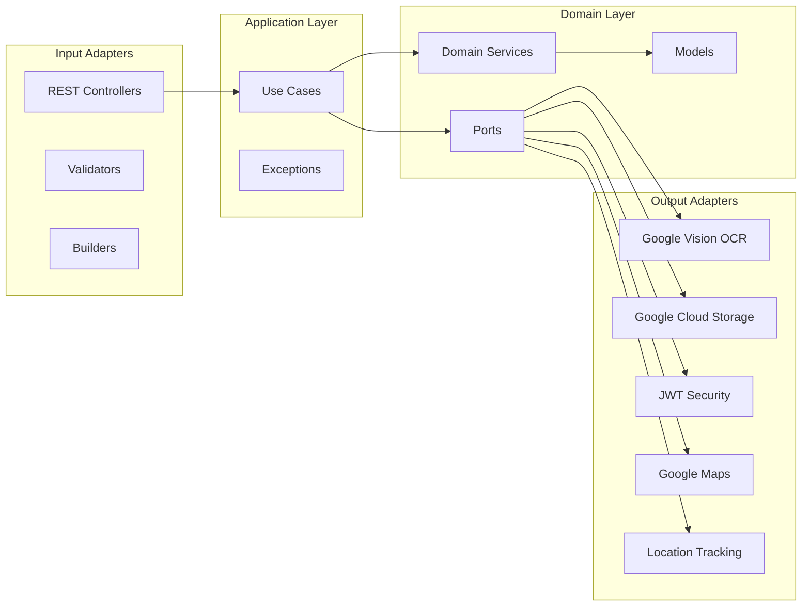
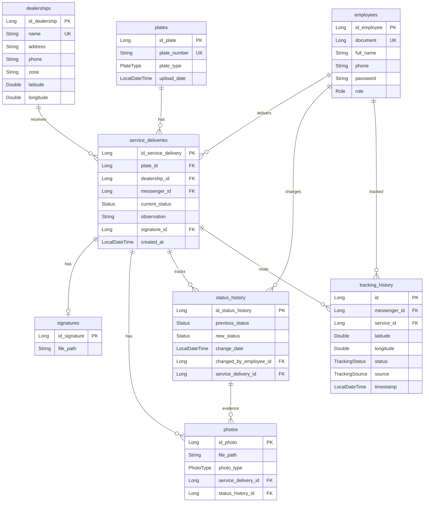
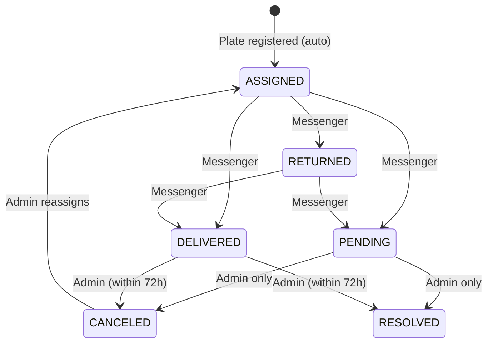
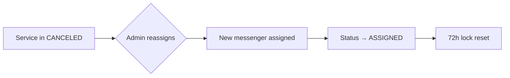
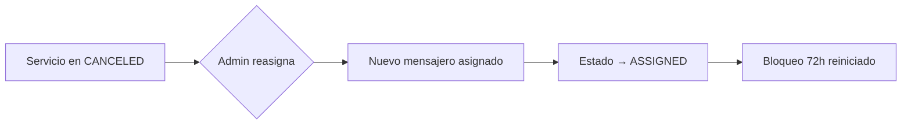

> **Copyright (C) 2025 Mateo Valencia Ardila. All rights reserved. Confidential and Proprietary.**

<div align="center">

[](https://github.com/fttmatteo/messenger-backend/actions/workflows/dependabot/dependabot-updates)
[](https://github.com/fttmatteo/messenger-backend/actions/workflows/maven.yml)

# 🚀 Messenger Backend API

[](https://openjdk.org/)
[](https://spring.io/projects/spring-boot)
[](https://www.mysql.com/)
[](https://redis.io/)
[](./LICENSE)

**Sistema de entregas con reconocimiento automático de placas vehiculares mediante OCR.**

*Delivery management system with automatic license plate recognition via OCR.*

[🇪🇸 Español](#-tabla-de-contenidos) • [🇺🇸 English](#-table-of-contents)

</div>

---

<details>
<summary><b>🇺🇸 English Version</b> (Click to expand)</summary>

## 📋 Table of Contents

- [Architecture](#-architecture)
- [Tech Stack](#-tech-stack)
- [Project Structure](#-project-structure)
- [Environment Profiles](#-environment-profiles)
- [API Endpoints](#-api-endpoints)
- [Database Schema](#-database-schema)
- [Real-Time Tracking](#-real-time-tracking)
- [State Flow](#-state-flow)
- [Security](#-security)
- [Observability](#-observability)
- [Auditing](#-auditing)
- [Setup & Installation](#️-setup--installation)
- [CI/CD](#-cicd)
- [Testing](#-testing)
- [Postman Collection](#-postman-collection)

---

## 🏗 Architecture

The project implements **Hexagonal Architecture (Ports & Adapters)** to keep the domain isolated from external dependencies.


```mermaid
graph LR
    subgraph InputAdapters ["Input Adapters"]
        direction TB
        REST[REST Controllers]
        VAL[Validators]
        BUILD[Builders]
    end

    subgraph ApplicationLayer ["Application Layer"]
        direction TB
        UC[Use Cases]
        EXC[Exceptions]
    end

    subgraph DomainLayer ["Domain Layer"]
        direction TB
        PORTS[Ports]
        SVC[Domain Services]
        MOD[Models]
    end

    subgraph OutputAdapters ["Output Adapters"]
        direction TB
        OCR[Google Vision OCR]
        STORAGE[Google Cloud Storage]
        SEC[JWT Security]
        MAPS[Google Maps]
        TRACKING[Location Tracking]
    end

    REST --> UC
    UC --> PORTS
    PORTS --> OCR
    PORTS --> STORAGE
    PORTS --> SEC
    PORTS --> MAPS
    PORTS --> TRACKING
    UC --> SVC
    SVC --> MOD
```

---

## 💻 Tech Stack

| Component | Technology |
|-----------|------------|
| **Framework** | Spring Boot 4.0.0 |
| **Language** | Java 21 |
| **Database** | MySQL 8.0+ |
| **Migrations** | Flyway |
| **Cache/Streaming** | Redis |
| **Security** | JWT + BCrypt + Bucket4j (Rate Limiting) |
| **Documentation** | OpenAPI / Swagger UI |
| **OCR** | Google Cloud Vision API |
| **Storage** | Google Cloud Storage |
| **Maps** | Google Maps Platform |
| **Real-Time** | WebSocket + Redis |
| **Build** | Maven 3.9+ |
| **Monitoring** | Spring Boot Actuator (Health, Metrics) |
| **Auditing** | JPA Callbacks + Status History |
| **CI/CD** | GitHub Actions |

---

## 📁 Project Structure

```
messenger/
├── src/main/java/app/
│   ├── MessengerApplication.java
│   ├── adapter/
│   │   ├── in/                          # Input Adapters
│   │   │   ├── builder/                 # Object Builders
│   │   │   ├── rest/
│   │   │   │   ├── controllers/         # 5 REST Controllers
│   │   │   │   ├── mapper/              # Request/Response Mappers
│   │   │   │   ├── request/             # Input DTOs
│   │   │   │   └── response/            # Output DTOs
│   │   │   └── validators/              # Input Validators
│   │   └── out/                         # Output Adapters
│   │       ├── maps/                    # Google Maps Integration
│   │       ├── ocr/                     # Google Vision OCR
│   │       ├── security/                # JWT Adapter
│   │       ├── storage/                 # Google Cloud Storage
│   │       └── tracking/                # Location Tracking
│   ├── application/
│   │   ├── exceptions/                  # BusinessException, InputsException
│   │   └── usecase/                     # 4 Use Cases
│   ├── domain/
│   │   ├── model/                       # 11 Models + 7 Enums + Auth
│   │   ├── ports/                       # 7 Ports (interfaces)
│   │   └── services/                    # 15 Domain Services
│   └── infrastructure/
│       ├── persistence/
│       │   ├── entities/                # JPA Entities
│       │   ├── mapper/                  # Entity ↔ Domain mappers
│       │   └── repository/              # Spring Data Repositories
│       └── security/                    # SecurityConfig, JwtFilter
└── src/main/resources/
    ├── application.properties           # Base Configuration
    ├── application-local.properties     # Local Development (H2)
    ├── application-dev.properties       # Development with APIs
    ├── application-test.properties      # Automated Testing
    ├── application-prod.properties      # Production
    └── db/migration/                    # Flyway Migrations
```

---

## 🌍 Environment Profiles

| Profile | Purpose | Database | External APIs | JWT Exp. |
|---------|---------|----------|---------------|----------|
| `local` | Local development without dependencies | H2 In-Memory | Mock/Disabled | 8 hours |
| `dev` | Development with real services | MySQL | Enabled | 8 hours |
| `test` | Automated testing (CI/CD) | H2 In-Memory | Mock | 1 hour |
| `prod` | Production (Cloud Run) | MySQL (SSL) | Enabled (JSON Logs) | 30 min |

### Profile Characteristics

<details>
<summary><b>🏠 Local</b> - No external dependencies</summary>

- H2 in-memory database
- Simulated OCR (placeholder)
- Local file storage
- Detailed logging
- Perfect for offline development

</details>

<details>
<summary><b>🔧 Dev</b> - Development with APIs</summary>

- MySQL development database
- Google Cloud APIs enabled
- SQL visible for debugging
- Actuator endpoints enabled
- Tracking interval: 15 seconds

</details>

<details>
<summary><b>🧪 Test</b> - Automated testing</summary>

- H2 in-memory (isolation)
- Mock services
- No external dependencies
- GitHub Actions compatible

</details>

<details>
<summary><b>🚀 Prod</b> - Production (Cloud Run Optimized)</summary>

- MySQL with mandatory SSL
- Optimized connection pool (HikariCP)
- **Structured JSON Logging** (Logstash Encoder)
- Graceful shutdown enabled (30s timeout)
- Security headers (HSTS, HTTP-only cookies)
- Compression enabled
- No exposed stack traces
- Cloud Run Proxy support (Forwarded Headers)

</details>

### Activation

```bash
# Environment variable (recommended)
export SPRING_PROFILES_ACTIVE=dev

# Command line
./mvnw spring-boot:run -Dspring.profiles.active=dev

# Docker
docker run -e SPRING_PROFILES_ACTIVE=prod messenger-api
```

---

## 🔌 API Endpoints

### Authentication (`/auth`)

| Method | Endpoint | Description | Auth |
|--------|----------|-------------|------|
| `POST` | `/auth/login` | Login and receive access + refresh tokens | 🔓 Public |
| `POST` | `/auth/refresh` | Renew access token with refresh token | 🔓 Public |

**Login Response:**
```json
{
  "token": "eyJhbGciOiJIUzI1NiIs...",
  "refreshToken": "eyJhbGciOiJIUzI1NiIs...",
  "role": "ADMIN"
}
```

**Refresh Request:**
```json
{
  "refreshToken": "eyJhbGciOiJIUzI1NiIs..."
}
```

---

### Employees (`/employees`) - ADMIN only

| Method | Endpoint | Description |
|--------|----------|-------------|
| `POST` | `/employees/createEmployee` | Create employee |
| `GET` | `/employees/allEmployees` | List all |
| `GET` | `/employees/findByEmployeeId/{id}` | Get by ID |
| `PUT` | `/employees/updateEmployee/{id}` | Update |
| `DELETE` | `/employees/deleteEmployee/{id}` | Delete |

---

### Dealerships (`/dealerships`)

| Method | Endpoint | Description | Auth |
|--------|----------|-------------|------|
| `POST` | `/dealerships/createDealership` | Create | ADMIN |
| `GET` | `/dealerships/allDealerships` | List | |
| `GET` | `/dealerships/findByDealershipId/{id}` | Get by ID | |
| `GET` | `/dealerships/findByDealershipName/{name}` | Get by Name | |
| `PUT` | `/dealerships/updateDealership/{id}` | Update | ADMIN |
| `DELETE` | `/dealerships/deleteDealership/{id}` | Delete | ADMIN |
| `POST` | `/dealerships/geocodeDealership/{id}` | Geocode | ADMIN |

---

### Service Deliveries (`/services`)

| Method | Endpoint | Description |
|--------|----------|-------------|
| `POST` | `/services/createService` | Create service (multipart) |
| `PUT` | `/services/updateService/{id}` | Update status |
| `GET` | `/services/allServices` | List all |
| `GET` | `/services/findByServiceId/{id}` | Get by ID |
| `DELETE` | `/services/deleteService/{id}` | Delete |

---

### Locations & Routes (`/locations`)

| Method | Endpoint | Description |
|--------|----------|-------------|
| `POST` | `/locations/geocode` | Address to coordinates |
| `POST` | `/locations/route` | Calculate optimized route |
| `GET` | `/locations/distance` | Distance between points |
| `GET` | `/locations/reverse` | Coordinates to address |

---

### Files (`/files`)

| Method | Endpoint | Description |
|--------|----------|-------------|
| `GET` | `/files/{filename}` | Download file (protected) |

---

### Real-Time Tracking (`/tracking`)

| Method | Endpoint | Description | Auth |
|--------|----------|-------------|------|
| `POST` | `/tracking/update` | Update location | MESSENGER/ADMIN |
| `GET` | `/tracking/messenger/{id}` | Last location | ADMIN |
| `GET` | `/tracking/active` | Active messengers | ADMIN |
| `GET` | `/tracking/history/{id}` | History by date | MESSENGER/ADMIN |
| `GET` | `/tracking/service/{id}` | History by service | MESSENGER/ADMIN |

---

## 🗄 Database Schema


```mermaid
erDiagram
    employees {
        Long id_employee PK
        Long document UK
        String full_name
        String phone

        String password
        Role role
    }
    
    dealerships {
        Long id_dealership PK
        String name UK
        String address
        String phone
        String zone
        Double latitude
        Double longitude
    }
    
    plates {
        Long id_plate PK
        String plate_number UK
        PlateType plate_type
        LocalDateTime upload_date
    }
    
    service_deliveries {
        Long id_service_delivery PK
        Long plate_id FK
        Long dealership_id FK
        Long messenger_id FK
        Status current_status
        String observation
        Long signature_id FK
        LocalDateTime created_at
    }
    
    signatures {
        Long id_signature PK
        String file_path
    }
    
    photos {
        Long id_photo PK
        String file_path
        PhotoType photo_type
        Long service_delivery_id FK
        Long status_history_id FK
    }
    
    status_history {
        Long id_status_history PK
        Status previous_status
        Status new_status
        LocalDateTime change_date
        Long changed_by_employee_id FK
        Long service_delivery_id FK
    }
    
    tracking_history {
        Long id PK
        Long messenger_id FK
        Long service_id FK
        Double latitude
        Double longitude
        TrackingStatus status
        TrackingSource source
        LocalDateTime timestamp
    }
    
    employees ||--o{ service_deliveries : "delivers"
    dealerships ||--o{ service_deliveries : "receives"
    plates ||--o{ service_deliveries : "has"
    service_deliveries ||--o| signatures : "has"
    service_deliveries ||--o{ photos : "has"
    service_deliveries ||--o{ status_history : "tracks"
    employees ||--o{ status_history : "changes"
    status_history ||--o{ photos : "evidence"
    employees ||--o{ tracking_history : "tracked"
    service_deliveries ||--o{ tracking_history : "route"
```

### Enums

| Enum | Values |
|------|--------|
| **Role** | `ADMIN`, `MESSENGER` |
| **PlateType** | `CAR` (ABC 123), `MOTORCYCLE` (ABC 12A), `MOTORCAR` (123 ABC) |
| **Status** | `ASSIGNED`, `PENDING`, `DELIVERED`, `RETURNED`, `CANCELED`, `RESOLVED` |
| **PhotoType** | `EVIDENCE`, `SIGNATURE`, `PLATE` |
| **TrackingStatus** | `ACTIVE`, `INACTIVE`, `OFFLINE` |
| **TrackingSource** | `GPS`, `NETWORK`, `MANUAL` |

---

## 📡 Real-Time Tracking

GPS tracking system using **Redis** + **WebSocket** for messenger monitoring.

### Features

| Feature | Description |
|---------|-------------|
| 🔴 **Live location** | Updates every 30 seconds |
| 📍 **Delivery validation** | Maximum 200m radius from destination |
| 📊 **Complete history** | 30-day retention |
| ⚡ **Low latency** | Redis for location caching |
| 🌐 **WebSocket** | Real-time push notifications |

### Google Maps Integration

- **Geocoding**: Address ↔ Coordinates
- **Directions API**: Optimized routes
- **Distance Matrix**: Time estimation
- **Reverse Geocoding**: Coordinates → Address

---

## 🔄 State Flow


```mermaid
stateDiagram-v2
    [*] --> ASSIGNED: Plate registered (auto)
    
    ASSIGNED --> PENDING: Messenger
    ASSIGNED --> DELIVERED: Messenger
    ASSIGNED --> RETURNED: Messenger
    
    PENDING --> CANCELED: Admin only
    PENDING --> RESOLVED: Admin only
    
    DELIVERED --> CANCELED: Admin (within 72h)
    DELIVERED --> RESOLVED: Admin (within 72h)
    
    CANCELED --> ASSIGNED: Admin reassigns
    
    RETURNED --> PENDING: Messenger
    RETURNED --> DELIVERED: Messenger
```

### Business Rules

> [!IMPORTANT]
> **Role-Based Status Transitions**
> - **MESSENGER** can only use: `PENDING`, `DELIVERED`, `RETURNED`
> - **ADMIN** can only use: `CANCELED`, `RESOLVED`

> [!WARNING]
> **Edit Lock (72-Hour Window)**
> When a service is updated to `DELIVERED` or `RESOLVED`, a **72-hour window** starts. 
> After this period, the service becomes **immutable** (no status or data changes allowed).

> [!NOTE]
> **Soft Delete (Trash Bin)**
> Deleted services are moved to a **trash bin** and permanently deleted after **60 days**.
> Admins can restore services from the trash before permanent deletion.

### State Rules

| State | Messenger | Admin | Delete | Edit Lock |
|-------|-----------|-------|--------|-----------|
| `ASSIGNED` | → `PENDING`, `DELIVERED`, `RETURNED` | → `CANCELED`, `RESOLVED` | ✅ Trash | - |
| `RETURNED` | → `PENDING`, `DELIVERED` | → `CANCELED`, `RESOLVED` | ✅ Trash | - |
| `PENDING` | 🔒 **Locked** until admin intervenes | → `CANCELED`, `RESOLVED` | ✅ Trash | - |
| `DELIVERED` | 🔒 **Locked** | → `CANCELED`, `RESOLVED` (within 72h) | ❌ Protected | ⏱️ 72h window |
| `CANCELED` | 🔒 Final | Admin can **reassign** → `ASSIGNED` | ✅ Trash | - |
| `RESOLVED` | 🔒 Final | 🔒 Final (within 72h from DELIVERED) | ✅ Trash | ⏱️ 72h window |

### Permissions Summary

| Role | Available States | Special Actions | Notes |
|------|------------------|-----------------|-------|
| **MESSENGER** | `PENDING`, `DELIVERED`, `RETURNED` | - | Blocked after using `PENDING` until admin intervenes |
| **ADMIN** | `CANCELED`, `RESOLVED` | **Reassign messenger** (from `CANCELED` only) | Can unlock blocked services |

### Reassignment Flow


```mermaid
flowchart LR
    A[Service in CANCELED] --> B{Admin reassigns}
    B --> C[New messenger assigned]
    C --> D[Status → ASSIGNED]
    D --> E[72h lock reset]
```

### Trash Management (Soft Delete)

| Action | Endpoint | Description |
|--------|----------|-------------|
| Delete → Trash | `DELETE /services/{id}` | Moves to trash (soft delete) |
| View Trash | `GET /services/trash` | Lists deleted services (ADMIN) |
| Restore | `POST /services/trash/restore/{id}` | Restores from trash (ADMIN) |
| Auto-Cleanup | Scheduled job | Permanent deletion after 60 days |


---

## 🔐 Security

### JWT Authentication with Refresh Tokens

```
┌─────────────┐     ┌─────────────┐     ┌─────────────┐
│   Client    │────▶│   /login    │────▶│   Server    │
└─────────────┘     └─────────────┘     └─────────────┘
                           │
                           ▼
              ┌─────────────────────────┐
              │  {                      │
              │    token: "...",        │
              │    refreshToken: "...", │
              │    role: "ADMIN"        │
              │  }                      │
              └─────────────────────────┘
                           │
                           ▼
                   ┌───────────────┐
                   │  API Request  │
                   │  Header:      │
                   │  Authorization│
                   │  Bearer token │
                   └───────────────┘
                           │
                  Token expired?
                           │
                           ▼
                   ┌───────────────┐
                   │ /auth/refresh │
                   │ refreshToken  │
                   └───────────────┘
                           │
                           ▼
                   New token pair
```

| Token | Prod Duration | Dev Duration | Local Duration | Usage |
|-------|---------------|--------------|----------------|-------|
| **Access Token** | 30 minutes | 8 hours | 8 hours | Header `Authorization: Bearer <token>` |
| **Refresh Token** | 7 days | 7 days | 7 days | Endpoint `/auth/refresh` to renew |

### Security Features

- 🔄 **Token Rotation**: Each refresh generates a new token pair
- 🔒 **Stateless**: No tokens stored server-side (Redis only for data caching)
- ⏱️ **Auto Expiration**: Tokens expire automatically
- 🛡️ **HMAC-SHA256**: Robust digital signature algorithm

### Rate Limiting

- Implemented with **Bucket4j** to prevent abuse
- Limits applied per IP address
- Response headers: `X-Rate-Limit-Remaining`, `X-Rate-Limit-Retry-After-Seconds`

### Roles & Permissions

- **ADMIN**: Full access to all endpoints
- **MESSENGER**: Only manages own services and location

### Security Headers (Production)

- HSTS (HTTP Strict Transport Security)
- Cookies: `Secure`, `HttpOnly`, `SameSite=Strict`
- CORS configured by origin
- No stack trace exposure

---

## 📊 Observability

### Monitoring Endpoints (Actuator)

| Endpoint | Description | Profile |
|----------|-------------|---------|
| `/actuator/health` | Health status (DB, Redis, Disk) | All |
| `/actuator/metrics` | JVM and HTTP metrics | `dev`, `prod` |
| `/actuator/env` | Environment variables | `dev` |
| `/actuator/info` | Build information | All |

### Cloud Run Optimization

- **JSON Logging (Prod):** Structured output compatible with Google Cloud Logging
- **Graceful Shutdown:** Waits 30s to finish active connections
- **SSL Offloading:** Trusts proxy headers (`X-Forwarded-Proto`) from Cloud Run

### API Documentation

| Endpoint | Description |
|----------|-------------|
| `/swagger-ui/index.html` | Interactive Swagger UI |
| `/v3/api-docs` | OpenAPI 3.0 Specification (JSON) |
| `/v3/api-docs.yaml` | OpenAPI 3.0 Specification (YAML) |

> [!TIP]
> Swagger UI is publicly accessible in `dev` profile. In production, consider restricting access via security configuration.

---

## 📝 Auditing

### AOP-Based Audit System

The application includes a centralized **audit logging system** using Aspect-Oriented Programming (AOP). Critical actions are automatically logged with user context, timing, and results.

### Audited Actions

| Component | Action | Description |
|-----------|--------|-------------|
| **AuthController** | `LOGIN` | User login attempts |
| | `TOKEN_REFRESH` | Access token renewal |
| **ServiceDeliveryUseCase** | `CREATE_SERVICE` | Create service from OCR image |
| | `CREATE_SERVICE_MANUAL` | Create service with manual plate |
| | `UPDATE_STATUS` | Update service status |
| | `REASSIGN_MESSENGER` | Reassign service to another messenger |
| | `DELETE_SERVICE` | Move service to trash |
| | `RESTORE_SERVICE` | Restore service from trash |
| **EmployeeUseCase** | `CREATE_EMPLOYEE` | Create new employee |
| | `UPDATE_EMPLOYEE` | Update employee |
| | `DELETE_EMPLOYEE` | Delete employee |

### Log Format

```
AUDIT | timestamp | user_document | action | method | params | status | duration | error
```

**Example:**
```
2025-12-21 00:42:00.123 [AUDIT] AUDIT | 2025-12-21 00:42:00 | 123456 | UPDATE_STATUS | ServiceDeliveryUseCase.updateStatus | [1, DELIVERED, "Delivered", ...] | SUCCESS | 125ms |
```

### Configuration

- **Logger Name:** `AUDIT`
- **Level:** `WARN` (always visible in all environments)
- **Output:** Console (Cloud Run captures stdout)
- **File Output:** Optional, enable `AUDIT_FILE` appender in `logback-spring.xml`

---

## ⚙️ Setup & Installation

> 🚀 **Deploying to Production?** See the complete [**Cloud Run Deployment Guide**](./DEPLOY_CLOUDRUN.md) for step-by-step instructions on deploying to Google Cloud.

### Prerequisites

| Requirement | Version |
|-------------|---------|
| Java | 21+ |
| MySQL | 8.0+ |
| Redis | 6.0+ |
| Maven | 3.9+ |

### Environment Variables

<details>
<summary><b>🔐 Required Variables</b></summary>

```bash
# Database
DB_HOST=localhost
DB_PORT=3306
DB_NAME=messenger
DB_USERNAME=root
DB_PASSWORD=your_password

# JWT
JWT_SECRET=your_base64_encoded_secret_key

# Redis
REDIS_HOST=localhost
REDIS_PORT=6379
REDIS_PASSWORD=            # Production only

# Google Cloud
GCP_PROJECT_ID=your_project_id
GCS_BUCKET_NAME=your_bucket_name
GOOGLE_MAPS_API_KEY=your_api_key
GOOGLE_APPLICATION_CREDENTIALS=/path/to/credentials.json
```

</details>

### Quick Start

```bash
# 1. Clone
git clone <repository-url>
cd messenger-backend/messenger

# 2. Configure variables (see above section)

# 3. Start Redis
redis-server

# 4. Run
./mvnw spring-boot:run -Dspring.profiles.active=dev
```

API available at `http://localhost:8080`

---

## 🔄 CI/CD

Automated pipeline with **GitHub Actions**:

```yaml
# .github/workflows/maven.yml
on:
  push:
    branches: [ "main" ]
  pull_request:
    branches: [ "main" ]
```

### Features

| Feature | Description |
|---------|-------------|
| ✅ Automated build | Java 21 + Maven |
| ✅ Dependency caching | Faster builds |
| ✅ Secure secrets | Credential injection |
| ✅ Testing | `test` profile with H2 |

### Required GitHub Secrets

```
DB_HOST, DB_PORT, DB_USERNAME
JWT_SECRET
REDIS_HOST, REDIS_PORT
GCP_PROJECT_ID, GCS_BUCKET_NAME
GOOGLE_MAPS_API_KEY
GOOGLE_APPLICATION_CREDENTIALS_JSON
```

---

## 🧪 Testing

- **Unit Tests**: Comprehensive coverage for all adapters
- **Integration Tests**: JPA repositories and domain services
- **Test Profile**: Isolated H2 database, no external dependencies
- **Coverage**: 100+ tests across adapters, use cases, and repositories

---

## 📬 Postman Collection

📄 **[Messenger_API.postman_collection.json](./Messenger_API.postman_collection.json)**

### Features

- ✅ **JWT and Refresh Token** saved automatically
- ✅ **Environment variables** preconfigured (`baseUrl`, `token`, `refreshToken`)
- ✅ **Automated tests** that save tokens to collection variables
- ✅ **Payload examples** for all endpoints
- ✅ **7 controllers** fully documented:
  - 🔐 Authentication (Login + Refresh)
  - 👥 Employees
  - 🏢 Dealerships
  - 📍 Locations
  - 📡 Tracking
  - 📦 Service Deliveries
  - 📁 Files

### Usage

1. Import collection in Postman
2. Configure `baseUrl` variable (default: `http://localhost:8080`)
3. Run **"Login"** first
4. Tokens (`token` and `refreshToken`) are saved automatically
5. All other endpoints use the token automatically
6. When access token expires, run **"Refresh Token"**

> **Last update**: December 2025
> - ✨ Added refresh token endpoint
> - 🔄 Improved automatic token handling
> - 📝 Updated response documentation

---

## 📧 Support & Contact

**Official Documentation:**
- [Spring Boot Documentation](https://spring.io/projects/spring-boot)
- [Google Cloud Run](https://cloud.google.com/run/docs)

**Project Specific:**
- Repository: `messenger-backend`
- Author: Matteo
- Email: valenciaardila988@icloud.com
- Last update: December 2025

</details>

---

## 📋 Tabla de Contenidos

- [Arquitectura](#-arquitectura)
- [Stack Tecnológico](#-stack-tecnológico)
- [Estructura del Proyecto](#-estructura-del-proyecto)
- [Perfiles de Ambiente](#-perfiles-de-ambiente)
- [API Endpoints](#-api-endpoints-1)
- [Esquema de Base de Datos](#-esquema-de-base-de-datos)
- [Tracking en Tiempo Real](#-tracking-en-tiempo-real)
- [Flujo de Estados](#-flujo-de-estados)
- [Seguridad](#-seguridad-1)
- [Observabilidad](#-observabilidad)
- [Auditoría](#-auditoría)
- [Configuración e Instalación](#️-configuración-e-instalación)
- [CI/CD](#-cicd-1)
- [Testing](#-testing-1)
- [Colección Postman](#-colección-postman)

---

## 🏗 Arquitectura

El proyecto implementa **Arquitectura Hexagonal (Ports & Adapters)** para mantener el dominio aislado de las dependencias externas.


```mermaid
graph LR
    subgraph InputAdapters ["Input Adapters"]
        direction TB
        REST[REST Controllers]
        VAL[Validators]
        BUILD[Builders]
    end

    subgraph ApplicationLayer ["Application Layer"]
        direction TB
        UC[Use Cases]
        EXC[Exceptions]
    end

    subgraph DomainLayer ["Domain Layer"]
        direction TB
        PORTS[Ports]
        SVC[Domain Services]
        MOD[Models]
    end

    subgraph OutputAdapters ["Output Adapters"]
        direction TB
        OCR[Google Vision OCR]
        STORAGE[Google Cloud Storage]
        SEC[JWT Security]
        MAPS[Google Maps]
        TRACKING[Location Tracking]
    end

    REST --> UC
    UC --> PORTS
    PORTS --> OCR
    PORTS --> STORAGE
    PORTS --> SEC
    PORTS --> MAPS
    PORTS --> TRACKING
    UC --> SVC
    SVC --> MOD
```

---

## 💻 Stack Tecnológico

| Componente | Tecnología |
|------------|------------|
| **Framework** | Spring Boot 4.0.0 |
| **Lenguaje** | Java 21 |
| **Base de Datos** | MySQL 8.0+ |
| **Migraciones** | Flyway |
| **Cache/Streaming** | Redis |
| **Seguridad** | JWT + BCrypt + Bucket4j (Rate Limiting) |
| **Documentación** | OpenAPI / Swagger UI |
| **OCR** | Google Cloud Vision API |
| **Almacenamiento** | Google Cloud Storage |
| **Mapas** | Google Maps Platform |
| **Tiempo Real** | WebSocket + Redis |
| **Build** | Maven 3.9+ |
| **Monitoreo** | Spring Boot Actuator (Health, Metrics) |
| **Auditoría** | JPA Callbacks + Historial de Estados |
| **CI/CD** | GitHub Actions |

---

## 📁 Estructura del Proyecto

```
messenger/
├── src/main/java/app/
│   ├── MessengerApplication.java
│   ├── adapter/
│   │   ├── in/                          # Adaptadores de entrada
│   │   │   ├── builder/                 # Constructores de objetos
│   │   │   ├── rest/
│   │   │   │   ├── controllers/         # 5 REST Controllers
│   │   │   │   ├── mapper/              # Mappers Request/Response
│   │   │   │   ├── request/             # DTOs de entrada
│   │   │   │   └── response/            # DTOs de salida
│   │   │   └── validators/              # Validadores de entrada
│   │   └── out/                         # Adaptadores de salida
│   │       ├── maps/                    # Google Maps Integration
│   │       ├── ocr/                     # Google Vision OCR
│   │       ├── security/                # JWT Adapter
│   │       ├── storage/                 # Google Cloud Storage
│   │       └── tracking/                # Location Tracking
│   ├── application/
│   │   ├── exceptions/                  # BusinessException, InputsException
│   │   └── usecase/                     # 4 Use Cases
│   ├── domain/
│   │   ├── model/                       # 11 Modelos + 7 Enums + Auth
│   │   ├── ports/                       # 7 Puertos (interfaces)
│   │   └── services/                    # 15 Servicios de dominio
│   └── infrastructure/
│       ├── persistence/
│       │   ├── entities/                # Entidades JPA
│       │   ├── mapper/                  # Entity ↔ Domain mappers
│       │   └── repository/              # Spring Data Repositories
│       └── security/                    # SecurityConfig, JwtFilter
└── src/main/resources/
    ├── application.properties           # Configuración base
    ├── application-local.properties     # Desarrollo local (H2)
    ├── application-dev.properties       # Desarrollo con APIs
    ├── application-test.properties      # Testing automatizado
    ├── application-prod.properties      # Producción
    └── db/migration/                    # Migraciones Flyway
```

---

## 🌍 Perfiles de Ambiente

| Perfil | Propósito | Base de Datos | APIs Externas | JWT Exp. |
|--------|-----------|---------------|---------------|----------|
| `local` | Desarrollo local sin dependencias | H2 In-Memory | Mock/Deshabilitado | 8 horas |
| `dev` | Desarrollo con servicios reales | MySQL | Habilitado | 8 horas |
| `test` | Testing automatizado (CI/CD) | H2 In-Memory | Mock | 1 hora |
| `prod` | Producción (Cloud Run) | MySQL (SSL) | Habilitado (JSON Logs) | 30 min |

### Características por Perfil

<details>
<summary><b>🏠 Local</b> - Sin dependencias externas</summary>

- Base de datos H2 en memoria
- OCR simulado (placeholder)
- Almacenamiento en sistema de archivos
- Logs detallados
- Perfecto para desarrollo offline

</details>

<details>
<summary><b>🔧 Dev</b> - Desarrollo con APIs</summary>

- MySQL de desarrollo
- Google Cloud APIs habilitadas
- SQL visible para debugging
- Actuator endpoints habilitados
- Tracking interval: 15 segundos

</details>

<details>
<summary><b>🧪 Test</b> - Testing automatizado</summary>

- H2 en memoria (aislamiento)
- Servicios mock
- Sin dependencias externas
- Compatible con GitHub Actions

</details>

<details>
<summary><b>🚀 Prod</b> - Producción (Optimizado Cloud Run)</summary>

- MySQL con SSL obligatorio
- Pool de conexiones optimizado (HikariCP)
- **Logging Estructurado JSON** (Logstash Encoder)
- Graceful shutdown habilitado (30s timeout)
- Headers de seguridad (HSTS, HTTP-only cookies)
- Compresión habilitada
- Sin stack traces expuestos
- Soporte Proxy Cloud Run (Forwarded Headers)

</details>

### Activación

```bash
# Variable de entorno (recomendado)
export SPRING_PROFILES_ACTIVE=dev

# Línea de comandos
./mvnw spring-boot:run -Dspring.profiles.active=dev

# Docker
docker run -e SPRING_PROFILES_ACTIVE=prod messenger-api
```

---

## 🔌 API Endpoints

### Autenticación (`/auth`)

| Método | Endpoint | Descripción | Auth |
|--------|----------|-------------|------|
| `POST` | `/auth/login` | Iniciar sesión y obtener tokens | 🔓 Público |
| `POST` | `/auth/refresh` | Renovar access token con refresh token | 🔓 Público |

**Respuesta de Login:**
```json
{
  "token": "eyJhbGciOiJIUzI1NiIs...",
  "refreshToken": "eyJhbGciOiJIUzI1NiIs...",
  "role": "ADMIN"
}
```

**Solicitud de Refresh:**
```json
{
  "refreshToken": "eyJhbGciOiJIUzI1NiIs..."
}
```

---

### Empleados (`/employees`) - Solo ADMIN

| Método | Endpoint | Descripción |
|--------|----------|-------------|
| `POST` | `/employees/createEmployee` | Crear empleado |
| `GET` | `/employees/allEmployees` | Listar todos |
| `GET` | `/employees/findByEmployeeId/{id}` | Obtener por ID |
| `PUT` | `/employees/updateEmployee/{id}` | Actualizar |
| `DELETE` | `/employees/deleteEmployee/{id}` | Eliminar |

---

### Concesionarios (`/dealerships`)

| Método | Endpoint | Descripción | Auth |
|--------|----------|-------------|------|
| `POST` | `/dealerships/createDealership` | Crear | ADMIN |
| `GET` | `/dealerships/allDealerships` | Listar | |
| `GET` | `/dealerships/findByDealershipId/{id}` | Obtener por ID | |
| `GET` | `/dealerships/findByDealershipName/{name}` | Obtener por Nombre | |
| `PUT` | `/dealerships/updateDealership/{id}` | Actualizar | ADMIN |
| `DELETE` | `/dealerships/deleteDealership/{id}` | Eliminar | ADMIN |
| `POST` | `/dealerships/geocodeDealership/{id}` | Geocodificar | ADMIN |

---

### Servicios de Entrega (`/services`)

| Método | Endpoint | Descripción |
|--------|----------|-------------|
| `POST` | `/services/createService` | Crear servicio (multipart) |
| `PUT` | `/services/updateService/{id}` | Actualizar estado |
| `GET` | `/services/allServices` | Listar todos |
| `GET` | `/services/findByServiceId/{id}` | Obtener por ID |
| `DELETE` | `/services/deleteService/{id}` | Eliminar |

---

### Ubicaciones y Rutas (`/locations`)

| Método | Endpoint | Descripción |
|--------|----------|-------------|
| `POST` | `/locations/geocode` | Convertir dirección a coordenadas |
| `POST` | `/locations/route` | Calcular ruta optimizada |
| `GET` | `/locations/distance` | Distancia entre dos puntos |
| `GET` | `/locations/reverse` | Coordenadas a dirección |

---

### Archivos (`/files`)

| Método | Endpoint | Descripción |
|--------|----------|-------------|
| `GET` | `/files/{filename}` | Descargar archivo (protegido) |

---

### Tracking en Tiempo Real (`/tracking`)

| Método | Endpoint | Descripción | Auth |
|--------|----------|-------------|------|
| `POST` | `/tracking/update` | Actualizar ubicación | MESSENGER/ADMIN |
| `GET` | `/tracking/messenger/{id}` | Última ubicación | ADMIN |
| `GET` | `/tracking/active` | Mensajeros activos | ADMIN |
| `GET` | `/tracking/history/{id}` | Historial por fecha | MESSENGER/ADMIN |
| `GET` | `/tracking/service/{id}` | Historial por servicio | MESSENGER/ADMIN |

---

## 🗄 Esquema de Base de Datos


```mermaid
erDiagram
    employees {
        Long id_employee PK
        Long document UK
        String full_name
        String phone

        String password
        Role role
    }
    
    dealerships {
        Long id_dealership PK
        String name UK
        String address
        String phone
        String zone
        Double latitude
        Double longitude
    }
    
    plates {
        Long id_plate PK
        String plate_number UK
        PlateType plate_type
        LocalDateTime upload_date
    }
    
    service_deliveries {
        Long id_service_delivery PK
        Long plate_id FK
        Long dealership_id FK
        Long messenger_id FK
        Status current_status
        String observation
        Long signature_id FK
        LocalDateTime created_at
    }
    
    signatures {
        Long id_signature PK
        String file_path
    }
    
    photos {
        Long id_photo PK
        String file_path
        PhotoType photo_type
        Long service_delivery_id FK
        Long status_history_id FK
    }
    
    status_history {
        Long id_status_history PK
        Status previous_status
        Status new_status
        LocalDateTime change_date
        Long changed_by_employee_id FK
        Long service_delivery_id FK
    }
    
    tracking_history {
        Long id PK
        Long messenger_id FK
        Long service_id FK
        Double latitude
        Double longitude
        TrackingStatus status
        TrackingSource source
        LocalDateTime timestamp
    }
    
    employees ||--o{ service_deliveries : "delivers"
    dealerships ||--o{ service_deliveries : "receives"
    plates ||--o{ service_deliveries : "has"
    service_deliveries ||--o| signatures : "has"
    service_deliveries ||--o{ photos : "has"
    service_deliveries ||--o{ status_history : "tracks"
    employees ||--o{ status_history : "changes"
    status_history ||--o{ photos : "evidence"
    employees ||--o{ tracking_history : "tracked"
    service_deliveries ||--o{ tracking_history : "route"
```

### Enums

| Enum | Valores |
|------|---------|
| **Role** | `ADMIN`, `MESSENGER` |
| **PlateType** | `CAR` (ABC 123), `MOTORCYCLE` (ABC 12A), `MOTORCAR` (123 ABC) |
| **Status** | `ASSIGNED`, `PENDING`, `DELIVERED`, `RETURNED`, `CANCELED`, `RESOLVED` |
| **PhotoType** | `EVIDENCE`, `SIGNATURE`, `PLATE` |
| **TrackingStatus** | `ACTIVE`, `INACTIVE`, `OFFLINE` |
| **TrackingSource** | `GPS`, `NETWORK`, `MANUAL` |

---

## 📡 Tracking en Tiempo Real

Sistema de tracking GPS usando **Redis** + **WebSocket** para monitoreo de mensajeros.

### Características

| Feature | Descripción |
|---------|-------------|
| 🔴 **Ubicación en vivo** | Actualización cada 30 segundos |
| 📍 **Validación de entrega** | Radio máximo de 200m del destino |
| 📊 **Historial completo** | Retención de 30 días |
| ⚡ **Baja latencia** | Redis para caché de ubicaciones |
| 🌐 **WebSocket** | Notificaciones push en tiempo real |

### Integración Google Maps

- **Geocoding**: Dirección ↔ Coordenadas
- **Directions API**: Rutas optimizadas
- **Distance Matrix**: Estimación de tiempos
- **Reverse Geocoding**: Coordenadas → Dirección

---

## 🔄 Flujo de Estados


```mermaid
stateDiagram-v2
    [*] --> ASSIGNED: Placa registrada (auto)
    
    ASSIGNED --> PENDING: Mensajero
    ASSIGNED --> DELIVERED: Mensajero
    ASSIGNED --> RETURNED: Mensajero
    
    PENDING --> CANCELED: Solo Admin
    PENDING --> RESOLVED: Solo Admin
    
    DELIVERED --> CANCELED: Admin (dentro de 72h)
    DELIVERED --> RESOLVED: Admin (dentro de 72h)
    
    CANCELED --> ASSIGNED: Admin reasigna
    
    RETURNED --> PENDING: Mensajero
    RETURNED --> DELIVERED: Mensajero
```

### Reglas de Negocio

> [!IMPORTANT]
> **Transiciones de Estado por Rol**
> - **MENSAJERO** solo puede usar: `PENDING`, `DELIVERED`, `RETURNED`
> - **ADMIN** solo puede usar: `CANCELED`, `RESOLVED`

> [!WARNING]
> **Bloqueo de Edición (Ventana de 72 Horas)**
> Cuando un servicio se actualiza a `DELIVERED` o `RESOLVED`, inicia una **ventana de 72 horas**.
> Después de este período, el servicio se vuelve **inmutable** (no se permiten cambios de estado ni datos).

> [!NOTE]
> **Eliminación Suave (Papelera)**
> Los servicios eliminados se mueven a una **papelera** y se eliminan permanentemente después de **60 días**.
> Los administradores pueden restaurar servicios de la papelera antes de la eliminación permanente.

### Reglas de Estados

| Estado | Mensajero | Admin | Eliminar | Bloqueo |
|--------|-----------|-------|----------|---------|
| `ASSIGNED` | → `PENDING`, `DELIVERED`, `RETURNED` | → `CANCELED`, `RESOLVED` | ✅ Papelera | - |
| `RETURNED` | → `PENDING`, `DELIVERED` | → `CANCELED`, `RESOLVED` | ✅ Papelera | - |
| `PENDING` | 🔒 **Bloqueado** hasta intervención admin | → `CANCELED`, `RESOLVED` | ✅ Papelera | - |
| `DELIVERED` | 🔒 **Bloqueado** | → `CANCELED`, `RESOLVED` (dentro de 72h) | ❌ Protegido | ⏱️ 72h |
| `CANCELED` | 🔒 Final | Admin puede **reasignar** → `ASSIGNED` | ✅ Papelera | - |
| `RESOLVED` | 🔒 Final | 🔒 Final (dentro de 72h desde DELIVERED) | ✅ Papelera | ⏱️ 72h |

### Resumen de Permisos

| Rol | Estados Disponibles | Acciones Especiales | Notas |
|-----|---------------------|---------------------|-------|
| **MENSAJERO** | `PENDING`, `DELIVERED`, `RETURNED` | - | Bloqueado después de usar `PENDING` hasta intervención admin |
| **ADMIN** | `CANCELED`, `RESOLVED` | **Reasignar mensajero** (solo desde `CANCELED`) | Puede desbloquear servicios |

### Flujo de Reasignación


```mermaid
flowchart LR
    A[Servicio en CANCELED] --> B{Admin reasigna}
    B --> C[Nuevo mensajero asignado]
    C --> D[Estado → ASSIGNED]
    D --> E[Bloqueo 72h reiniciado]
```

### Gestión de Papelera (Soft Delete)

| Acción | Endpoint | Descripción |
|--------|----------|-------------|
| Eliminar → Papelera | `DELETE /services/{id}` | Mueve a papelera (soft delete) |
| Ver Papelera | `GET /services/trash` | Lista servicios eliminados (ADMIN) |
| Restaurar | `POST /services/trash/restore/{id}` | Restaura desde papelera (ADMIN) |
| Limpieza Automática | Job programado | Eliminación permanente después de 60 días |

---

## 🔐 Seguridad

### Autenticación JWT con Refresh Tokens

```
┌─────────────┐     ┌─────────────┐     ┌─────────────┐
│   Client    │────▶│   /login    │────▶│   Server    │
└─────────────┘     └─────────────┘     └─────────────┘
                           │
                           ▼
              ┌─────────────────────────┐
              │  {                      │
              │    token: "...",        │
              │    refreshToken: "...", │
              │    role: "ADMIN"        │
              │  }                      │
              └─────────────────────────┘
                           │
                           ▼
                   ┌───────────────┐
                   │  API Request  │
                   │  Header:      │
                   │  Authorization│
                   │  Bearer token │
                   └───────────────┘
                           │
                  Token expired?
                           │
                           ▼
                   ┌───────────────┐
                   │ /auth/refresh │
                   │ refreshToken  │
                   └───────────────┘
                           │
                           ▼
                   New token pair
```

| Token | Duración (prod) | Duración (dev) | Duración (local) | Uso |
|-------|-----------------|----------------|------------------|-----|
| **Access Token** | 30 minutos | 8 horas | 8 horas | Header `Authorization: Bearer <token>` |
| **Refresh Token** | 7 días | 7 días | 7 días | Endpoint `/auth/refresh` para renovar |

### Características de Seguridad

- 🔄 **Token Rotation**: Cada refresh genera un nuevo par de tokens
- 🔒 **Stateless**: No se almacenan tokens en el servidor (Redis solo para caché de datos)
- ⏱️ **Expiración Automática**: Tokens expire automáticamente
- 🛡️ **HMAC-SHA256**: Algoritmo robusto de firma digital

### Rate Limiting

- Implementado con **Bucket4j** para prevenir abusos
- Límites aplicados por dirección IP
- Headers de respuesta: `X-Rate-Limit-Remaining`, `X-Rate-Limit-Retry-After-Seconds`

### Roles y Permisos

- **ADMIN**: Acceso completo a todos los endpoints
- **MESSENGER**: Solo gestiona sus propios servicios y ubicación

### Headers de Seguridad (Producción)

- HSTS (HTTP Strict Transport Security)
- Cookies: `Secure`, `HttpOnly`, `SameSite=Strict`
- CORS configurado por origen
- Sin exposición de stack traces

---

## 📊 Observabilidad

### Endpoints de Monitoreo (Actuator)

| Endpoint | Descripción | Perfil |
|----------|-------------|--------|
| `/actuator/health` | Estado de salud (DB, Redis, Disco) | Todos |
| `/actuator/metrics` | Métricas de JVM y HTTP | `dev`, `prod` |
| `/actuator/env` | Variables de entorno | `dev` |
| `/actuator/info` | Información de la build | Todos |

### Optimización para Cloud Run

- **Logging JSON (Prod):** Salida estructurada compatible con Google Cloud Logging
- **Graceful Shutdown:** Espera 30s para terminar conexiones activas
- **SSL Offloading:** Confía en headers de proxy (`X-Forwarded-Proto`) de Cloud Run

### Documentación API

| Endpoint | Descripción |
|----------|-------------|
| `/swagger-ui/index.html` | Interfaz Swagger UI interactiva |
| `/v3/api-docs` | Especificación OpenAPI 3.0 (JSON) |
| `/v3/api-docs.yaml` | Especificación OpenAPI 3.0 (YAML) |

> [!TIP]
> Swagger UI es accesible públicamente en el perfil `dev`. En producción, considera restringir el acceso mediante configuración de seguridad.

---

## 📝 Auditoría

### Sistema de Auditoría Basado en AOP

La aplicación incluye un **sistema de logging de auditoría centralizado** usando Programación Orientada a Aspectos (AOP). Las acciones críticas se registran automáticamente con contexto de usuario, tiempo y resultados.

### Acciones Auditadas

| Componente | Acción | Descripción |
|------------|--------|-------------|
| **AuthController** | `LOGIN` | Intentos de inicio de sesión |
| | `TOKEN_REFRESH` | Renovación de token de acceso |
| **ServiceDeliveryUseCase** | `CREATE_SERVICE` | Crear servicio desde imagen OCR |
| | `CREATE_SERVICE_MANUAL` | Crear servicio con placa manual |
| | `UPDATE_STATUS` | Actualizar estado de servicio |
| | `REASSIGN_MESSENGER` | Reasignar servicio a otro mensajero |
| | `DELETE_SERVICE` | Mover servicio a papelera |
| | `RESTORE_SERVICE` | Restaurar servicio desde papelera |
| **EmployeeUseCase** | `CREATE_EMPLOYEE` | Crear nuevo empleado |
| | `UPDATE_EMPLOYEE` | Actualizar empleado |
| | `DELETE_EMPLOYEE` | Eliminar empleado |

### Formato del Log

```
AUDIT | timestamp | documento_usuario | accion | metodo | parametros | estado | duracion | error
```

**Ejemplo:**
```
2025-12-21 00:42:00.123 [AUDIT] AUDIT | 2025-12-21 00:42:00 | 123456 | UPDATE_STATUS | ServiceDeliveryUseCase.updateStatus | [1, DELIVERED, "Entregado", ...] | SUCCESS | 125ms |
```

### Configuración

- **Nombre del Logger:** `AUDIT`
- **Nivel:** `WARN` (siempre visible en todos los ambientes)
- **Salida:** Consola (Cloud Run captura stdout)
- **Salida a Archivo:** Opcional, habilitar `AUDIT_FILE` appender en `logback-spring.xml`

---

## ⚙️ Configuración e Instalación

> 🚀 **¿Desplegar en Producción?** Consulta la guía completa de [**Despliegue en Cloud Run**](./DEPLOY_CLOUDRUN.md) con instrucciones paso a paso para desplegar en Google Cloud.

### Prerrequisitos

| Requisito | Versión |
|-----------|---------|
| Java | 21+ |
| MySQL | 8.0+ |
| Redis | 6.0+ |
| Maven | 3.9+ |

### Variables de Entorno

<details>
<summary><b>🔐 Variables Requeridas</b></summary>

```bash
# Base de Datos
DB_HOST=localhost
DB_PORT=3306
DB_NAME=messenger
DB_USERNAME=root
DB_PASSWORD=your_password

# JWT
JWT_SECRET=your_base64_encoded_secret_key

# Redis
REDIS_HOST=localhost
REDIS_PORT=6379
REDIS_PASSWORD=            # Solo producción

# Google Cloud
GCP_PROJECT_ID=your_project_id
GCS_BUCKET_NAME=your_bucket_name
GOOGLE_MAPS_API_KEY=your_api_key
GOOGLE_APPLICATION_CREDENTIALS=/path/to/credentials.json
```

</details>

### Instalación Rápida

```bash
# 1. Clonar
git clone <repository-url>
cd messenger-backend/messenger

# 2. Configurar variables (ver sección anterior)

# 3. Iniciar Redis
redis-server

# 4. Ejecutar
./mvnw spring-boot:run -Dspring.profiles.active=dev
```

La API estará disponible en `http://localhost:8080`

---

## 🔄 CI/CD

Pipeline automatizado con **GitHub Actions**:

```yaml
# .github/workflows/maven.yml
on:
  push:
    branches: [ "main" ]
  pull_request:
    branches: [ "main" ]
```

### Características

| Feature | Descripción |
|---------|-------------|
| ✅ Build automático | Java 21 + Maven |
| ✅ Caché de dependencias | Builds más rápidos |
| ✅ Secrets seguros | Inyección de credenciales |
| ✅ Testing | Profile `test` con H2 |

### Secrets de GitHub Requeridos

```
DB_HOST, DB_PORT, DB_USERNAME
JWT_SECRET
REDIS_HOST, REDIS_PORT
GCP_PROJECT_ID, GCS_BUCKET_NAME
GOOGLE_MAPS_API_KEY
GOOGLE_APPLICATION_CREDENTIALS_JSON
```

---

## 🧪 Testing

- **Unit Tests**: Cobertura completa para todos los adaptadores
- **Integration Tests**: Repositorios JPA y servicios de dominio
- **Test Profile**: Base de datos H2 aislada, sin dependencias externas
- **Coverage**: 100+ tests en adaptadores, use cases y repositorios

---

## 📬 Colección Postman

📄 **[Messenger_API.postman_collection.json](./Messenger_API.postman_collection.json)**

### Características

- ✅ **Token JWT y Refresh Token** guardados automáticamente
- ✅ **Variables de entorno** preconfiguradas (`baseUrl`, `token`, `refreshToken`)
- ✅ **Tests automáticos** que guardan tokens en variables de colección
- ✅ **Ejemplos de payloads** para todos los endpoints
- ✅ **7 controladores** completamente documentados:
  - 🔐 Authentication (Login + Refresh)
  - 👥 Employees
  - 🏢 Dealerships
  - 📍 Locations
  - 📡 Tracking
  - 📦 Service Deliveries
  - 📁 Files

### Uso

1. Importar colección en Postman
2. Configurar variable `baseUrl` (default: `http://localhost:8080`)
3. Ejecutar **"Login"** primero
4. Los tokens (`token` y `refreshToken`) se guardan automáticamente
5. Todos los demás endpoints usan el token automáticamente
6. Cuando el access token expire, ejecutar **"Refresh Token"**

---

## 📧 Soporte y Contacto

**Documentación Oficial:**
- [Documentación de Spring Boot](https://spring.io/projects/spring-boot)
- [Google Cloud Run](https://cloud.google.com/run/docs)

**Proyecto Específico:**
- Repositorio: `messenger-backend`
- Autor: Matteo
- Email: valenciaardila988@icloud.com
- Última actualización: Diciembre 2025

---

## 📄 Licencia

Ver archivo [LICENSE](./LICENSE) para detalles.

---

<div align="center">

**Made with ❤️ using Spring Boot 4.0**

</div>

> **Copyright (C) 2025 Mateo Valencia Ardila. All rights reserved. Confidential and Proprietary.**
