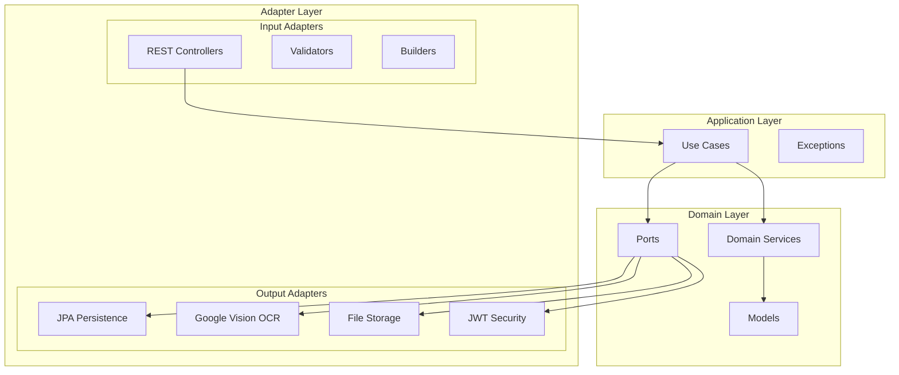
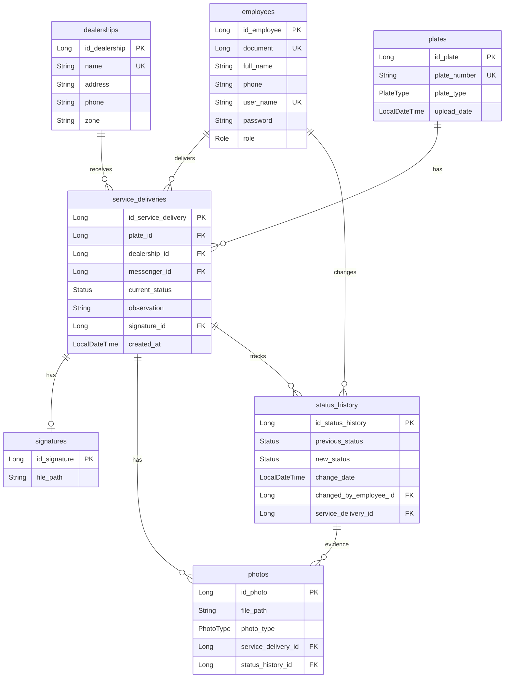
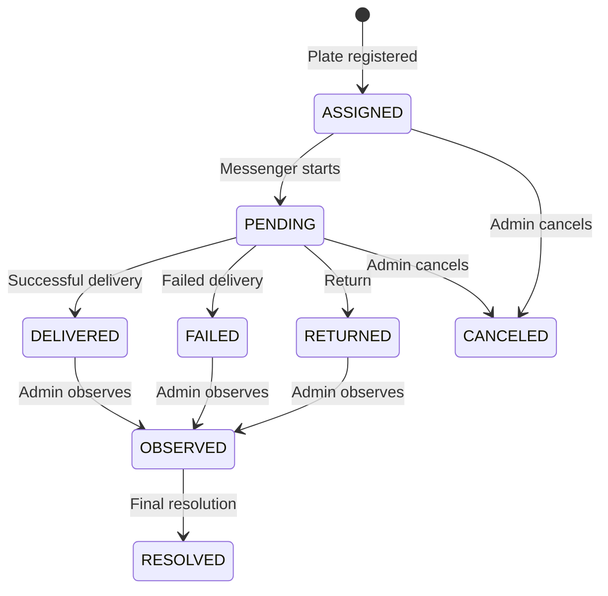

# 🚀 Messenger Backend API

**[🇪🇸 Español](./README.md)** | **🇺🇸 English**

Delivery and messaging management system for transit operations. REST API backend with automatic vehicle license plate recognition via OCR.

## 📋 Table of Contents

- [Architecture](#-architecture)
- [Technology Stack](#-technology-stack)
- [Project Structure](#-project-structure)
- [API Endpoints](#-api-endpoints)
- [Database Schema](#-database-schema)
- [Status Flow](#-status-flow)
- [Security](#-security)
- [Configuration and Installation](#️-configuration-and-installation)
- [Postman Collection](#-postman-collection)

---

## 🏗 Architecture

The project implements **Hexagonal Architecture (Ports & Adapters)** to keep the domain isolated from external dependencies.



---

## 💻 Technology Stack

| Component | Technology |
|-----------|------------|
| **Framework** | Spring Boot 4.0.0 |
| **Language** | Java 21 |
| **Database** | MySQL 8.0+ |
| **Security** | JWT + BCrypt |
| **OCR** | Google Cloud Vision API |
| **Build** | Maven 3.9+ |
| **Validation** | Spring Validation |

---

## 📁 Project Structure

```
messenger/
├── src/main/java/app/
│   ├── MessengerApplication.java
│   ├── adapter/
│   │   ├── in/                          # Input adapters
│   │   │   ├── builder/                 # Object builders
│   │   │   ├── rest/
│   │   │   │   ├── controllers/         # 5 REST Controllers
│   │   │   │   ├── mapper/              # Request/Response mappers
│   │   │   │   ├── request/             # Input DTOs
│   │   │   │   └── response/            # Output DTOs
│   │   │   └── validators/              # Input validators
│   │   └── out/                         # Output adapters
│   │       ├── files/                   # File storage
│   │       ├── ocr/                     # Google Vision OCR
│   │       ├── persistence/             # JPA Adapters
│   │       └── security/                # JWT Adapter
│   ├── application/
│   │   ├── exceptions/                  # BusinessException, InputsException
│   │   └── usecase/                     # 4 Use Cases
│   ├── domain/
│   │   ├── model/                       # 7 Domain models + enums
│   │   ├── ports/                       # 7 Ports (interfaces)
│   │   └── services/                    # 15 Domain services
│   └── infrastructure/
│       ├── persistence/
│       │   ├── entities/                # 7 JPA Entities
│       │   ├── mapper/                  # Entity ↔ Domain mappers
│       │   └── repository/              # Spring Data Repositories
│       └── security/                    # SecurityConfig, JwtFilter
└── src/main/resources/
    └── application.properties
```

---

## 🔌 API Endpoints

### Authentication (`/auth`)

| Method | Endpoint | Description | Auth |
|--------|----------|-------------|------|
| `POST` | `/auth/login` | Login | 🔓 Public |

### Employees (`/employees`) - ADMIN Only

| Method | Endpoint | Description |
|--------|----------|-------------|
| `POST` | `/employees` | Create employee |
| `GET` | `/employees` | List all |
| `GET` | `/employees/{id}` | Get by ID |
| `PUT` | `/employees/{id}` | Update |
| `DELETE` | `/employees/{id}` | Delete |

### Dealerships (`/dealerships`)

| Method | Endpoint | Description | Auth |
|--------|----------|-------------|------|
| `POST` | `/dealerships` | Create | ADMIN |
| `GET` | `/dealerships` | List | Authenticated |
| `GET` | `/dealerships/{id}` | Get by ID | Authenticated |
| `PUT` | `/dealerships/{id}` | Update | ADMIN |
| `DELETE` | `/dealerships/{id}` | Delete | ADMIN |

### Delivery Services (`/services`)

| Method | Endpoint | Description |
|--------|----------|-------------|
| `POST` | `/services/create` | Create service (multipart: image, dealershipId, messengerDocument, manualPlateNumber) |
| `PUT` | `/services/{id}/status` | Update status (multipart: status, observation, signature, photos) |
| `GET` | `/services` | List all (ADMIN) or own (MESSENGER) |
| `GET` | `/services/{id}` | Get by ID |
| `GET` | `/services/messenger/{doc}` | Filter by messenger |
| `GET` | `/services/dealership/{id}` | Filter by dealership |
| `GET` | `/services/status/{status}` | Filter by status |

### Files (`/api/files`)

| Method | Endpoint | Description | Auth |
|--------|----------|-------------|------|
| `GET` | `/api/files/{filename}` | Get file | 🔓 Public |

---

## 🗄 Database Schema



### Enums

**Role:** `ADMIN`, `MESSENGER`

**PlateType:** `CAR` (ABC 123), `MOTORCYCLE` (ABC 12A), `MOTORCAR` (123 ABC)

**Status:** `ASSIGNED`, `PENDING`, `DELIVERED`, `FAILED`, `RETURNED`, `CANCELED`, `OBSERVED`, `RESOLVED`

---

## 🔄 Status Flow



### Evidence Requirements

| Status | Signature | Photos | Observation |
|--------|:---------:|:------:|:-----------:|
| `DELIVERED` | ✅ Required | ⚪ Optional | ⚪ Optional |
| `PENDING` | ✅ Required | ✅ Required | ✅ Required |
| `FAILED` | ✅ Required | ✅ Required | ✅ Required |
| `RETURNED` | ✅ Required | ✅ Required | ✅ Required |
| `CANCELED` | ⚪ Not applicable | ⚪ Not applicable | ⚪ Not applicable |
| `OBSERVED` | ⚪ Not applicable | ⚪ Not applicable | ⚪ Not applicable |

---

## 🔐 Security

### JWT Authentication
- Tokens signed with HMAC-SHA256
- Expiration: 30 minutes
- Header: `Authorization: Bearer <token>`

### Roles and Permissions
- **ADMIN**: Full access to all endpoints
- **MESSENGER**: Can only view/manage their own services

### CORS
Allowed origins (development):
- `http://localhost:3000` (React)
- `http://localhost:4200` (Angular)
- `http://localhost:5173` (Vite)

---

## ⚙️ Configuration and Installation

### Prerequisites
- Java 21+
- MySQL 8.0+
- Maven 3.9+
- Google Cloud Vision API credentials

### 1. Clone repository
```bash
git clone <repository-url>
cd messenger-backend/messenger
```

### 2. Configure Database
```sql
CREATE DATABASE messenger;
```

### 3. Configure `application.properties`
```properties
# Database
spring.datasource.url=jdbc:mysql://localhost:3306/messenger
spring.datasource.username=root
spring.datasource.password=<your-password>

# File storage
app.storage.path=/path/to/uploads

# Google Cloud Vision
google.cloud.credentials.path=config/google-vision-credentials.json

# JWT
jwt.secret=<your-secret-key-base64>
jwt.expiration=1800000
```

### 4. Configure Google Cloud Vision
Place your credentials file at:
```
messenger/config/google-vision-credentials.json
```

### 5. Run
```bash
./mvnw spring-boot:run
```

The API will be available at `http://localhost:8080`

---

## 📬 Postman Collection

Import the included collection to test all endpoints:

📄 **[Messenger_API.postman_collection.json](./Messenger_API.postman_collection.json)**

### Features:
- ✅ Automatic JWT token saving
- ✅ Pre-configured environment variables
- ✅ Payload examples for all endpoints
- ✅ Inline documentation for each request

### Usage:
1. Import collection in Postman
2. Execute "Login" first (the token is saved automatically)
3. Other endpoints will use the saved token

---

## 📄 License

See [LICENSE](./LICENSE) file for details.
