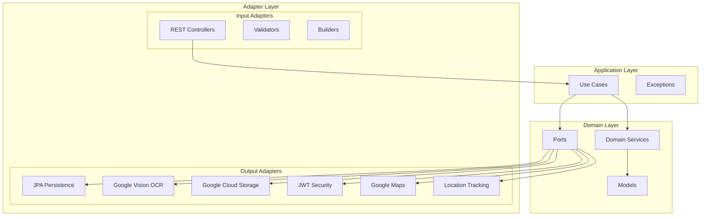
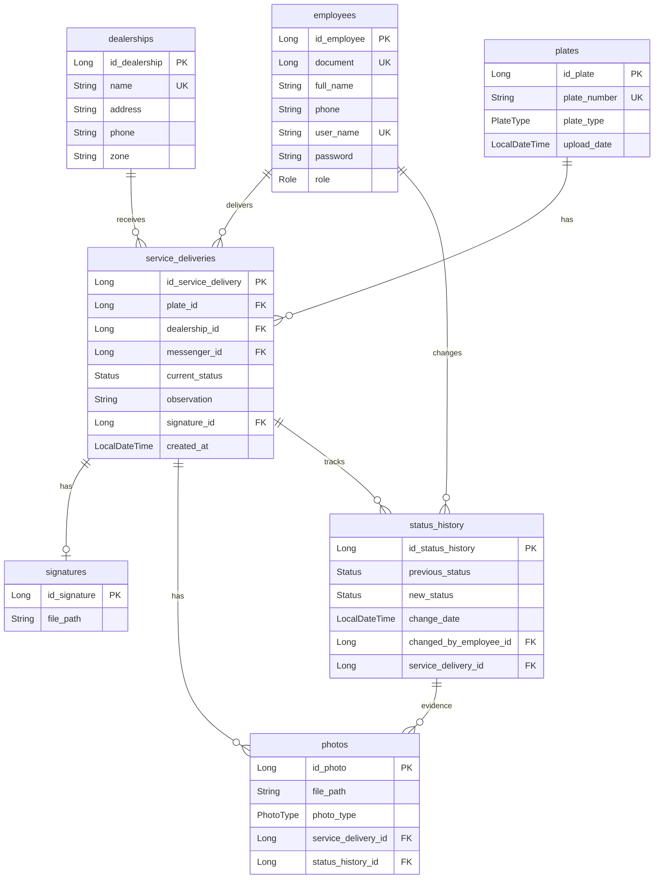
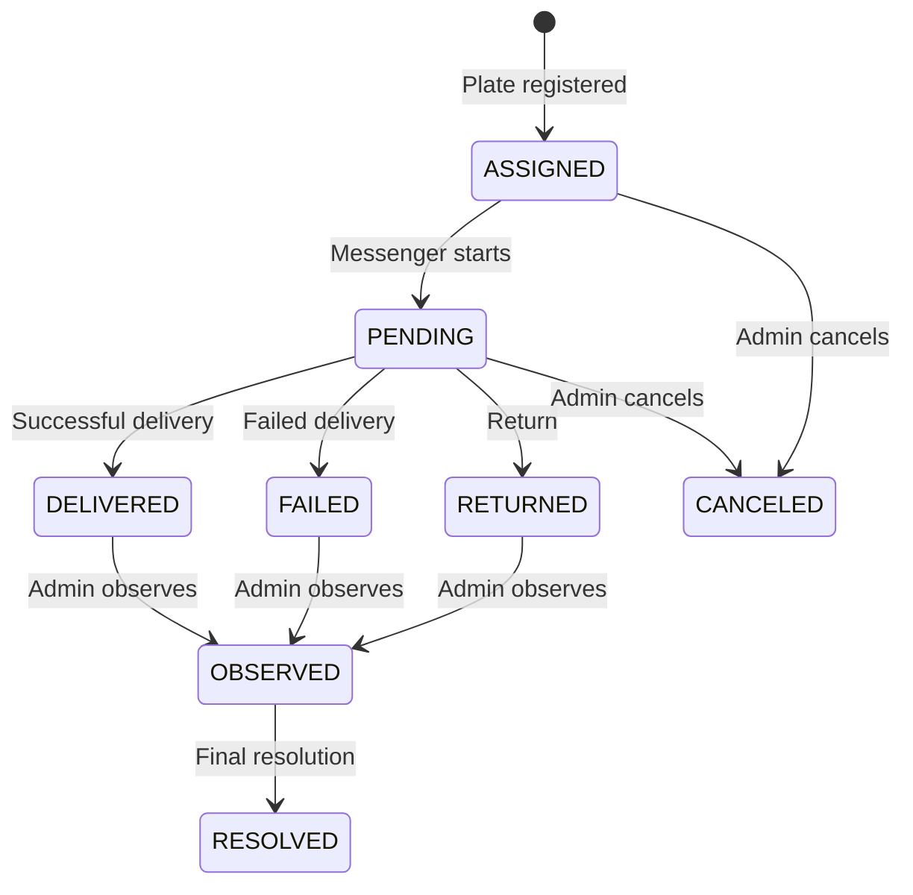

# 🚀 Messenger Backend API

**[🇪🇸 Español](./README.md)** | **🇺🇸 English**

Delivery and messaging management system for transit operations. REST API backend with automatic vehicle license plate recognition via OCR.

## 📋 Table of Contents

- [Architecture](#-architecture)
- [Technology Stack](#-technology-stack)
- [Project Structure](#-project-structure)
- [API Endpoints](#-api-endpoints)
- [Database Schema](#-database-schema)
- [Status Flow](#-status-flow)
- [Security](#-security)
- [Configuration and Installation](#️-configuration-and-installation)
- [Postman Collection](#-postman-collection)

---

## 🏗 Architecture

The project implements **Hexagonal Architecture (Ports & Adapters)** to keep the domain isolated from external dependencies.


```mermaid
graph TB
    subgraph "Adapter Layer"
        subgraph "Input Adapters"
            REST[REST Controllers]
            VAL[Validators]
            BUILD[Builders]
        end
        subgraph "Output Adapters"
            PERSIST[JPA Persistence]
            OCR[Google Vision OCR]
            STORAGE[Google Cloud Storage]
            SEC[JWT Security]
            MAPS[Google Maps]
            TRACKING[Location Tracking]
        end
    end
    
    subgraph "Application Layer"
        UC[Use Cases]
        EXC[Exceptions]
    end
    
    subgraph "Domain Layer"
        MOD[Models]
        PORTS[Ports]
        SVC[Domain Services]
    end
    
    REST --> UC
    UC --> PORTS
    PORTS --> PERSIST
    PORTS --> OCR
    PORTS --> STORAGE
    PORTS --> SEC
    PORTS --> MAPS
    PORTS --> TRACKING
    UC --> SVC
    SVC --> MOD
```

---

## 💻 Technology Stack

| Component | Technology |
|-----------|------------|
| **Framework** | Spring Boot 4.0.0 |
| **Language** | Java 21 |
| **Database** | MySQL 8.0+ |
| **Cache/Streaming** | Redis |
| **Security** | JWT + BCrypt |
| **OCR** | Google Cloud Vision API |
| **Storage** | Google Cloud Storage |
| **Maps** | Google Maps Platform |
| **Real-time** | WebSocket + Redis |
| **Build** | Maven 3.9+ |
| **Validation** | Spring Validation |

---

## 📁 Project Structure

```
messenger/
├── src/main/java/app/
│   ├── MessengerApplication.java
│   ├── adapter/
│   │   ├── in/                          # Input adapters
│   │   │   ├── builder/                 # Object builders
│   │   │   ├── rest/
│   │   │   │   ├── controllers/         # 5 REST Controllers
│   │   │   │   ├── mapper/              # Request/Response mappers
│   │   │   │   ├── request/             # Input DTOs
│   │   │   │   └── response/            # Output DTOs
│   │   │   └── validators/              # Input validators
│   │   └── out/                         # Output adapters
│   │       ├── maps/                    # Google Maps Integration
│   │       ├── ocr/                     # Google Vision OCR
│   │       ├── persistence/             # JPA Adapters
│   │       ├── security/                # JWT Adapter
│   │       ├── storage/                 # Google Cloud Storage
│   │       └── tracking/                # Location Tracking
│   ├── application/
│   │   ├── exceptions/                  # BusinessException, InputsException
│   │   └── usecase/                     # 4 Use Cases
│   ├── domain/
│   │   ├── model/                       # 7 Domain models + enums
│   │   ├── ports/                       # 7 Ports (interfaces)
│   │   └── services/                    # 15 Domain services
│   └── infrastructure/
│       ├── persistence/
│       │   ├── entities/                # 7 JPA Entities
│       │   ├── mapper/                  # Entity ↔ Domain mappers
│       │   └── repository/              # Spring Data Repositories
│       └── security/                    # SecurityConfig, JwtFilter
└── src/main/resources/
    └── application.properties
```

---

## 🔌 API Endpoints

### Authentication (`/auth`)

| Method | Endpoint | Description | Auth |
|--------|----------|-------------|------|
| `POST` | `/auth/login` | Login | 🔓 Public |

### Employees (`/employees`) - ADMIN Only

| Method | Endpoint | Description |
|--------|----------|-------------|
| `POST` | `/employees` | Create employee |
| `GET` | `/employees` | List all |
| `GET` | `/employees/{id}` | Get by ID |
| `PUT` | `/employees/{id}` | Update |
| `DELETE` | `/employees/{id}` | Delete |

### Dealerships (`/dealerships`)

| Method | Endpoint | Description | Auth |
|--------|----------|-------------|------|
| `POST` | `/dealerships` | Create | ADMIN |
| `GET` | `/dealerships` | List | Authenticated |
| `GET` | `/dealerships/{id}` | Get by ID | Authenticated |
| `PUT` | `/dealerships/{id}` | Update | ADMIN |
| `DELETE` | `/dealerships/{id}` | Delete | ADMIN |

### Delivery Services (`/services`)

| Method | Endpoint | Description |
|--------|----------|-------------|
| `POST` | `/services/create` | Create service (multipart: image, dealershipId, messengerDocument, manualPlateNumber) |
| `PUT` | `/services/{id}/status` | Update status (multipart: status, observation, signature, photos) |
| `GET` | `/services` | List all (ADMIN) or own (MESSENGER) |
| `GET` | `/services/{id}` | Get by ID |
| `GET` | `/services/messenger/{doc}` | Filter by messenger |
| `GET` | `/services/dealership/{id}` | Filter by dealership |
| `GET` | `/services/status/{status}` | Filter by status |

### Files (`/api/files`)

| Method | Endpoint | Description | Auth |
|--------|----------|-------------|------|
| `GET` | `/api/files/{filename}` | Get file | 🔓 Public |

### Locations and Routes (`/locations`)

| Method | Endpoint | Description |
|--------|----------|-------------|
| `POST` | `/locations/geocode` | Convert address to coordinates |
| `POST` | `/locations/route` | Calculate optimal route for multiple destinations |
| `GET` | `/locations/distance` | Calculate distance between two points |
| `GET` | `/locations/reverse` | Convert coordinates to address (reverse geocoding) |

### Real-time Tracking (`/api/tracking`)

| Method | Endpoint | Description | Auth |
|--------|----------|-------------|------|
| `POST` | `/api/tracking/update` | Update messenger location | MESSENGER/ADMIN |
| `GET` | `/api/tracking/messenger/{id}` | Get last messenger location | ADMIN |
| `GET` | `/api/tracking/active` | List all active messengers | ADMIN |
| `GET` | `/api/tracking/history/{id}` | Tracking history by date | MESSENGER/ADMIN |
| `GET` | `/api/tracking/service/{id}` | Tracking history by service | MESSENGER/ADMIN |

---

## 🗄 Database Schema


```mermaid
erDiagram
    employees {
        Long id_employee PK
        Long document UK
        String full_name
        String phone
        String user_name UK
        String password
        Role role
    }
    
    dealerships {
        Long id_dealership PK
        String name UK
        String address
        String phone
        String zone
    }
    
    plates {
        Long id_plate PK
        String plate_number UK
        PlateType plate_type
        LocalDateTime upload_date
    }
    
    service_deliveries {
        Long id_service_delivery PK
        Long plate_id FK
        Long dealership_id FK
        Long messenger_id FK
        Status current_status
        String observation
        Long signature_id FK
        LocalDateTime created_at
    }
    
    signatures {
        Long id_signature PK
        String file_path
    }
    
    photos {
        Long id_photo PK
        String file_path
        PhotoType photo_type
        Long service_delivery_id FK
        Long status_history_id FK
    }
    
    status_history {
        Long id_status_history PK
        Status previous_status
        Status new_status
        LocalDateTime change_date
        Long changed_by_employee_id FK
        Long service_delivery_id FK
    }
    
    employees ||--o{ service_deliveries : "delivers"
    dealerships ||--o{ service_deliveries : "receives"
    plates ||--o{ service_deliveries : "has"
    service_deliveries ||--o| signatures : "has"
    service_deliveries ||--o{ photos : "has"
    service_deliveries ||--o{ status_history : "tracks"
    employees ||--o{ status_history : "changes"
    status_history ||--o{ photos : "evidence"
```

### Enums

**Role:** `ADMIN`, `MESSENGER`

**PlateType:** `CAR` (ABC 123), `MOTORCYCLE` (ABC 12A), `MOTORCAR` (123 ABC)

**Status:** `ASSIGNED`, `PENDING`, `DELIVERED`, `FAILED`, `RETURNED`, `CANCELED`, `OBSERVED`, `RESOLVED`

---

## 📡 Real-time Tracking

The system implements live GPS tracking using **Redis** + **WebSocket** for messenger monitoring.

### Features:
- 🔴 **Live location**: Updates every 30 seconds
- 📍 **Delivery validation**: Maximum radius of 200 meters from dealership
- 📊 **Complete history**: 30-day retention of trajectories
- ⚡ **Low latency**: Redis for active location cache
- 🌐 **WebSocket**: Real-time push notifications

### Google Maps Integration:
- **Geocoding**: Address ↔ coordinates conversion
- **Directions API**: Optimized route calculation
- **Distance Matrix**: Estimated arrival times
- **Reverse Geocoding**: Get address from coordinates

---

## 🔄 Status Flow


```mermaid
stateDiagram-v2
    [*] --> ASSIGNED: Plate registered
    ASSIGNED --> PENDING: Messenger starts
    PENDING --> DELIVERED: Successful delivery
    PENDING --> FAILED: Failed delivery
    PENDING --> RETURNED: Return
    DELIVERED --> OBSERVED: Admin observes
    FAILED --> OBSERVED: Admin observes
    RETURNED --> OBSERVED: Admin observes
    OBSERVED --> RESOLVED: Final resolution
    ASSIGNED --> CANCELED: Admin cancels
    PENDING --> CANCELED: Admin cancels
```

### Evidence Requirements

| Status | Signature | Photos | Observation |
|--------|:---------:|:------:|:-----------:|
| `DELIVERED` | ✅ Required | ⚪ Optional | ⚪ Optional |
| `PENDING` | ✅ Required | ✅ Required | ✅ Required |
| `FAILED` | ✅ Required | ✅ Required | ✅ Required |
| `RETURNED` | ✅ Required | ✅ Required | ✅ Required |
| `CANCELED` | ⚪ Not applicable | ⚪ Not applicable | ⚪ Not applicable |
| `OBSERVED` | ⚪ Not applicable | ⚪ Not applicable | ⚪ Not applicable |

---

## 🔐 Security

### JWT Authentication
- Tokens signed with HMAC-SHA256
- Expiration: 30 minutes
- Header: `Authorization: Bearer <token>`

### Roles and Permissions
- **ADMIN**: Full access to all endpoints
- **MESSENGER**: Can only view/manage their own services

### CORS
Allowed origins (development):
- `http://localhost:3000` (React)
- `http://localhost:4200` (Angular)
- `http://localhost:5173` (Vite)

---

## ⚙️ Configuration and Installation

### Prerequisites
- Java 21+
- MySQL 8.0+
- Redis 6.0+
- Maven 3.9+
- Google Cloud credentials (Vision + Storage)
- Google Maps Platform API Key

### 1. Clone repository
```bash
git clone <repository-url>
cd messenger-backend/messenger
```

### 2. Configure Database
```sql
CREATE DATABASE messenger;
```

### 3. Configure Redis
Redis is used for real-time messenger tracking.

**macOS (Homebrew):**
```bash
brew install redis
brew services start redis
```

**Linux (Ubuntu/Debian):**
```bash
sudo apt update
sudo apt install redis-server
sudo systemctl start redis-server
```

**Verify installation:**
```bash
redis-cli ping
# Should respond: PONG
```

### 4. Configure `application.properties`
```properties
# Database
spring.datasource.url=jdbc:mysql://localhost:3306/messenger
spring.datasource.username=root
spring.datasource.password=<your-password>

# Google Cloud Storage
google.cloud.storage.bucket-name=<your-bucket-name>
google.cloud.storage.project-id=<your-project-id>
google.cloud.storage.signed-url-expiration-hours=24

# Google Cloud Vision
google.cloud.vision.project-id=<your-project-id>

# Google Maps Platform
google.maps.api.key=<your-api-key>

# Redis (real-time tracking)
spring.data.redis.host=localhost
spring.data.redis.port=6379

# WebSocket (real-time notifications)
websocket.allowed.origins=http://localhost:3000,http://localhost:5173,http://localhost:4200

# Tracking Configuration
tracking.update.interval=30000
tracking.max.distance.validation=200
tracking.history.retention.days=30

# JWT
jwt.secret=<your-secret-key-base64>
jwt.expiration=1800000
```

### 5. Configure Google Cloud (Vision + Storage)

#### Recommended option: Application Default Credentials (ADC)
```bash
# Configure ADC with your Google Cloud account
gcloud auth application-default login

# Or set the environment variable
export GOOGLE_APPLICATION_CREDENTIALS=/path/to/credentials.json
```

#### Google Cloud Storage Features:
- **Temporary Signed URLs**: Secure access without public bucket
- **Automatic Expiration**: URLs expire after 24 hours (configurable)
- **Private Storage**: Maximum security for legal evidence
- **Infinite Scalability**: Does not consume server space
- **Global CDN**: Fast delivery from any location

### 6. Run
```bash
./mvnw spring-boot:run
```

The API will be available at `http://localhost:8080`

---

## 📬 Postman Collection

Import the included collection to test all endpoints:

📄 **[Messenger_API.postman_collection.json](./Messenger_API.postman_collection.json)**

### Features:
- ✅ Automatic JWT token saving
- ✅ Pre-configured environment variables
- ✅ Payload examples for all endpoints
- ✅ Inline documentation for each request

### Usage:
1. Import collection in Postman
2. Execute "Login" first (the token is saved automatically)
3. Other endpoints will use the saved token

---

## 📄 License

See [LICENSE](./LICENSE) file for details.
